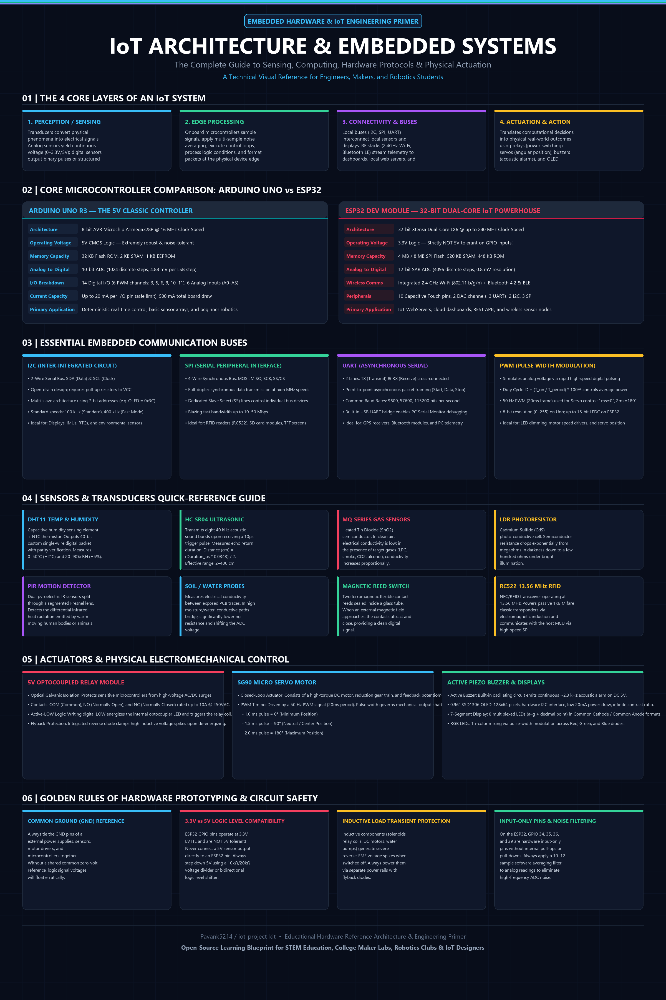
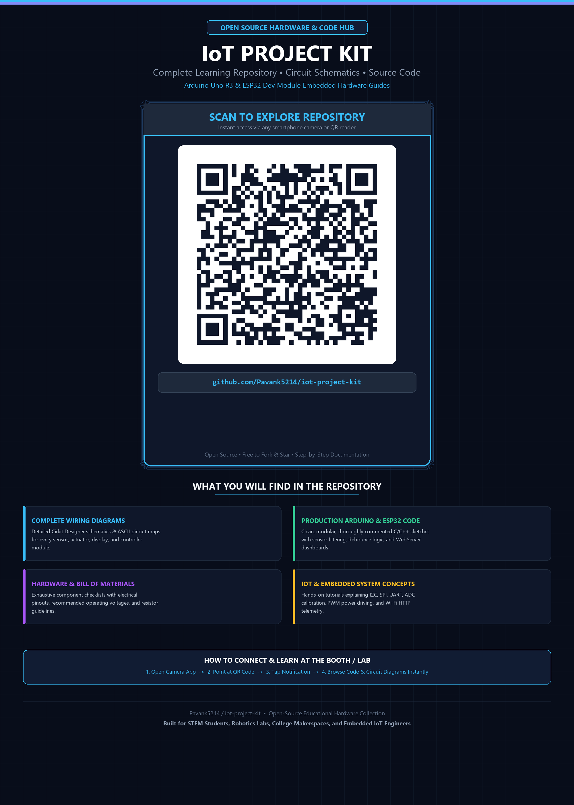
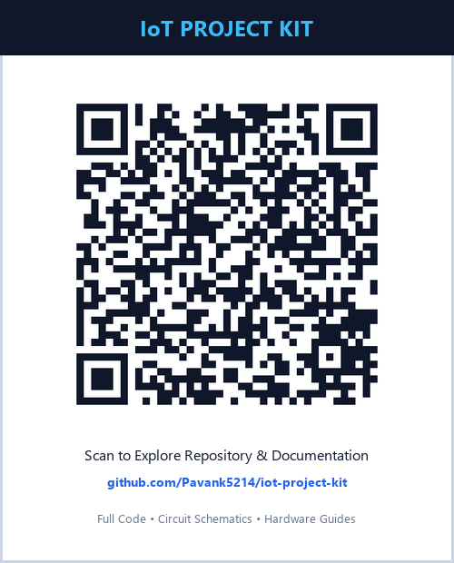

# IoT Project Kit 🧰⚡

Welcome to the **IoT Project Kit** repository! This collection contains step-by-step projects, circuit schematics, source code, and documentation designed for learning Internet of Things (IoT) and embedded systems hardware using **Arduino Uno**, **ESP32**, sensors, and actuators.

<p align="center">
  
  &nbsp;&nbsp;
  
</p>
<p align="center">
  <i>Scan the QR code on the poster or visit <a href="https://github.com/Pavank5214/iot-project-kit">github.com/Pavank5214/iot-project-kit</a> to explore all schematics, code, and documentation!</i>
</p>

---

## 📁 Repository Structure

```text
iot-project-kit/
│
├── assets/                            # Exhibition posters & scannable repository QR code
│   ├── iot-learning-poster.png        # Educational architecture & embedded systems learning poster
│   ├── qr-showcase-poster.png         # Standalone QR exhibition poster (print-ready)
│   ├── qr-code.png                    # High-resolution scannable QR code card
│   ├── poster-art.png                 # Concept exhibition poster artwork
│   ├── poster-with-qr.png             # Exhibition poster with embedded scannable QR code
│   └── project-catalog-poster.png     # Infographic catalog poster
├── poster.html                        # Exhibition poster portal & preview hub
├── poster-learning.html               # Printable educational architecture poster (A4/A3)
├── poster-qr.html                     # Printable standalone QR exhibition poster (A4/A3)
├── README.md                          # Main repository overview & index
└── projects/                          # Individual IoT project guides
    ├── 01-led-blinking/               # Project 01: LED Blinking
    ├── 02-traffic-light/              # Project 02: Traffic Light Controller
    ├── 03-rock-paper-scissors/        # Project 03: Rock Paper Scissors OLED Game
    ├── 04-electronic-dice/            # Project 04: Electronic Die with Touch/Button
    ├── 05-rgb-mood-lamp/              # Project 05: RGB Mood Lamp / Smooth Color Fader
    ├── 06-digital-stopwatch/          # Project 06: Digital Stopwatch with OLED Display
    ├── 07-buzzer-reaction-game/       # Project 07: Buzzer Reaction Game
    ├── 08-weather-monitor/            # Project 08: Weather Monitor (DHT11 + OLED)
    ├── 09-temperature-alarm/          # Project 09: Temperature Alarm (DHT11 + Buzzer)
    ├── 10-distance-meter/             # Project 10: Digital Distance Meter (HC-SR04)
    ├── 11-parking-indicator/          # Project 11: Smart Parking Indicator (HC-SR04 + LEDs)
    ├── 12-motion-alarm/               # Project 12: Motion Alarm (PIR Sensor + Buzzer)
    ├── 13-door-alarm/                 # Project 13: Door Alarm (Reed Switch + Buzzer)
    ├── 14-touchless-doorbell/         # Project 14: Touchless Doorbell (Ultrasonic + Buzzer)
    ├── 15-rain-alarm/                 # Project 15: Rain Alarm (Raindrop Sensor + Buzzer)
    ├── 16-water-level/                # Project 16: Water Level Indicator (Sensor + OLED)
    ├── 17-water-leakage-alarm/        # Project 17: Water Leakage Alarm (Sensor + Buzzer + OLED)
    ├── 18-soil-moisture/              # Project 18: Soil Moisture Meter (Sensor + OLED)
    ├── 19-flame-alarm/                # Project 19: Flame Alarm (IR Flame Sensor + Buzzer + OLED)
    ├── 20-gas-smoke-alarm/            # Project 20: Gas & Smoke Alarm (MQ-2 Sensor + Buzzer + OLED)
    ├── 21-night-lamp/                 # Project 21: Automatic Night Lamp (LDR Sensor + LED + OLED)
    ├── 22-automatic-fan/              # Project 22: Automatic Temperature-Controlled Fan (DHT11 + Fan + OLED)
    ├── 23-automatic-room-light/       # Project 23: Smart Automatic Room Light (PIR + LDR + LED + OLED)
    ├── 24-smart-street-light/         # Project 24: Smart Street Light (LDR Sensor + LED + OLED)
    ├── 25-servo-door/                 # Project 25: Smart Servo Door (Servo Motor + Push Button + OLED)
    ├── 26-keypad-door-lock/           # Project 26: Keypad Door Lock (4x4 Matrix Keypad + Servo + OLED)
    ├── 27-rfid-door/                  # Project 27: Smart RFID Door (RC522 RFID + Servo + OLED)
    ├── 28-smart-dustbin/              # Project 28: Smart Touchless Dustbin (Ultrasonic + Servo + OLED)
    ├── 29-tilt-alarm/                 # Project 29: Tilt Alarm (Ball Tilt Sensor + Buzzer + OLED)
    ├── 30-wifi-temperature-monitor/   # Project 30: Wi-Fi Temp & Humidity Monitor (ESP32 + DHT11 + OLED)
    ├── 31-wifi-led-control/           # Project 31: Wi-Fi LED Controller (ESP32 + WebServer + OLED)
    ├── 32-wifi-motion-monitor/        # Project 32: Wi-Fi Motion Monitor (ESP32 + PIR Sensor + OLED)
    ├── 33-wifi-door-monitor/          # Project 33: Wi-Fi Door Monitor (ESP32 + Reed Switch + OLED)
    ├── 34-wifi-plant-monitor/         # Project 34: IoT Smart Plant Monitor (ESP32 + Soil + DHT11 + OLED)
    ├── 35-automatic-water-pump/       # Project 35: Automatic Plant Watering System (ESP32 + Soil + Relay + OLED)
    ├── 36-wifi-smart-fan/             # Project 36: Wi-Fi Smart Fan (ESP32 + DHT11 + 5V Relay + OLED)
    ├── 37-smart-night-lamp/           # Project 37: Smart Night Lamp (ESP32 + LDR Sensor + LED + OLED)
    ├── 38-smart-water-tank/           # Project 38: Smart Water Tank (ESP32 + Ultrasonic + Relay + OLED)
    ├── 39-wifi-rain-monitor/          # Project 39: Wi-Fi Rain Monitor (ESP32 + Rain Sensor + OLED)
    └── 40-wifi-air-quality-monitor/   # Project 40: Wi-Fi Air Quality Monitor (ESP32 + MQ-135 + OLED)
```

---

## 🚀 Projects Index

| # | Project Name | Hardware Used | Difficulty | Status | Documentation |
| :-: | :--- | :--- | :-: | :-: | :-: |
| **01** | **LED Blinking** | Arduino Uno, 5mm LED | `Easy` | ✅ Completed | [View Guide 📖](projects/01-led-blinking/) |
| **02** | **Traffic Light Controller** | Arduino Uno, 3-LED Traffic Light Module | `Easy` | ✅ Completed | [View Guide 📖](projects/02-traffic-light/) |
| **03** | **Rock Paper Scissors Game** | Arduino Uno, SSD1306 OLED, 3x Buttons | `Medium` | ✅ Completed | [View Guide 📖](projects/03-rock-paper-scissors/) |
| **04** | **Electronic Die** | Arduino Uno, 7-Seg Display, Push Button | `Easy` | ✅ Completed | [View Guide 📖](projects/04-electronic-dice/) |
| **05** | **RGB Mood Lamp** | Arduino Uno, 4-Pin RGB LED | `Easy` | ✅ Completed | [View Guide 📖](projects/05-rgb-mood-lamp/) |
| **06** | **Digital Stopwatch** | Arduino Uno, SSD1306 OLED, 3x Buttons | `Medium` | ✅ Completed | [View Guide 📖](projects/06-digital-stopwatch/) |
| **07** | **Buzzer Reaction Game** | Arduino Uno, SSD1306 OLED, Button, Buzzer | `Easy` | ✅ Completed | [View Guide 📖](projects/07-buzzer-reaction-game/) |
| **08** | **Weather Monitor** | Arduino Uno, DHT11 Sensor, SSD1306 OLED | `Easy` | ✅ Completed | [View Guide 📖](projects/08-weather-monitor/) |
| **09** | **Temperature Alarm** | Arduino Uno, DHT11 Sensor, Buzzer, OLED | `Easy` | ✅ Completed | [View Guide 📖](projects/09-temperature-alarm/) |
| **10** | **Digital Distance Meter** | Arduino Uno, HC-SR04 Sensor, SSD1306 OLED | `Easy` | ✅ Completed | [View Guide 📖](projects/10-distance-meter/) |
| **11** | **Smart Parking Indicator** | Arduino Uno, HC-SR04 Sensor, 3x LEDs, Buzzer, OLED | `Medium` | ✅ Completed | [View Guide 📖](projects/11-parking-indicator/) |
| **12** | **Motion Alarm** | Arduino Uno, PIR Sensor, Buzzer, SSD1306 OLED | `Easy` | ✅ Completed | [View Guide 📖](projects/12-motion-alarm/) |
| **13** | **Door Alarm** | Arduino Uno, Reed Switch Module, Buzzer, OLED | `Easy` | ✅ Completed | [View Guide 📖](projects/13-door-alarm/) |
| **14** | **Touchless Doorbell** | Arduino Uno, HC-SR04 Sensor, Buzzer, OLED | `Easy` | ✅ Completed | [View Guide 📖](projects/14-touchless-doorbell/) |
| **15** | **Rain Alarm** | Arduino Uno, Raindrop Sensor Module, Buzzer, OLED | `Easy` | ✅ Completed | [View Guide 📖](projects/15-rain-alarm/) |
| **16** | **Water Level Indicator** | Arduino Uno, Water Level Sensor, SSD1306 OLED | `Easy` | ✅ Completed | [View Guide 📖](projects/16-water-level/) |
| **17** | **Water Leakage Alarm** | Arduino Uno, Water Leak Module, Buzzer, OLED | `Easy` | ✅ Completed | [View Guide 📖](projects/17-water-leakage-alarm/) |
| **18** | **Soil Moisture Meter** | Arduino Uno, Soil Moisture Sensor, SSD1306 OLED | `Easy` | ✅ Completed | [View Guide 📖](projects/18-soil-moisture/) |
| **19** | **Flame Alarm** | Arduino Uno, IR Flame Sensor, Buzzer, OLED | `Easy` | ✅ Completed | [View Guide 📖](projects/19-flame-alarm/) |
| **20** | **Gas & Smoke Alarm** | Arduino Uno, MQ-2 Gas Sensor, Buzzer, OLED | `Easy` | ✅ Completed | [View Guide 📖](projects/20-gas-smoke-alarm/) |
| **21** | **Automatic Night Lamp** | Arduino Uno, LDR Module, LED, SSD1306 OLED | `Easy` | ✅ Completed | [View Guide 📖](projects/21-night-lamp/) |
| **22** | **Automatic Fan** | Arduino Uno, DHT11 Sensor, Fan Module, OLED | `Easy` | ✅ Completed | [View Guide 📖](projects/22-automatic-fan/) |
| **23** | **Smart Room Light** | Arduino Uno, PIR Sensor, LDR Module, LED, OLED | `Easy` | ✅ Completed | [View Guide 📖](projects/23-automatic-room-light/) |
| **24** | **Smart Street Light** | Arduino Uno, LDR Module, LED, SSD1306 OLED | `Easy` | ✅ Completed | [View Guide 📖](projects/24-smart-street-light/) |
| **25** | **Smart Servo Door** | Arduino Uno, SG90 Servo, Button, SSD1306 OLED | `Easy` | ✅ Completed | [View Guide 📖](projects/25-servo-door/) |
| **26** | **Keypad Door Lock** | Arduino Uno, 4x4 Keypad, SG90 Servo, SSD1306 OLED | `Medium` | ✅ Completed | [View Guide 📖](projects/26-keypad-door-lock/) |
| **27** | **Smart RFID Door** | Arduino Uno, RC522 RFID, SG90 Servo, SSD1306 OLED | `Medium` | ✅ Completed | [View Guide 📖](projects/27-rfid-door/) |
| **28** | **Smart Touchless Dustbin** | Arduino Uno, HC-SR04 Sensor, SG90 Servo, SSD1306 OLED | `Easy` | ✅ Completed | [View Guide 📖](projects/28-smart-dustbin/) |
| **29** | **Tilt Alarm** | Arduino Uno, SW-520D Tilt Sensor, Buzzer, SSD1306 OLED | `Easy` | ✅ Completed | [View Guide 📖](projects/29-tilt-alarm/) |
| **30** | **Wi-Fi Temperature Monitor** | ESP32 DevKit, DHT11 Sensor, SSD1306 OLED | `Medium` | ✅ Completed | [View Guide 📖](projects/30-wifi-temperature-monitor/) |
| **31** | **Wi-Fi LED Controller** | ESP32 DevKit, 5mm LED, 220Ω, SSD1306 OLED | `Easy` | ✅ Completed | [View Guide 📖](projects/31-wifi-led-control/) |
| **32** | **Wi-Fi Motion Monitor** | ESP32 DevKit, HC-SR501 PIR, SSD1306 OLED | `Easy` | ✅ Completed | [View Guide 📖](projects/32-wifi-motion-monitor/) |
| **33** | **Wi-Fi Door Monitor** | ESP32 DevKit, Reed Switch Module, SSD1306 OLED | `Easy` | ✅ Completed | [View Guide 📖](projects/33-wifi-door-monitor/) |
| **34** | **IoT Smart Plant Monitor** | ESP32 DevKit, Soil Sensor, DHT11, SSD1306 OLED | `Medium` | ✅ Completed | [View Guide 📖](projects/34-wifi-plant-monitor/) |
| **35** | **Automatic Plant Watering** | ESP32 DevKit, Soil Sensor, 5V Relay, DC Pump, OLED | `Medium` | ✅ Completed | [View Guide 📖](projects/35-automatic-water-pump/) |
| **36** | **Wi-Fi Smart Fan** | ESP32 DevKit, DHT11 Sensor, 5V Relay, DC Fan, OLED | `Medium` | ✅ Completed | [View Guide 📖](projects/36-wifi-smart-fan/) |
| **37** | **Smart Night Lamp** | ESP32 DevKit, LDR Module, 5mm LED, SSD1306 OLED | `Easy` | ✅ Completed | [View Guide 📖](projects/37-smart-night-lamp/) |
| **38** | **Smart Water Tank** | ESP32 DevKit, HC-SR04 Sensor, 5V Relay, Water Pump, OLED | `Medium` | ✅ Completed | [View Guide 📖](projects/38-smart-water-tank/) |
| **39** | **Wi-Fi Rain Monitor** | ESP32 DevKit, Rain Sensor, SSD1306 OLED | `Easy` | ✅ Completed | [View Guide 📖](projects/39-wifi-rain-monitor/) |
| **40** | **Wi-Fi Air Quality Monitor** | ESP32 DevKit, MQ-135 Sensor, SSD1306 OLED | `Medium` | ✅ Completed | [View Guide 📖](projects/40-wifi-air-quality-monitor/) |

---

## 🛠️ Hardware Kit / Shopping List (Bill of Materials)

> [!TIP]
> **Key Kit Features:**
> - **100% USB-Powered**: Everything runs directly off 5V supplied by the Arduino USB cable connected to your computer. No external batteries (e.g. 9V) or DC adapters are required!
> - **Module & Discrete Prototyping**: All sensor boards, displays, and modules feature onboard signal conditioning. Standard 220Ω, 1kΩ, and 10kΩ resistors are included for wiring discrete LEDs, displays, and general prototyping.

### 1. Core Microcontroller & Prototyping
| Item | Qty | Specifications / Notes | Used in Projects |
| :--- | :---: | :--- | :--- |
| **Arduino Uno R3** | 1 | Microcontroller board with USB-A to Type-B programming cable | Projects 01–29 |
| **ESP32 Dev Module (30-Pin)** | 1 | Dual-core 2.4GHz Wi-Fi + Bluetooth microcontroller board | Projects 30, 31, 32, 33, 34, 35, 36, 37, 38, 39, 40 |
| **Solderless Breadboard** | 1 | Standard 830 tie-points (or 400 tie-points) | All Projects (01–40) |
| **Jumper Wires (M-to-M)** | ~30–40 | Male-to-Male prototyping wires | Projects 01–40 |
| **Jumper Wires (M-to-F)** | ~15–20 | Male-to-Female wires (for module header pins) | Projects 08–40 |
| **Jumper Wires (F-to-F)** | ~5–10 | Female-to-Female wires (for direct module connects) | Optional / Convenient |

### 2. Displays
| Item | Qty | Specifications / Notes | Used in Projects |
| :--- | :---: | :--- | :--- |
| **0.96" I2C OLED Display** | 1 | 128x64 resolution, SSD1306 driver, 4-pin (VCC, GND, SCL, SDA, `0x3C`) | Projects 03, 06, 07, 08, 09, 10, 11, 12, 13, 14, 15, 16, 17, 18, 19, 20, 21, 22, 23, 24, 25, 26, 27, 28, 29, 30, 31, 32, 33, 34, 35, 36, 37, 38, 39, 40 |
| **1-Digit 7-Segment Display** | 1 | **Common Cathode (CC)**, 10-pin through-hole display | Project 04 |

### 3. Sensor & Reader Modules (14 Modules)
| Sensor Module | Qty | Specifications / Interface | Used in Projects |
| :--- | :---: | :--- | :--- |
| **DHT11 Sensor** | 1 | Temperature & Relative Humidity digital sensor module (3-pin) | Projects 08, 09, 22, 30, 34, 36 |
| **HC-SR04 Ultrasonic Sensor** | 1 | Ultrasonic distance sensor (4-pin: VCC, Trig, Echo, GND) | Projects 10, 11, 14, 28, 38 |
| **HC-SR501 PIR Motion Sensor** | 1 | Passive Infrared motion detection module (3-pin: VCC, OUT, GND) | Projects 12, 23, 32 |
| **Magnetic Reed Switch Module** | 1 | Door magnetic contact switch module + companion bar magnet | Projects 13, 33 |
| **Raindrop Sensor Module** | 1 | Rain sensing plate + LM393 comparator driver board (`DO`) | Projects 15, 39 |
| **Submersible Water Level Sensor** | 1 | Analog resistive water depth sensor board (3-pin: `S`, `+`, `-`) | Project 16 |
| **Water Leakage Sensor Module** | 1 | Droplet detection probe board + LM393 comparator (`DO`) | Project 17 |
| **Soil Moisture Sensor Module** | 1 | 2-prong soil probe fork + LM393 comparator board (`AO`) | Projects 18, 34, 35 |
| **IR Flame Sensor Module** | 1 | 760nm–1100nm infrared receiver phototransistor + LM393 (`DO`) | Project 19 |
| **MQ-2 Gas & Smoke Sensor** | 1 | Combustible gas (LPG, methane, smoke) sensor module (`DO`) | Project 20 |
| **MQ-135 Air Quality Sensor** | 1 | Hazardous gas (NH3, NOx, alcohol, smoke, CO2) module (`AO`) | Project 40 |
| **LDR Light Sensor Module** | 1 | Photoresistor + LM393 comparator driver board (`DO`) | Projects 21, 23, 24, 37 |
| **RC522 RFID Reader Module** | 1 | 13.56 MHz RFID/NFC reader board with SPI interface + RFID Card & Fob | Project 27 |
| **SW-520D Tilt Sensor Module** | 1 | Ball-switch tilt/inclination sensor with LM393 comparator (`DO`) | Project 29 |

### 4. Actuators, Audio & Indicators
| Item | Qty | Specifications / Notes | Used in Projects |
| :--- | :---: | :--- | :--- |
| **Active 5V Piezo Buzzer** | 1 | 5V continuous audio buzzer (+ and - pins) | Projects 07, 09, 11, 12, 13, 14, 15, 17, 19, 20, 29 |
| **Traffic Light Module (3-in-1)** | 1 | Integrated Red/Yellow/Green LED module with onboard resistors | Projects 02, 11 |
| **5mm LEDs (Assorted)** | 5 | Red, Yellow, Green standard 5mm LEDs | Projects 01, 11, 21, 23, 24, 31, 37 |
| **4-Pin RGB LED** | 1 | **Common Cathode** 5mm RGB LED or RGB Module | Project 05 |
| **5V DC Fan / Driver Module** | 1 | 5V cooling fan or motor driver module | Projects 22, 36 |
| **5V Relay Module (1-Channel)** | 1 | Optocoupler-isolated 5V relay module (active-LOW) | Projects 35, 36, 38 |
| **Mini Submersible DC Water Pump** | 1 | 2.5V–6V DC submersible mini water pump with tubing | Projects 35, 38 |
| **SG90 Micro Servo Motor** | 1 | 9g 180° micro servo motor with horns | Projects 25, 26, 27, 28 |

### 5. Inputs & Switches
| Item | Qty | Specifications / Notes | Used in Projects |
| :--- | :---: | :--- | :--- |
| **Tactile Push Buttons** | 4 | 6x6mm mini tactile momentary switches | Projects 03, 04, 06, 07, 25 |
| **4x4 Matrix Membrane Keypad** | 1 | 16-key matrix (4 rows x 4 columns, 8-pin connector) | Project 26 |

### 6. Resistors (For LEDs & Prototyping)
| Item | Qty | Specifications / Notes | Purpose |
| :--- | :---: | :--- | :--- |
| **220Ω Resistors** | 10 | 1/4W through-hole | Current-limiting for 5mm LEDs & 7-Segment display (Projects 01, 04, 31) |
| **10kΩ Resistors** | 5 | 1/4W through-hole | General pull-up / pull-down circuitry |
| **1kΩ Resistors** | 5 | 1/4W through-hole | General purpose electronics prototyping |

---

## 🖼️ Exhibition Posters & QR Code

| 📘 Educational Learning Poster | 📱 Standalone QR Showcase Poster | 🔲 Scannable QR Card |
| :---: | :---: | :---: |
| [](assets/iot-learning-poster.png) | [](assets/qr-showcase-poster.png) | [](assets/qr-code.png) |
| [View & Print Web Poster 📖](poster-learning.html) | [View & Print QR Poster 📱](poster-qr.html) | [High-Res PNG Card 🔍](assets/qr-code.png) |

* **Central Exhibition Portal**: Open [`poster.html`](poster.html) to preview both posters and seamlessly switch between them.
* **Direct Printing & PDF Export**: Open [`poster-learning.html`](poster-learning.html) or [`poster-qr.html`](poster-qr.html) in any modern browser and press <kbd>Ctrl</kbd> + <kbd>P</kbd> (<kbd>Cmd</kbd> + <kbd>P</kbd>) to print directly or export crisp, publication-grade A4/A3 PDFs for maker fairs, robotics symposiums, and engineering labs.
* **Direct Repository URL**: [https://github.com/Pavank5214/iot-project-kit](https://github.com/Pavank5214/iot-project-kit)

---

## 💻 Getting Started

1. Clone this repository:
   ```bash
   git clone https://github.com/Pavank5214/iot-project-kit.git
   ```
2. Navigate to any project folder under `projects/` (e.g., `projects/07-buzzer-reaction-game/`).
3. Open the `.ino` file in **Arduino IDE**.
4. Wire your circuit according to the provided `README.md` diagram.
5. Select your board (`Tools -> Board -> Arduino Uno`) and COM port, then click **Upload**.

---

## 📜 License

This repository is open-source and available under the [MIT License](LICENSE).
