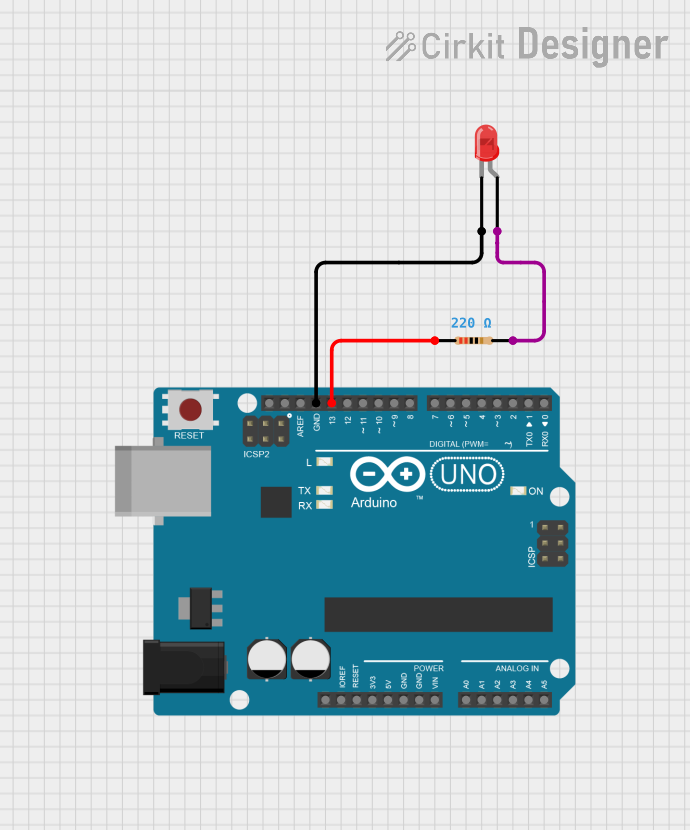

# Project 01 — LED Blinking

[](#difficulty)
[](#hardware-used)

## Overview

**LED Blinking** is the foundational project in the IoT Kit. It demonstrates how to control a digital output pin on an Arduino Uno to toggle an LED ON and OFF at fixed time intervals.

This project introduces essential electronics and microcontroller programming concepts:
* **Digital Output Pins** & GPIO control
* **LED Polarity** (Anode vs Cathode)
* **Direct Pin Control** & Safe Circuit Prototyping
* Arduino API: `pinMode()`, `digitalWrite()`, and `delay()`

---

## Difficulty

**Easy** — Perfect for beginners starting with microcontrollers and breadboard circuits.

---

## Hardware Required

| Component | Quantity | Notes |
| :--- | :---: | :--- |
| **Arduino Uno** | 1 | Microcontroller board (powered via USB cable) |
| **5mm LED** | 1 | Any color (Red, Green, Yellow, etc.) or standard LED module |
| **Breadboard & Jumpers** | 1 | Solderless prototyping board & wires |

> [!NOTE]
> **No External Resistors Needed:** The kit is designed to be completely resistor-free. Pin 13 can directly drive the 5mm LED / LED module, or you can observe the Arduino Uno's built-in `L` LED!

---

## Circuit Connections

| Arduino Uno Pin | Component Connection | Notes |
| :--- | :--- | :--- |
| **Digital Pin 13** | LED Anode (+) | Long leg of LED |
| **GND** | LED Cathode (−) | Short leg of LED |

### Identifying LED Polarity

* **Anode (+)**: Longer leg (Positive terminal)
* **Cathode (−)**: Shorter leg & flat edge on the plastic casing (Negative terminal)

---

## Circuit Diagram

### Wiring Diagram


### Schematic (ASCII)

```text
Arduino UNO

       D13 ──────[ LED Anode (+)   ]
       GND ──────[ LED Cathode (-) ]
```

---

## Arduino Code

The source code for this project is available in [`01_led_blinking.ino`](01_led_blinking.ino).

```cpp
// Project 01: LED Blinking
// Board: Arduino Uno

const int LED_PIN = 13;

void setup() {
  // Configure digital pin 13 as an output
  pinMode(LED_PIN, OUTPUT);
}

void loop() {
  digitalWrite(LED_PIN, HIGH);  // Turn LED ON (5V)
  delay(1000);                  // Wait 1 second (1000 ms)

  digitalWrite(LED_PIN, LOW);   // Turn LED OFF (0V)
  delay(1000);                  // Wait 1 second (1000 ms)
}
```

---

## How It Works

1. **Initialization (`setup()`)**:
   When the Arduino powers up, `setup()` runs once. `pinMode(LED_PIN, OUTPUT)` configures Pin 13 as an output pin capable of supplying current.

2. **Main Loop (`loop()`)**:
   `loop()` runs repeatedly as long as the Arduino is powered:
   * **Step 1**: `digitalWrite(LED_PIN, HIGH)` sets Pin 13 voltage to +5V, causing current to flow through the LED to GND, turning the LED **ON**.
   * **Step 2**: `delay(1000)` pauses program execution for 1,000 milliseconds (1 second).
   * **Step 3**: `digitalWrite(LED_PIN, LOW)` drops Pin 13 voltage to 0V (GND), turning the LED **OFF**.
   * **Step 4**: `delay(1000)` pauses for another 1 second before the loop restarts.

---

## Expected Result

Once uploaded to your Arduino Uno, the onboard/external LED will cycle continuously:

```text
[ ON ]  ──( 1 second )──>  [ OFF ]  ──( 1 second )──>  [ ON ] ...
```

---

## Experiments & Try It Yourself

1. **Fast Blinking**: Change `delay(1000)` to `delay(100)` for a fast strobe effect.
2. **Heartbeat Pattern**:
   ```cpp
   digitalWrite(LED_PIN, HIGH); delay(100);
   digitalWrite(LED_PIN, LOW);  delay(100);
   digitalWrite(LED_PIN, HIGH); delay(100);
   digitalWrite(LED_PIN, LOW);  delay(700);
   ```

---

## What You Learned

- Connecting components directly on a breadboard or header
- Controlling digital output pins (`digitalWrite`)
- Controlling code execution speed (`delay`)
- Powering microcontroller circuits safely via USB
