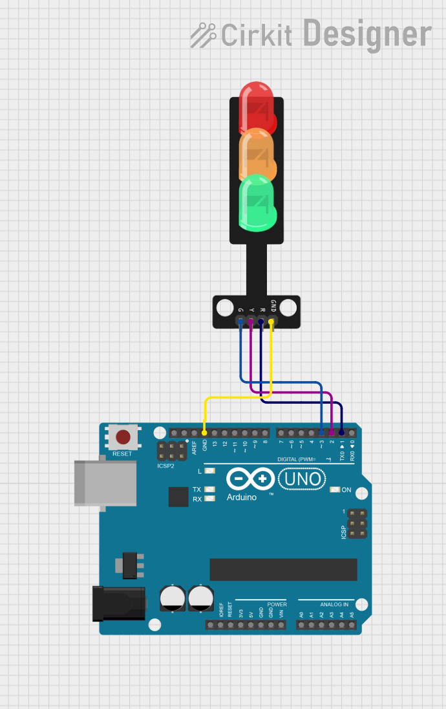

# Project 02 — Traffic Light Controller

[](#difficulty)
[](#hardware-used)

## Overview

The **Traffic Light Controller** simulates a real-world automated traffic signal using three LEDs (Green, Yellow, and Red). It builds upon basic digital outputs by controlling multiple pins in a synchronized, timed state machine.

This project introduces:
* Multi-pin digital output control
* Sequential timing logic using `delay()`
* Real-world automation state machines
* Traffic safety light sequencing (GO -> CAUTION -> STOP)

---

## Difficulty

**Easy** — Ideal for beginners transitioning from single LED control to multi-LED sequential logic.

---

## Hardware Required

| Component | Quantity | Notes |
| :--- | :---: | :--- |
| **Arduino Uno** | 1 | Microcontroller board |
| **Traffic Light Module** *(or 3x 5mm LEDs)* | 1 | Integrated 3-LED traffic light board (or 1x Red, 1x Yellow, 1x Green LED + 3x 220Ω resistors) |
| **Jumper Wires** | 4 | Male-to-Female or Male-to-Male wires |

---

## Circuit Connections

| Traffic Light Module Pin | Arduino Uno Pin | Description |
| :--- | :--- | :--- |
| **G** (Green) | **Digital Pin 3** | Signal control for Green LED |
| **Y** (Yellow) | **Digital Pin 2** | Signal control for Yellow LED |
| **R** (Red) | **Digital Pin 1** | Signal control for Red LED |
| **GND** | **GND** | Common Ground connection |

> [!TIP]
> **Serial Pin Note**: Pin 1 on Arduino Uno is labeled `TX` (Transmit) and is used for USB serial communication. If uploading code fails while Pin 1 is plugged in, unplug Pin 1 temporarily during upload, or reassign the Red LED pin to **Pin 4**.

---

## Circuit Diagram

### Wiring Diagram


### Schematic (ASCII)

```text
Arduino UNO

       D3 ─────────────── Green (G)
       D2 ─────────────── Yellow (Y)
       D1 ─────────────── Red (R)
      GND ─────────────── GND
                          ┌────────┐
                          │  (R)   │ Red LED
                          │  (Y)   │ Yellow LED
                          │  (G)   │ Green LED
                          └────────┘
                     Traffic Light Module
```

---

## Traffic Light Sequence State Machine

| State | Active Light | Duration | Real-world Meaning |
| :---: | :---: | :---: | :--- |
| **1** | 🟢 Green ON | 5 seconds (5000 ms) | **GO** — Traffic moves |
| **2** | 🟡 Yellow ON | 2 seconds (2000 ms) | **CAUTION** — Prepare to stop |
| **3** | 🔴 Red ON | 5 seconds (5000 ms) | **STOP** — Traffic halts |

---

## Arduino Code

The source code for this project is available in [`02_traffic_light.ino`](02_traffic_light.ino).

```cpp
/*
 * Project 02: Traffic Light Controller
 * Board: Arduino Uno
 *
 * Sequence:
 * - Green LED ON for 5 seconds
 * - Yellow LED ON for 2 seconds
 * - Red LED ON for 5 seconds
 */

// Pin definitions
const int greenPin = 3;
const int yellowPin = 2;
const int redPin = 1;

void setup() {
  // Initialize the digital pins as outputs
  pinMode(greenPin, OUTPUT);
  pinMode(yellowPin, OUTPUT);
  pinMode(redPin, OUTPUT);
}

void loop() {
  // 1. Green LED on for 5 seconds
  digitalWrite(greenPin, HIGH);
  delay(5000);
  digitalWrite(greenPin, LOW);

  // 2. Yellow LED on for 2 seconds
  digitalWrite(yellowPin, HIGH);
  delay(2000);
  digitalWrite(yellowPin, LOW);

  // 3. Red LED on for 5 seconds
  digitalWrite(redPin, HIGH);
  delay(5000);
  digitalWrite(redPin, LOW);
}
```

---

## How It Works

1. **Pin Setup**:
   The `setup()` function sets digital pins 3 (Green), 2 (Yellow), and 1 (Red) as outputs using `pinMode()`.

2. **Sequential Loop Execution**:
   - **Green Phase**: `greenPin` is set to `HIGH` for 5,000ms. Green turns on, then turns `LOW`.
   - **Yellow Phase**: `yellowPin` is set to `HIGH` for 2,000ms. Yellow turns on, then turns `LOW`.
   - **Red Phase**: `redPin` is set to `HIGH` for 5,000ms. Red turns on, then turns `LOW`.
   - **Looping**: The `loop()` function automatically restarts from the Green phase.

---

## Experiments & Challenges

1. **UK/European Sequence**:
   In some countries, Red and Yellow turn ON together before changing to Green:
   - Red (5s) -> Red + Yellow (2s) -> Green (5s) -> Yellow (2s).
2. **Night Mode (Flashing Yellow)**:
   Create a function to flash the Yellow LED ON/OFF every 500ms to simulate late-night low-traffic mode.

---

## What You Learned

- Managing multiple output pins simultaneously
- Programming fixed state transitions and timing intervals
- Modeling real-world embedded control applications
