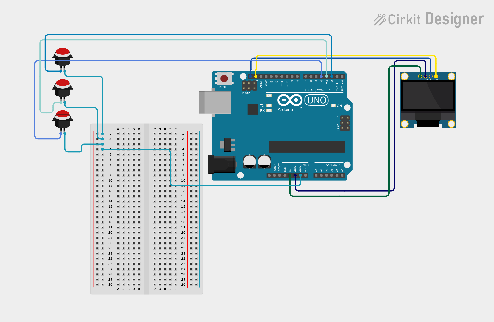

# Project 03 — Rock Paper Scissors OLED Game 🎮

[](#difficulty)
[](#hardware-used)
[](#hardware-used)
[](#circuit-connections)

## Overview

The **Rock Paper Scissors OLED Game** is an interactive handheld game built with an Arduino Uno, a 0.96" I2C SSD1306 OLED display, and 3 tactile push buttons. Players select their move (Rock, Paper, or Scissors) by pressing a button. The Arduino generates a random computer move, renders the graphics on the display, and determines the winner in real time.

This updated version utilizes **Arduino's internal pull-up resistors (`INPUT_PULLUP`)**, eliminating the need for external pull-down/pull-up resistors!

This project introduces key embedded systems concepts:
* **I2C Protocol & Graphics Rendering** using `Adafruit_SSD1306`
* **Internal Pull-Up Resistors (`INPUT_PULLUP`)** and active-LOW button logic
* **Pseudo-Random Number Generation** (`randomSeed()`)
* **Conditional Game Logic & UI State Management**

---

## Difficulty

**Medium** — Requires installing external Arduino libraries and wiring an I2C display alongside digital inputs using internal pull-up logic.

---

## Hardware Required

| Component | Quantity | Notes |
| :--- | :---: | :--- |
| **Arduino Uno** | 1 | Microcontroller board |
| **0.96" I2C OLED Display** | 1 | 128x64 pixels (SSD1306 controller, address `0x3C`) |
| **Push Buttons** | 3 | Tactile switches (Rock, Paper, Scissors) |
| **Breadboard** | 1 | Solderless prototyping board |
| **Jumper Wires** | 8–10 | Male-to-Male wires |

> [!TIP]
> **No External Resistors Needed!** Thanks to `pinMode(pin, INPUT_PULLUP)`, each button is connected directly between its designated digital pin and Ground (`GND`).

---

## Circuit Connections

### OLED Display (I2C)

| OLED Pin | Arduino Uno Pin | Description |
| :--- | :--- | :--- |
| **VCC / VDD** | **5V** | Power supply (+5V) |
| **GND** | **GND** | Ground |
| **SCK / SCL** | **Analog Pin A5** | I2C Clock Line |
| **SDA** | **Analog Pin A4** | I2C Data Line |

### Push Buttons (Internal Pull-Up Active-LOW Logic)

| Button Function | Arduino Pin | Ground Connection | Logic State when Pressed |
| :--- | :--- | :--- | :---: |
| **Rock Button** | **Digital Pin 2** | Connected to **GND** | `LOW` |
| **Paper Button** | **Digital Pin 3** | Connected to **GND** | `LOW` |
| **Scissor Button** | **Digital Pin 4** | Connected to **GND** | `LOW` |

---

## Circuit Diagram

### Wiring Diagram


### Schematic (ASCII)

```text
Arduino UNO

             ┌───────────────────────┐
      A5 ────┤ SCL                   │
      A4 ────┤ SDA   0.96" SSD1306   │
      5V ────┤ VCC   OLED Display    │
     GND ────┤ GND                   │
             └───────────────────────┘

      D2 ───────[ Button 1: Rock     ]───────┐
      D3 ───────[ Button 2: Paper    ]───────┼───> GND
      D4 ───────[ Button 3: Scissors ]───────┘
```

---

## Required Arduino Libraries

To compile and run this sketch, install the following libraries via the **Arduino IDE Library Manager** (`Ctrl + Shift + I`):

1. **Adafruit SSD1306** by Adafruit
2. **Adafruit GFX Library** by Adafruit

---

## Game Logic & Rules Matrix

| Player Choice | Computer Choice | Result |
| :---: | :---: | :---: |
| 🪨 **Rock** (1) | ✂️ **Scissors** (3) | **PLAYER WINS!** |
| 📄 **Paper** (2) | 🪨 **Rock** (1) | **PLAYER WINS!** |
| ✂️ **Scissors** (3) | 📄 **Paper** (2) | **PLAYER WINS!** |
| *Same Choice* | *Same Choice* | **TIE!** |
| *Otherwise* | — | **COMPUTER WINS!** |

---

## Arduino Code

The source code for this project is available in [`03_rock_paper_scissors.ino`](03_rock_paper_scissors.ino).

```cpp
/*
  Project 03: Rock Paper Scissors OLED Game
  Board: Arduino Uno
  
  Buttons use Arduino's internal INPUT_PULLUP.
  NO external resistors required.
*/

#include <Wire.h>
#include <Adafruit_GFX.h>
#include <Adafruit_SSD1306.h>

#define SCREEN_WIDTH 128
#define SCREEN_HEIGHT 64

Adafruit_SSD1306 display(SCREEN_WIDTH, SCREEN_HEIGHT, &Wire, -1);

const int RockButton = 2;
const int PaperButton = 3;
const int ScissorButton = 4;

int playerChoice;
int computerChoice;

void setup() {
  pinMode(RockButton, INPUT_PULLUP);
  pinMode(PaperButton, INPUT_PULLUP);
  pinMode(ScissorButton, INPUT_PULLUP);

  Serial.begin(115200);
  randomSeed(analogRead(A0));

  if (!display.begin(SSD1306_SWITCHCAPVCC, 0x3C)) {
    Serial.println(F("SSD1306 allocation failed"));
    while (true) {}
  }

  display.clearDisplay();
  display.setTextColor(WHITE);
  display.setTextSize(1);
  display.setCursor(20, 25);
  display.println("Rock Paper");
  display.setCursor(35, 40);
  display.println("Scissors!");
  display.display();
  delay(2000);
}

void loop() {
  playerChoice = 0;
  computerChoice = 0;

  display.clearDisplay();
  display.setTextSize(1);
  display.setCursor(10, 0);  display.println("Lets Play!");
  display.setCursor(25, 12); display.println("Choose One");
  display.setCursor(5, 28);  display.println("ROCK   PAPER   SCISSOR");
  display.setCursor(5, 45);  display.println(" D2      D3       D4");
  display.display();

  while (playerChoice == 0) {
    if (digitalRead(RockButton) == LOW) {
      playerChoice = 1;
      display.clearDisplay();
      display.setTextSize(2);
      display.setCursor(25, 10); display.println("YOU");
      display.setCursor(20, 35); display.println("ROCK");
      display.display();
      delay(500);
    }
    else if (digitalRead(PaperButton) == LOW) {
      playerChoice = 2;
      display.clearDisplay();
      display.setTextSize(2);
      display.setCursor(25, 10); display.println("YOU");
      display.setCursor(15, 35); display.println("PAPER");
      display.display();
      delay(500);
    }
    else if (digitalRead(ScissorButton) == LOW) {
      playerChoice = 3;
      display.clearDisplay();
      display.setTextSize(2);
      display.setCursor(15, 10); display.println("YOU");
      display.setCursor(5, 35);  display.println("SCISSOR");
      display.display();
      delay(500);
    }
  }

  computerChoice = random(1, 4);

  display.clearDisplay();
  display.setTextSize(1);
  display.setCursor(0, 0);   display.println("YOU");
  display.setCursor(70, 0);  display.println("COMPUTER");
  display.drawLine(64, 0, 64, 30, WHITE);
  display.drawLine(0, 30, 128, 30, WHITE);

  display.setCursor(5, 15);
  if (playerChoice == 1) display.println("ROCK");
  else if (playerChoice == 2) display.println("PAPER");
  else display.println("SCISSOR");

  display.setCursor(70, 15);
  if (computerChoice == 1) display.println("ROCK");
  else if (computerChoice == 2) display.println("PAPER");
  else display.println("SCISSOR");

  display.display();
  delay(1500);

  display.clearDisplay();
  display.setTextSize(2);

  if (playerChoice == computerChoice) {
    display.setCursor(25, 25);
    display.println("TIE!");
  } else if (
    (playerChoice == 1 && computerChoice == 3) ||
    (playerChoice == 2 && computerChoice == 1) ||
    (playerChoice == 3 && computerChoice == 2)
  ) {
    display.setCursor(15, 25);
    display.println("YOU WIN!");
  } else {
    display.setCursor(5, 25);
    display.println("COMP WINS!");
  }

  display.display();
  delay(2000);

  display.clearDisplay();
  display.display();
  delay(300);
}
```

---

## How It Works

1. **Internal Pull-Up Activation**: `pinMode(pin, INPUT_PULLUP)` enables an internal ~20kΩ pull-up resistor inside the ATmega328P microcontroller. When a button is not pressed, the input pin reads `HIGH`. When pressed, it connects directly to GND and reads `LOW`.
2. **Random Seed Generation**: `randomSeed(analogRead(A0))` reads floating electrical noise from pin A0 to ensure true random computer choices.
3. **Selection Loop**: The program waits until `digitalRead(buttonPin) == LOW`, identifying which choice was pressed.
4. **Result Screen**: Splits the display into two columns (Player vs Computer) and shows the match outcome.

---

## Future Enhancements & Experiments

* **Bitmap Graphics**: Render custom 16x16 pixel icons for Rock 🪨, Paper 📄, and Scissors ✂️ using `display.drawBitmap()`.
* **Score Tracker**: Store and render overall Wins, Losses, and Ties across rounds.
* **Buzzer Audio**: Add a piezo buzzer to play tone effects for button presses and victory melodies!
