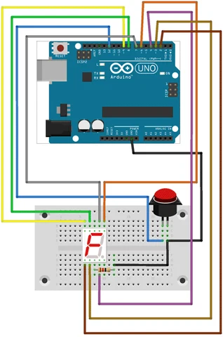

# Project 04 — Electronic Die with 7-Segment Display & Push Button 🎲

[](#difficulty)
[](#hardware-used)
[](#circuit-connections)

## Overview

The **Electronic Die** simulates a 6-sided rolling die for tabletop board games. Interfaced with a **Push Button** and a **1-Digit 7-Segment LED Display**, holding down the button triggers a fast "rolling" animation on the display by cycling numbers 1 through 6. When the button is released, a random number between **1** and **6** is generated and held on the display.

This project introduces key embedded systems concepts:
* Controlling a 7-Segment LED Display (Common Cathode logic)
* Using **Arduino's internal pull-up resistors (`INPUT_PULLUP`)** for clean button wiring without external resistors
* Simulating a rolling animation with `delay()` timing loops
* Generating random numbers with `random(1, 7)` and `randomSeed()`

---

## Difficulty

**Easy** — Perfect beginner project for learning segment mapping, switch-case state selection, and active-LOW button logic.

---

## Hardware Required

| Component | Quantity | Notes |
| :--- | :---: | :--- |
| **Arduino Uno** | 1 | Microcontroller board |
| **1-Digit 7-Segment Display** | 1 | **Common Cathode** type |
| **Push Button** | 1 | Tactile switch |
| **220Ω Resistor** | 1 | Current-limiting resistor for Common Cathode GND pin |
| **Breadboard** | 1 | Solderless prototyping board |
| **Jumper Wires** | 9–10 | Male-to-Male wires |

---

## Circuit Connections

### 7-Segment Display (Common Cathode)

```text
       ── A ──
      │       │
      F       B
      │       │
       ── G ──
      │       │
      E       C
      │       │
       ── D ──
```

| 7-Segment Display Pin | Arduino Uno Pin | Description |
| :--- | :--- | :--- |
| **Segment A** | **Digital Pin 7** | Top segment |
| **Segment B** | **Digital Pin 6** | Upper-right segment |
| **Segment C** | **Digital Pin 4** | Lower-right segment |
| **Segment D** | **Digital Pin 3** | Bottom segment |
| **Segment E** | **Digital Pin 2** | Lower-left segment |
| **Segment F** | **Digital Pin 8** | Upper-left segment |
| **Segment G** | **Digital Pin 9** | Middle segment |
| **Common Cathode (-)** | **GND** | Connected via 220Ω Resistor |

### Push Button Wiring

| Component Terminal | Connection | Logic State |
| :--- | :--- | :---: |
| **Button Terminal 1** | **Digital Pin 12** (`INPUT_PULLUP`) | `HIGH` (Unpressed) / `LOW` (Pressed) |
| **Button Terminal 2** | **GND** | Ground reference |

---

## Circuit Diagram

### Wiring Diagram


### Schematic (ASCII)

```text
Arduino UNO

      D7 ───────> Segment A
      D6 ───────> Segment B
      D4 ───────> Segment C           ┌─────────┐
      D3 ───────> Segment D           │ 7-Seg   │
      D2 ───────> Segment E           │ Display │
      D8 ───────> Segment F           └────┬────┘
      D9 ───────> Segment G                │
                                           │ 220Ω
     D12 ───────[ Push Button ]───────────┴─> GND
```

---

## Common Cathode 7-Segment Truth Table

> [!NOTE]
> In a **Common Cathode** 7-segment display, the common pin is tied to **GND**. Therefore:
> * **`HIGH`** turns an LED segment **ON** (+5V output from pin).
> * **`LOW`** turns an LED segment **OFF** (0V output from pin).

| Digit | A | B | C | D | E | F | G |
| :---: | :---: | :---: | :---: | :---: | :---: | :---: | :---: |
| **1** | LOW | **HIGH** | **HIGH** | LOW | LOW | LOW | LOW |
| **2** | **HIGH** | **HIGH** | LOW | **HIGH** | **HIGH** | LOW | **HIGH** |
| **3** | **HIGH** | **HIGH** | **HIGH** | **HIGH** | LOW | LOW | **HIGH** |
| **4** | LOW | **HIGH** | **HIGH** | LOW | LOW | **HIGH** | **HIGH** |
| **5** | **HIGH** | LOW | **HIGH** | **HIGH** | LOW | **HIGH** | **HIGH** |
| **6** | **HIGH** | LOW | **HIGH** | **HIGH** | **HIGH** | **HIGH** | **HIGH** |

---

## Arduino Code & Detailed Explanation

The complete source code is available in [`04_electronic_dice.ino`](04_electronic_dice.ino).

```cpp
/*
 * Project 04: Electronic Die with 7-Segment Display & Push Button
 * Board: Arduino Uno
 */

const int A = 7;
const int B = 6;
const int C = 4;
const int D = 3;
const int E = 2;
const int F = 8;
const int G = 9;
const int buttonPin = 12;

int random_int = 0;

void setup() {
  pinMode(A, OUTPUT);
  pinMode(B, OUTPUT);
  pinMode(C, OUTPUT);
  pinMode(D, OUTPUT);
  pinMode(E, OUTPUT);
  pinMode(F, OUTPUT);
  pinMode(G, OUTPUT);
  pinMode(buttonPin, INPUT_PULLUP);

  randomSeed(analogRead(A0));
}

void loop() {
  int pusshed = digitalRead(buttonPin);

  if (pusshed == LOW) {
    random_int = random(1, 7);

    // Rapidly cycle digits to simulate a rolling dice effect
    one();   delay(20);
    two();   delay(20);
    three(); delay(20);
    four();  delay(20);
    five();  delay(20);
    six();   delay(20);
  }
  else {
    switch (random_int) {
      case 1: one();   break;
      case 2: two();   break;
      case 3: three(); break;
      case 4: four();  break;
      case 5: five();  break;
      case 6: six();   break;
    }
    delay(200);
  }
}

void one() {
  digitalWrite(A, LOW);  digitalWrite(B, HIGH); digitalWrite(C, HIGH);
  digitalWrite(D, LOW);  digitalWrite(E, LOW);  digitalWrite(F, LOW);  digitalWrite(G, LOW);
}

void two() {
  digitalWrite(A, HIGH); digitalWrite(B, HIGH); digitalWrite(C, LOW);
  digitalWrite(D, HIGH); digitalWrite(E, HIGH); digitalWrite(F, LOW);  digitalWrite(G, HIGH);
}

void three() {
  digitalWrite(A, HIGH); digitalWrite(B, HIGH); digitalWrite(C, HIGH);
  digitalWrite(D, HIGH); digitalWrite(E, LOW);  digitalWrite(F, LOW);  digitalWrite(G, HIGH);
}

void four() {
  digitalWrite(A, LOW);  digitalWrite(B, HIGH); digitalWrite(C, HIGH);
  digitalWrite(D, LOW);  digitalWrite(E, LOW);  digitalWrite(F, HIGH); digitalWrite(G, HIGH);
}

void five() {
  digitalWrite(A, HIGH); digitalWrite(B, LOW);  digitalWrite(C, HIGH);
  digitalWrite(D, HIGH); digitalWrite(E, LOW);  digitalWrite(F, HIGH); digitalWrite(G, HIGH);
}

void six() {
  digitalWrite(A, HIGH); digitalWrite(B, LOW);  digitalWrite(C, HIGH);
  digitalWrite(D, HIGH); digitalWrite(E, HIGH); digitalWrite(F, HIGH); digitalWrite(G, HIGH);
}
```

---

## Step-by-Step Code Breakdown

### 1. Pin Definitions & Variable Declarations
```cpp
const int A = 7;
const int B = 6;
const int C = 4; ...
int random_int = 0;
```
Defines pin mappings for each segment of the 7-segment display and declares `random_int` to store the final rolled dice number.

### 2. Pin Setup & Internal Pull-Up Configuration
```cpp
void setup() {
  ...
  pinMode(buttonPin, INPUT_PULLUP);
}
```
Configures segment pins as `OUTPUT`s and Digital Pin 12 as an `INPUT_PULLUP`. Using `INPUT_PULLUP` enables the microcontroller's internal pull-up resistor, keeping Pin 12 `HIGH` when the button is not pressed and pulling it `LOW` when pressed.

### 3. Rolling Loop Logic
```cpp
int pusshed = digitalRead(buttonPin);
if (pusshed == LOW) {
  random_int = random(1, 7);
  one();   delay(20);
  two();   delay(20); ...
```
While the push button is held down (`pusshed == LOW`), the program continually picks a random number from 1 to 6 and rapidly cycles through digits `1` to `6` with 20ms delays, creating a visual "dice rolling" flicker effect.

### 4. Holding the Result
```cpp
else {
  switch(random_int) {
    case 1: one(); break;
    ...
  }
  delay(200);
}
```
When the user releases the button (`pusshed == HIGH`), the `switch-case` statement reads `random_int` and lights up the corresponding segments to display the final result.

---

## What You Learned

- Wiring a 7-segment LED display with Common Cathode logic
- Using internal pull-up resistors (`INPUT_PULLUP`) to simplify circuit wiring
- Creating animated visual feedback loops in microcontrollers
- Using `switch-case` blocks for state-based segment display control
