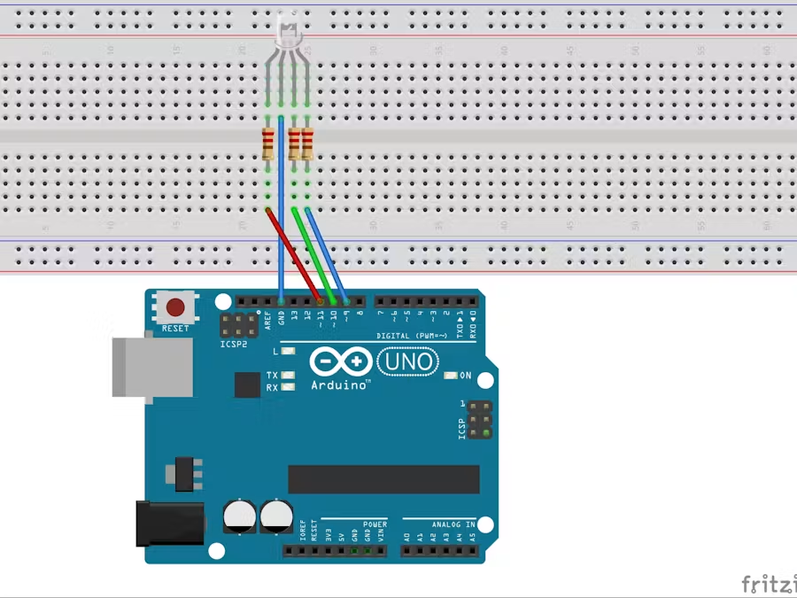

# Project 05 — RGB Mood Lamp / Smooth Color Fader 🌈

[](#difficulty)
[](#hardware-used)
[](#hardware-used)

## Overview

The **RGB Mood Lamp** creates ambient lighting by smoothly transitioning between randomly chosen color spectrums. By utilizing **Pulse Width Modulation (PWM)** on digital pins 9, 10, and 11, the Arduino can blend Red, Green, and Blue light channels into millions of subtle color shades.

This project introduces core embedded engineering concepts:
* **Pulse Width Modulation (PWM)** via `analogWrite()` (8-bit resolution: 0–255)
* **Additive Color Mixing** (Red + Green + Blue)
* **Linear Interpolation Math** for seamless visual color transitions
* **Common Cathode vs Common Anode RGB LED wiring**

---

## Difficulty

**Easy** — Ideal for learning analog output simulation, math calculations, and array manipulation in C++.

---

## Hardware Required

| Component | Quantity | Notes |
| :--- | :---: | :--- |
| **Arduino Uno** | 1 | Microcontroller board |
| **RGB LED** | 1 | **Common Cathode** (4-pin module/LED) |
| **220Ω Resistors** | 3 | Current-limiting resistors for Red, Green, Blue pins |
| **Breadboard** | 1 | Solderless prototyping board |
| **Jumper Wires** | 4–6 | Male-to-Male wires |

---

## RGB LED Pinout Identification

A standard 4-pin RGB LED has pins arranged as follows:

```text
       R   Cathode(-)  G   B
       │       │       │   │
      (1)     (2)     (3) (4)
               │
          Longest Leg
```

1. **Pin 1 (Anode Red)**: Connect to Pin 11 via 220Ω resistor.
2. **Pin 2 (Cathode)**: **Longest leg** — Connect directly to GND.
3. **Pin 3 (Anode Green)**: Connect to Pin 10 via 220Ω resistor.
4. **Pin 4 (Anode Blue)**: Connect to Pin 9 via 220Ω resistor.

---

## Circuit Connections

| Component Lead | Resistor Connection | Arduino Uno Pin | Description |
| :--- | :--- | :--- | :--- |
| **Red Anode Pin** | 220Ω Resistor | **Digital Pin 11** (~PWM) | Controls Red intensity |
| **Green Anode Pin** | 220Ω Resistor | **Digital Pin 10** (~PWM) | Controls Green intensity |
| **Blue Anode Pin** | 220Ω Resistor | **Digital Pin 9** (~PWM) | Controls Blue intensity |
| **Common Cathode** | Direct Connection | **GND** | Ground reference |

---

## Circuit Diagram

### Wiring Diagram


### Schematic (ASCII)

```text
Arduino UNO

     ~D11 ────[ 220Ω ]────> Red Anode
     ~D10 ────[ 220Ω ]────> Green Anode
      ~D9 ────[ 220Ω ]────> Blue Anode
      GND ────────────────> Common Cathode (-)
                            ┌──────────────┐
                            │   RGB LED    │
                            └──────────────┘
```

---

## Arduino Code

The source code for this project is available in [`05_rgb_mood_lamp.ino`](05_rgb_mood_lamp.ino).

```cpp
/*
 * Project 05: RGB Mood Lamp / Smooth Color Fader
 * Board: Arduino Uno
 */

float RGB1[3]; // Current RGB color state
float RGB2[3]; // Target RGB color state
float INC[3];  // Step size for transition

int red, green, blue;

const int RedPin = 11;
const int GreenPin = 10;
const int BluePin = 9;

void setup() {
  Serial.begin(9600);
  randomSeed(analogRead(0));

  RGB1[0] = 0; RGB1[1] = 0; RGB1[2] = 0;
  RGB2[0] = random(256);
  RGB2[1] = random(256);
  RGB2[2] = random(256);
}

void loop() {
  randomSeed(analogRead(0));

  // Compute color delta step for 256 transition steps
  for (int x = 0; x < 3; x++) {
    INC[x] = (RGB1[x] - RGB2[x]) / 256.0;
  }

  // Perform smooth color fade
  for (int x = 0; x < 256; x++) {
    red   = int(RGB1[0]);
    green = int(RGB1[1]);
    blue  = int(RGB1[2]);

    analogWrite(RedPin, red);
    analogWrite(GreenPin, green);
    analogWrite(BluePin, blue);

    delay(100);

    RGB1[0] -= INC[0];
    RGB1[1] -= INC[1];
    RGB1[2] -= INC[2];
  }

  // Generate new constrained random target color
  for (int x = 0; x < 3; x++) {
    RGB2[x] = random(556) - 300;
    RGB2[x] = constrain(RGB2[x], 0, 255);
    delay(1000);
  }
}
```

---

## How It Works

### 1. Pulse Width Modulation (PWM)
Standard digital output pins can only supply 0V (`LOW`) or 5V (`HIGH`). PWM pins (marked with `~` on Arduino Uno) rapidly switch between 0V and 5V at a high frequency (approx. 490Hz or 980Hz). By varying the duty cycle from `0` (0% ON) to `255` (100% ON) via `analogWrite()`, the average voltage delivered to each LED pin varies, producing custom brightness levels.

### 2. Linear Interpolation (Color Fading)
Instead of abruptly switching colors, the code calculates step increments:
$$\text{INC}[x] = \frac{\text{Current Color} - \text{Target Color}}{256}$$
Over 256 loops, the current color array `RGB1` gradually steps toward `RGB2`, producing a smooth gradient transition.

---

## Experiments & Try It Yourself

1. **Faster Transitions**: Reduce `delay(100)` to `delay(20)` for a fast pulsing strobe effect.
2. **Warm Sunset Theme**: Restrain target colors to warm tones (High Red, Moderate Green, Low Blue):
   ```cpp
   RGB2[0] = random(180, 256); // Red
   RGB2[1] = random(50, 150);  // Green
   RGB2[2] = random(0, 40);    // Blue
   ```
3. **LDR Light Control**: Add a Photoresistor (LDR) to automatically activate the mood lamp only when ambient room light goes dark!
