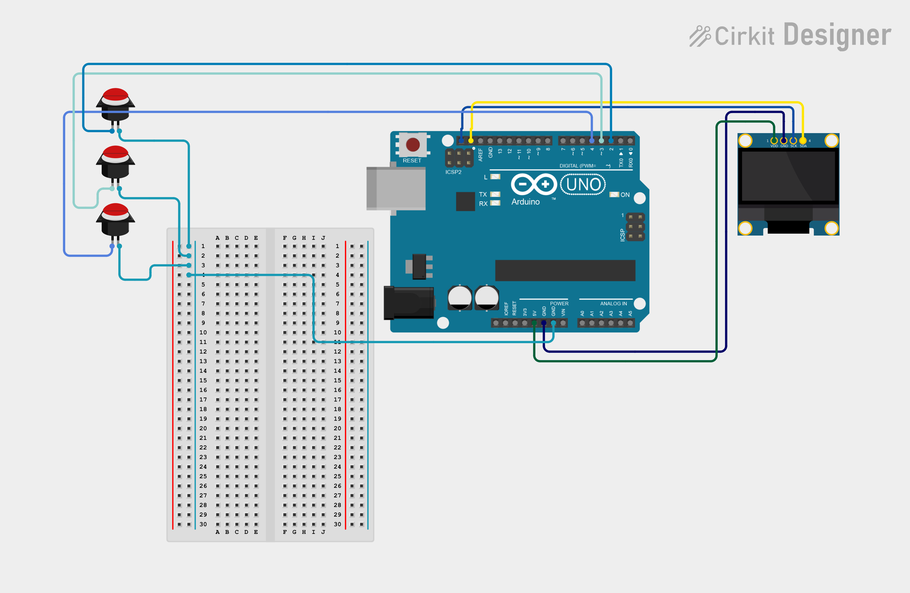

# Project 06 — Digital Stopwatch with OLED Display ⏱️

[](#difficulty)
[](#hardware-used)
[](#hardware-used)
[](#circuit-connections)

## Overview

The **Digital Stopwatch** is a precision timing application built using an Arduino Uno, a 0.96" I2C SSD1306 OLED display, and 3 push buttons. It measures elapsed time in minutes, seconds, and tenths of a second (`MM:SS.d`) with support for Start/Pause, Lap recording, and Reset functions.

> [!NOTE]
> **Hardware Reuse**: This project uses the **exact same circuit setup and pin connections as Project 03 (Rock Paper Scissors OLED Game)**! If you already built Project 03, you can upload this code directly without changing any wires.

This project introduces key embedded software concepts:
* **Non-blocking Timing** using `millis()` instead of `delay()`
* **Software Debouncing** for tactile push buttons
* **State Machine Logic** ([READY], [RUN], [PAUSE])
* **Real-time Formatting & Graphic Layouts** on OLED screens

---

## Difficulty

**Medium** — Demonstrates non-blocking timer loops, button debouncing, and UI rendering.

---

## Hardware Required

| Component | Quantity | Notes |
| :--- | :---: | :--- |
| **Arduino Uno** | 1 | Microcontroller board |
| **0.96" I2C OLED Display** | 1 | 128x64 pixels (SSD1306 controller, address `0x3C`) |
| **Push Buttons** | 3 | Tactile switches (Start/Pause, Lap, Reset) |
| **Breadboard** | 1 | Solderless prototyping board |
| **Jumper Wires** | 8–10 | Male-to-Male wires |

---

## Circuit Connections

### OLED Display (I2C)

| OLED Pin | Arduino Uno Pin | Description |
| :--- | :--- | :--- |
| **VCC / VDD** | **5V** | Power supply (+5V) |
| **GND** | **GND** | Ground |
| **SCK / SCL** | **Analog Pin A5** | I2C Clock Line |
| **SDA** | **Analog Pin A4** | I2C Data Line |

### Push Buttons (Internal Pull-Up Active-LOW Logic)

| Button Function | Arduino Pin | Ground Connection | Logic State when Pressed |
| :--- | :--- | :--- | :---: |
| **Button 1 (Start / Pause)** | **Digital Pin 2** | Connected to **GND** | `LOW` |
| **Button 2 (Lap Split)** | **Digital Pin 3** | Connected to **GND** | `LOW` |
| **Button 3 (Reset)** | **Digital Pin 4** | Connected to **GND** | `LOW` |

---

## Circuit Diagram

### Wiring Diagram


### Schematic (ASCII)

```text
Arduino UNO

             ┌───────────────────────┐
      A5 ────┤ SCL                   │
      A4 ────┤ SDA   0.96" SSD1306   │
      5V ────┤ VCC   OLED Display    │
     GND ────┤ GND                   │
             └───────────────────────┘

      D2 ───────[ Button 1: Start / Pause ]───────┐
      D3 ───────[ Button 2: Lap Split     ]───────┼───> GND
      D4 ───────[ Button 3: Reset         ]───────┘
```

---

## Required Arduino Libraries

To compile and run this sketch, install the following libraries via the **Arduino IDE Library Manager** (`Ctrl + Shift + I`):

1. **Adafruit SSD1306** by Adafruit
2. **Adafruit GFX Library** by Adafruit

---

## Button Functions & UI State Matrix

| Button | Function | Description |
| :---: | :--- | :--- |
| **D2** | **Start / Pause** | Toggles timer between **RUNNING** and **PAUSED** states |
| **D3** | **Lap Split** | Captures and displays the split duration for the current lap |
| **D4** | **Reset** | Clears elapsed time, lap counters, and resets status to **READY** |

---

## Arduino Code

The source code for this project is available in [`06_digital_stopwatch.ino`](06_digital_stopwatch.ino).

```cpp
/*
  Project 06: Digital Stopwatch with OLED Display & 3 Buttons
  Board: Arduino Uno
  
  Uses exact same pinout as Project 03 (Rock Paper Scissors OLED Game).
*/

#include <Wire.h>
#include <Adafruit_GFX.h>
#include <Adafruit_SSD1306.h>

#define SCREEN_WIDTH 128
#define SCREEN_HEIGHT 64

Adafruit_SSD1306 display(SCREEN_WIDTH, SCREEN_HEIGHT, &Wire, -1);

const int startStopButton = 2; // Pin 2: Start / Pause
const int lapButton       = 3; // Pin 3: Record Lap
const int resetButton     = 4; // Pin 4: Reset Timer

bool isRunning = false;
unsigned long startTime = 0;
unsigned long elapsedTime = 0;
unsigned long pausedTime = 0;

unsigned long lastLapTime = 0;
int lapCount = 0;
char lapBuffer[20] = "Lap --: 00:00.0";

unsigned long lastDebounceTime = 0;
const unsigned long debounceDelay = 200;

void updateDisplay();
void formatTime(unsigned long ms, char* buffer);

void setup() {
  pinMode(startStopButton, INPUT_PULLUP);
  pinMode(lapButton, INPUT_PULLUP);
  pinMode(resetButton, INPUT_PULLUP);

  Serial.begin(115200);

  if (!display.begin(SSD1306_SWITCHCAPVCC, 0x3C)) {
    Serial.println(F("SSD1306 allocation failed"));
    while (true);
  }

  display.clearDisplay();
  display.setTextColor(WHITE);
  display.setTextSize(1);
  display.setCursor(15, 15); display.println("DIGITAL STOPWATCH");
  display.setCursor(20, 35); display.println("IoT Project Kit");
  display.display();
  delay(1500);

  updateDisplay();
}

void loop() {
  unsigned long currentMillis = millis();

  if (isRunning) {
    elapsedTime = pausedTime + (currentMillis - startTime);
  }

  // Button 1: Start / Pause
  if (digitalRead(startStopButton) == LOW && (currentMillis - lastDebounceTime > debounceDelay)) {
    lastDebounceTime = currentMillis;

    if (!isRunning) {
      isRunning = true;
      startTime = millis();
    } else {
      isRunning = false;
      pausedTime = elapsedTime;
    }
  }

  // Button 2: Lap Split
  if (digitalRead(lapButton) == LOW && (currentMillis - lastDebounceTime > debounceDelay)) {
    lastDebounceTime = currentMillis;

    if (isRunning && elapsedTime > 0) {
      lapCount++;
      unsigned long currentLap = elapsedTime - lastLapTime;
      lastLapTime = elapsedTime;

      char lapTimeStr[12];
      formatTime(currentLap, lapTimeStr);
      sprintf(lapBuffer, "Lap %d: %s", lapCount, lapTimeStr);
    }
  }

  // Button 3: Reset
  if (digitalRead(resetButton) == LOW && (currentMillis - lastDebounceTime > debounceDelay)) {
    lastDebounceTime = currentMillis;

    isRunning = false;
    startTime = 0;
    elapsedTime = 0;
    pausedTime = 0;
    lastLapTime = 0;
    lapCount = 0;
    sprintf(lapBuffer, "Lap --: 00:00.0");
  }

  updateDisplay();
}

void updateDisplay() {
  display.clearDisplay();
  display.setTextColor(WHITE);

  display.setTextSize(1);
  display.setCursor(0, 0); display.println("STOPWATCH");
  display.setCursor(75, 0);
  if (isRunning) display.println("[RUN]");
  else if (elapsedTime > 0) display.println("[PAUSE]");
  else display.println("[READY]");

  display.drawLine(0, 10, 128, 10, WHITE);

  char mainTimeStr[12];
  formatTime(elapsedTime, mainTimeStr);

  display.setTextSize(2);
  display.setCursor(10, 18);
  display.println(mainTimeStr);

  display.drawLine(0, 38, 128, 38, WHITE);

  display.setTextSize(1);
  display.setCursor(0, 43); display.println(lapBuffer);
  display.setCursor(0, 55); display.println("D2:St/Sp D3:Lap D4:Rst");

  display.display();
}

void formatTime(unsigned long ms, char* buffer) {
  unsigned long seconds = ms / 1000;
  unsigned int minutes = seconds / 60;
  seconds = seconds % 60;
  unsigned int tenths = (ms % 1000) / 100;

  sprintf(buffer, "%02u:%02lu.%1u", minutes, seconds, tenths);
}
```

---

## How It Works

1. **Non-blocking Timing (`millis()`)**:
   Instead of using `delay()`, which blocks execution, `millis()` returns the number of milliseconds passed since the Arduino turned on. The stopwatch calculates elapsed time by taking `(currentMillis - startTime)`.
2. **Debouncing Buttons**:
   Physical push buttons vibrate when pressed, causing fake multiple triggers. Checking `(currentMillis - lastDebounceTime > 200)` ensures a button press is registered only once every 200ms.
3. **Format Formatting**:
   The `formatTime()` function converts raw milliseconds into `MM:SS.d` format (e.g., `01:23.4`).

---

## Experiments & Try It Yourself

1. **Add Sound Effects**: Connect a Piezo Buzzer to Pin 5 to beep on button presses or when starting/pausing the stopwatch.
2. **Best Lap Tracker**: Save the fastest lap time in memory and display `Fastest: MM:SS.d` at the bottom of the OLED screen.
