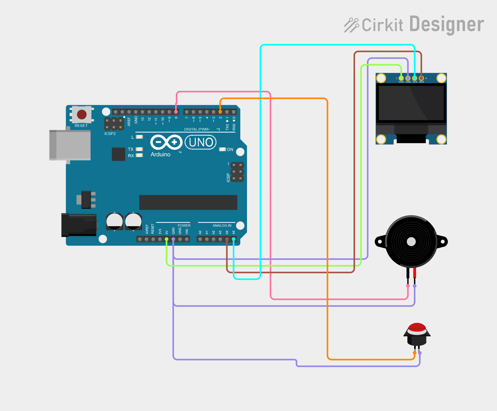

# Project 07 — Buzzer Reaction Game ⚡

[](#difficulty)
[](#hardware-used)
[](#hardware-used)

## Overview

The **Buzzer Reaction Game** tests a player's reflexes. When started, the Arduino waits for a random delay between 2 and 5 seconds before sounding a buzzer and displaying **"GO!"**. The player must press the button as fast as possible. The reaction time is measured in milliseconds and displayed on the 0.96" SSD1306 OLED screen. Pressing the button before the buzzer triggers a **FALSE START** penalty!

This project introduces key concepts:
* **Audio Feedback** using `tone()` function and a Piezo Buzzer
* **Randomized State Timing** (`random(2000, 5001)`)
* **Millisecond Precision Timing** (`millis()`)
* **Active-LOW Input Handling** with Arduino's internal `INPUT_PULLUP` resistor

---

## Hardware Required

| Component | Quantity | Notes |
| :--- | :---: | :--- |
| **Arduino Uno** | 1 | Microcontroller board |
| **0.96" I2C OLED Display** | 1 | 128x64 pixels (SSD1306 controller, address `0x3C`) |
| **Push Button** | 1 | Tactile switch (wired directly to D2 and GND) |
| **Piezo Buzzer** | 1 | Sound module (Positive to D8, Negative to GND) |
| **Breadboard** | 1 | Solderless prototyping board |
| **Jumper Wires** | 6–8 | Male-to-Male wires |

---

## Circuit Connections

| Component | Arduino Pin | Description |
| :--- | :--- | :--- |
| **OLED VCC** | **5V** | Power (+5V) |
| **OLED GND** | **GND** | Ground |
| **OLED SDA** | **Analog Pin A4** | I2C Data Line |
| **OLED SCL** | **Analog Pin A5** | I2C Clock Line |
| **Push Button** | **Digital Pin 2** | Signal pin (Internal `INPUT_PULLUP` -> GND) |
| **Buzzer (+)** | **Digital Pin 8** | Audio signal |
| **Buzzer (−)** | **GND** | Ground |

---

## Circuit Diagram

### Wiring Diagram


### Schematic (ASCII)

```text
Arduino UNO

             ┌───────────────────────┐
      A5 ────┤ SCL                   │
      A4 ────┤ SDA   0.96" SSD1306   │
      5V ────┤ VCC   OLED Display    │
     GND ────┤ GND                   │
             └───────────────────────┘

      D2 ───────[ Push Button ]───────────> GND
      D8 ───────[ Piezo Buzzer (+) ]──────> GND
```

---

## Arduino Code

Available in [`07_buzzer_reaction_game.ino`](07_buzzer_reaction_game.ino).

```cpp
#include <Wire.h>
#include <Adafruit_GFX.h>
#include <Adafruit_SSD1306.h>

#define SCREEN_WIDTH 128
#define SCREEN_HEIGHT 64
#define OLED_RESET -1
#define OLED_ADDRESS 0x3C

Adafruit_SSD1306 display(SCREEN_WIDTH, SCREEN_HEIGHT, &Wire, OLED_RESET);

#define BUTTON_PIN 2
#define BUZZER_PIN 8

void setup() {
  pinMode(BUTTON_PIN, INPUT_PULLUP);
  pinMode(BUZZER_PIN, OUTPUT);

  randomSeed(analogRead(A0));
  display.begin(SSD1306_SWITCHCAPVCC, OLED_ADDRESS);

  display.clearDisplay();
  display.setTextColor(SSD1306_WHITE);

  display.setTextSize(1); display.setCursor(25, 5);  display.println("REACTION GAME");
  display.setTextSize(2); display.setCursor(20, 25); display.println("READY");
  display.display();

  delay(1000);
}

void loop() {
  if (digitalRead(BUTTON_PIN) == LOW) {
    delay(50);
    while (digitalRead(BUTTON_PIN) == LOW);

    display.clearDisplay();
    display.setTextSize(2); display.setCursor(15, 20); display.println("WAIT...");
    display.display();

    unsigned long randomDelay = random(2000, 5001);
    unsigned long waitStart = millis();
    bool falseStart = false;

    while (millis() - waitStart < randomDelay) {
      if (digitalRead(BUTTON_PIN) == LOW) {
        falseStart = true;
        break;
      }
    }

    if (falseStart) {
      tone(BUZZER_PIN, 400, 300);
      display.clearDisplay();
      display.setTextSize(2);
      display.setCursor(5, 10);  display.println("FALSE");
      display.setCursor(15, 35); display.println("START!");
      display.display();
      while (digitalRead(BUTTON_PIN) == LOW);
      delay(1500);
      return;
    }

    tone(BUZZER_PIN, 2000, 150);
    display.clearDisplay();
    display.setTextSize(2); display.setCursor(40, 20); display.println("GO!");
    display.display();

    unsigned long reactionStart = millis();
    while (digitalRead(BUTTON_PIN) == HIGH);
    unsigned long reactionTime = millis() - reactionStart;

    display.clearDisplay();
    display.setTextSize(1); display.setCursor(25, 5);  display.println("REACTION TIME");
    display.setTextSize(2); display.setCursor(15, 25); display.print(reactionTime); display.println(" ms");
    display.setTextSize(1); display.setCursor(20, 50); display.println("Press to play");
    display.display();

    delay(500);
    while (digitalRead(BUTTON_PIN) == LOW);
    delay(1000);
  }
}
```

---

## How It Works

1. **Initialization**: Displays `"READY"` on the screen and enables `INPUT_PULLUP` on button pin 2.
2. **Random Wait**: When the player presses the button, the game clears the display to `"WAIT..."` and sets a random timer between 2,000ms and 5,000ms.
3. **False Start Check**: If the button goes `LOW` during the wait period, a low 400Hz buzz sounds and `"FALSE START!"` appears.
4. **Reaction Measurement**: When the delay finishes, a sharp 2000Hz tone plays for 150ms and `"GO!"` appears. The timer captures the exact millisecond duration until the button is pressed.
