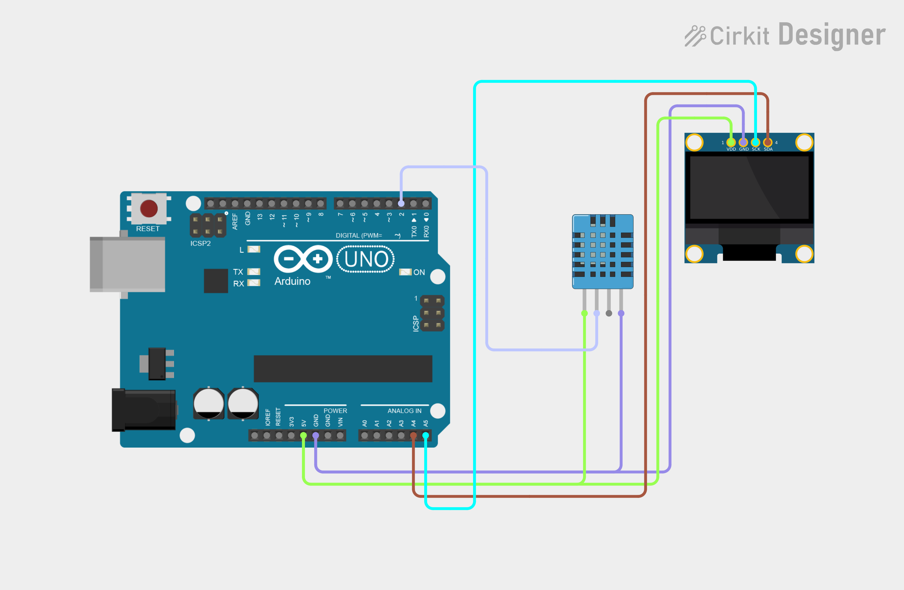

# Project 08 — Weather Monitor (DHT11 + OLED) 🌡️💧

[](#difficulty)
[](#hardware-used)
[](#hardware-used)

## Overview

The **Weather Monitor** measures ambient temperature (°C) and relative humidity (%) using a **DHT11 digital sensor** and displays the live sensor data on a 0.96" SSD1306 OLED screen.

This project introduces:
* Reading digital temperature & humidity data via 1-wire protocol (`DHT` library)
* Handling sensor error states with `isnan()`
* Multi-column graphic formatting on I2C OLED screens

---

## Hardware Required

| Component | Quantity | Notes |
| :--- | :---: | :--- |
| **Arduino Uno** | 1 | Microcontroller board |
| **DHT11 Sensor** | 1 | Digital temperature & humidity sensor module |
| **0.96" I2C OLED Display** | 1 | 128x64 pixels (SSD1306 controller, address `0x3C`) |
| **Breadboard** | 1 | Solderless prototyping board |
| **Jumper Wires** | 6–7 | Male-to-Male wires |

---

## Circuit Connections

| Component Pin | Arduino Pin | Description |
| :--- | :--- | :--- |
| **DHT11 Data** | **Digital Pin 2** | One-Wire sensor data signal |
| **DHT11 VCC** | **5V** | Power (+5V) |
| **DHT11 GND** | **GND** | Ground |
| **OLED VCC** | **5V** | Display Power (+5V) |
| **OLED GND** | **GND** | Display Ground |
| **OLED SDA** | **Analog Pin A4** | I2C Data Line |
| **OLED SCL** | **Analog Pin A5** | I2C Clock Line |

---

## Circuit Diagram

### Wiring Diagram


### Schematic (ASCII)

```text
Arduino UNO

             ┌───────────────────────┐
      A5 ────┤ SCL                   │
      A4 ────┤ SDA   0.96" SSD1306   │
      5V ────┤ VCC   OLED Display    │
     GND ────┤ GND                   │
             └───────────────────────┘

      D2 ───────────[ DHT11 DATA ]
      5V ───────────[ DHT11 VCC  ]
     GND ───────────[ DHT11 GND  ]
```

---

## Arduino Code

Available in [`08_weather_monitor.ino`](08_weather_monitor.ino).

```cpp
#include <Wire.h>
#include <Adafruit_GFX.h>
#include <Adafruit_SSD1306.h>
#include <DHT.h>

#define SCREEN_WIDTH 128
#define SCREEN_HEIGHT 64
#define OLED_RESET -1
#define OLED_ADDRESS 0x3C

#define DHT_PIN 2
#define DHT_TYPE DHT11

DHT dht(DHT_PIN, DHT_TYPE);
Adafruit_SSD1306 display(SCREEN_WIDTH, SCREEN_HEIGHT, &Wire, OLED_RESET);

void setup() {
  dht.begin();
  if (!display.begin(SSD1306_SWITCHCAPVCC, OLED_ADDRESS)) {
    while (true);
  }

  display.clearDisplay();
  display.setTextColor(SSD1306_WHITE);
  display.setTextSize(1); display.setCursor(25, 5);  display.println("WEATHER MONITOR");
  display.setTextSize(2); display.setCursor(30, 25); display.println("READY");
  display.display();
  delay(1500);
}

void loop() {
  float temperature = dht.readTemperature();
  float humidity = dht.readHumidity();

  display.clearDisplay();
  display.setTextColor(SSD1306_WHITE);
  display.setTextSize(1); display.setCursor(25, 0); display.println("WEATHER MONITOR");

  if (isnan(temperature) || isnan(humidity)) {
    display.setTextSize(2);
    display.setCursor(10, 25); display.println("SENSOR");
    display.setCursor(10, 45); display.println("ERROR");
  } else {
    display.setTextSize(1); display.setCursor(5, 18);  display.println("Temperature:");
    display.setTextSize(2); display.setCursor(15, 28); display.print(temperature, 1); display.print(" C");

    display.setTextSize(1); display.setCursor(75, 18); display.println("Humidity:");
    display.setTextSize(2); display.setCursor(78, 28); display.print(humidity, 0); display.print("%");
  }

  display.display();
  delay(2000);
}
```

---

## How It Works

1. **DHT11 Sampling**: The `dht.readTemperature()` and `dht.readHumidity()` methods fetch data from the sensor.
2. **Error Guard**: `isnan()` checks if the reading returned a valid float value. If loose wiring occurs, `"SENSOR ERROR"` displays.
3. **Display Update**: Valid temperature and humidity values refresh on screen every 2 seconds.
