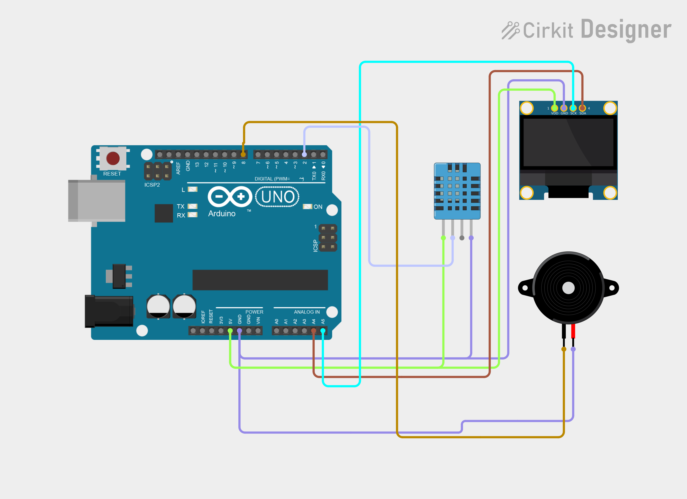

# Project 09 — Temperature Alarm 🚨

[](#difficulty)
[](#hardware-used)
[](#hardware-used)

## Overview

The **Temperature Alarm** monitors thermal conditions using a **DHT11 sensor**. If ambient temperature rises above a preset safety threshold (`30.0°C`), the system activates a **Piezo Buzzer** warning alarm and displays `"!! HIGH TEMP !!"` on the OLED screen.

This project introduces:
* Threshold-based conditional monitoring
* Actuating audible alerts based on environmental telemetry
* Industrial safety logic for thermal protection

---

## Hardware Required

| Component | Quantity | Notes |
| :--- | :---: | :--- |
| **Arduino Uno** | 1 | Microcontroller board |
| **DHT11 Sensor** | 1 | Digital temperature sensor |
| **Piezo Buzzer** | 1 | Sound module (+ to D8, - to GND) |
| **0.96" I2C OLED Display** | 1 | 128x64 pixels (SSD1306 controller, address `0x3C`) |
| **Breadboard** | 1 | Solderless prototyping board |
| **Jumper Wires** | 8–9 | Male-to-Male wires |

---

## Circuit Connections

| Component Pin | Arduino Pin | Description |
| :--- | :--- | :--- |
| **DHT11 Data** | **Digital Pin 2** | One-Wire sensor signal |
| **DHT11 VCC** | **5V** | Power (+5V) |
| **DHT11 GND** | **GND** | Ground |
| **Buzzer (+)** | **Digital Pin 8** | Audio alarm trigger |
| **Buzzer (−)** | **GND** | Ground |
| **OLED VCC** | **5V** | Display Power (+5V) |
| **OLED GND** | **GND** | Display Ground |
| **OLED SDA** | **Analog Pin A4** | I2C Data Line |
| **OLED SCL** | **Analog Pin A5** | I2C Clock Line |

---

## Circuit Diagram

### Wiring Diagram


### Schematic (ASCII)

```text
Arduino UNO

             ┌───────────────────────┐
      A5 ────┤ SCL                   │
      A4 ────┤ SDA   0.96" SSD1306   │
      5V ────┤ VCC   OLED Display    │
     GND ────┤ GND                   │
             └───────────────────────┘

      D2 ───────────[ DHT11 DATA ]
      D8 ───────────[ Piezo Buzzer (+) ] ────> GND
```

---

## Arduino Code

Available in [`09_temperature_alarm.ino`](09_temperature_alarm.ino).

```cpp
#include <Wire.h>
#include <Adafruit_GFX.h>
#include <Adafruit_SSD1306.h>
#include <DHT.h>

#define SCREEN_WIDTH 128
#define SCREEN_HEIGHT 64
#define OLED_RESET -1
#define OLED_ADDRESS 0x3C

#define DHT_PIN 2
#define DHT_TYPE DHT11
#define BUZZER_PIN 8
#define TEMP_LIMIT 30.0

DHT dht(DHT_PIN, DHT_TYPE);
Adafruit_SSD1306 display(SCREEN_WIDTH, SCREEN_HEIGHT, &Wire, OLED_RESET);

void setup() {
  pinMode(BUZZER_PIN, OUTPUT);
  digitalWrite(BUZZER_PIN, LOW);
  dht.begin();

  if (!display.begin(SSD1306_SWITCHCAPVCC, OLED_ADDRESS)) {
    while (true);
  }

  display.clearDisplay();
  display.setTextColor(SSD1306_WHITE);
  display.setTextSize(1); display.setCursor(25, 5);  display.println("TEMPERATURE");
  display.setCursor(35, 18); display.println("ALARM");
  display.setTextSize(2); display.setCursor(30, 35); display.println("READY");
  display.display();
  delay(1500);
}

void loop() {
  float temperature = dht.readTemperature();

  display.clearDisplay();
  display.setTextColor(SSD1306_WHITE);
  display.setTextSize(1); display.setCursor(32, 0); display.println("TEMP ALARM");

  if (isnan(temperature)) {
    digitalWrite(BUZZER_PIN, LOW);
    display.setTextSize(2);
    display.setCursor(10, 20); display.println("SENSOR");
    display.setCursor(25, 43); display.println("ERROR");
  } else {
    display.setTextSize(1); display.setCursor(5, 16);  display.print("Temperature: ");
    display.setTextSize(2); display.setCursor(25, 27); display.print(temperature, 1); display.print(" C");

    if (temperature >= TEMP_LIMIT) {
      digitalWrite(BUZZER_PIN, HIGH);
      display.setTextSize(1); display.setCursor(30, 50); display.println("!! HIGH TEMP !!");
    } else {
      digitalWrite(BUZZER_PIN, LOW);
      display.setTextSize(1); display.setCursor(45, 50); display.println("NORMAL");
    }
  }

  display.display();
  delay(2000);
}
```

---

## How It Works

1. **Continuous Sampling**: Reads temperature every 2 seconds.
2. **Threshold Logic**: Compares temperature against `TEMP_LIMIT` (default 30.0°C).
3. **Alarm Trigger**: If temperature exceeds limit, Pin 8 is driven `HIGH` to sound the buzzer while the OLED screen flashes `"!! HIGH TEMP !!"`.
