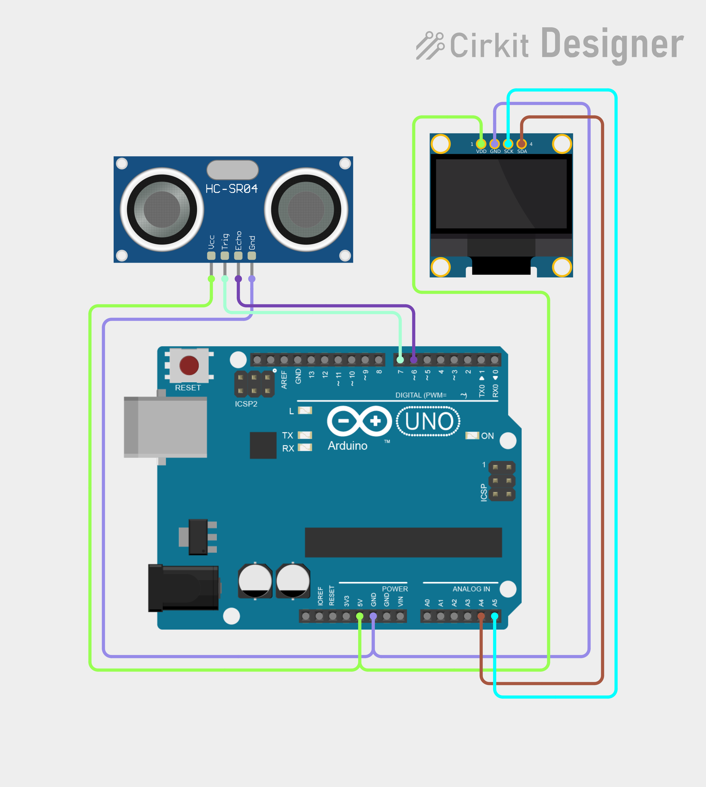

# Project 10 — Digital Distance Meter (HC-SR04 + OLED) 📏

[](#difficulty)
[](#hardware-used)
[](#hardware-used)

## Overview

The **Digital Distance Meter** uses an **HC-SR04 Ultrasonic Distance Sensor** to accurately measure distance to nearby obstacles. The calculated distance is formatted and displayed in both centimeters (`cm`) and inches (`inch`) on a 0.96" SSD1306 OLED screen.

This project introduces:
* Ultrasonic distance measurement principles (Time of Flight)
* Pulse timing using `pulseIn()`
* Speed of sound physics calculations ($v = 343\text{ m/s} = 0.0343\text{ cm/}\mu\text{s}$)
* Range validation and error bounds handling

---

## Hardware Required

| Component | Quantity | Notes |
| :--- | :---: | :--- |
| **Arduino Uno** | 1 | Microcontroller board |
| **HC-SR04 Ultrasonic Sensor** | 1 | Ultrasonic range finder |
| **0.96" I2C OLED Display** | 1 | 128x64 pixels (SSD1306 controller, address `0x3C`) |
| **Breadboard** | 1 | Solderless prototyping board |
| **Jumper Wires** | 7–8 | Male-to-Male wires |

---

## Circuit Connections

| Component Pin | Arduino Pin | Description |
| :--- | :--- | :--- |
| **HC-SR04 TRIG** | **Digital Pin 7** | Ultrasonic trigger pulse pin |
| **HC-SR04 ECHO** | **Digital Pin 6** | Ultrasonic echo return pin |
| **HC-SR04 VCC** | **5V** | Power (+5V) |
| **HC-SR04 GND** | **GND** | Ground |
| **OLED VCC** | **5V** | Display Power (+5V) |
| **OLED GND** | **GND** | Display Ground |
| **OLED SDA** | **Analog Pin A4** | I2C Data Line |
| **OLED SCL** | **Analog Pin A5** | I2C Clock Line |

---

## Circuit Diagram

### Wiring Diagram


### Schematic (ASCII)

```text
Arduino UNO

             ┌───────────────────────┐
      A5 ────┤ SCL                   │
      A4 ────┤ SDA   0.96" SSD1306   │
      5V ────┤ VCC   OLED Display    │
     GND ────┤ GND                   │
             └───────────────────────┘

      D7 ───────────[ HC-SR04 TRIG ]
      D6 ───────────[ HC-SR04 ECHO ]
```

---

## Arduino Code

Available in [`10_distance_meter.ino`](10_distance_meter.ino).

```cpp
#include <Wire.h>
#include <Adafruit_GFX.h>
#include <Adafruit_SSD1306.h>

#define SCREEN_WIDTH 128
#define SCREEN_HEIGHT 64
#define OLED_RESET -1
#define OLED_ADDRESS 0x3C

#define TRIG_PIN 7
#define ECHO_PIN 6

Adafruit_SSD1306 display(SCREEN_WIDTH, SCREEN_HEIGHT, &Wire, OLED_RESET);

void setup() {
  pinMode(TRIG_PIN, OUTPUT);
  pinMode(ECHO_PIN, INPUT);
  digitalWrite(TRIG_PIN, LOW);

  if (!display.begin(SSD1306_SWITCHCAPVCC, OLED_ADDRESS)) {
    while (true);
  }

  display.clearDisplay();
  display.setTextColor(SSD1306_WHITE);
  display.setTextSize(1); display.setCursor(30, 5);  display.println("DIGITAL");
  display.setCursor(25, 18); display.println("DISTANCE");
  display.setTextSize(2); display.setCursor(30, 38); display.println("METER");
  display.display();
  delay(1500);
}

void loop() {
  digitalWrite(TRIG_PIN, LOW);  delayMicroseconds(2);
  digitalWrite(TRIG_PIN, HIGH); delayMicroseconds(10);
  digitalWrite(TRIG_PIN, LOW);

  long duration = pulseIn(ECHO_PIN, HIGH, 30000);
  float distanceCm = duration * 0.0343 / 2.0;

  display.clearDisplay();
  display.setTextColor(SSD1306_WHITE);
  display.setTextSize(1); display.setCursor(25, 0); display.println("DIGITAL DISTANCE");

  if (duration == 0 || distanceCm > 400 || distanceCm < 2) {
    display.setTextSize(2);
    display.setCursor(20, 25); display.println("OUT OF");
    display.setCursor(25, 45); display.println("RANGE");
  } else {
    float distanceInch = distanceCm / 2.54;
    display.setTextSize(1); display.setCursor(5, 18);  display.println("Distance:");
    display.setTextSize(2); display.setCursor(15, 30); display.print(distanceCm, 1); display.print(" cm");
    display.setTextSize(1); display.setCursor(25, 52); display.print(distanceInch, 1); display.println(" inch");
  }

  display.display();
  delay(200);
}
```

---

## Physics Calculation Formula

The HC-SR04 transmits a 40kHz ultrasonic sound burst and measures the round-trip travel duration $t$ (in microseconds):
$$\text{Distance (cm)} = \frac{t \times 0.0343}{2}$$
Dividing by 2 accounts for the sound wave traveling out to the target and reflecting back to the sensor.
