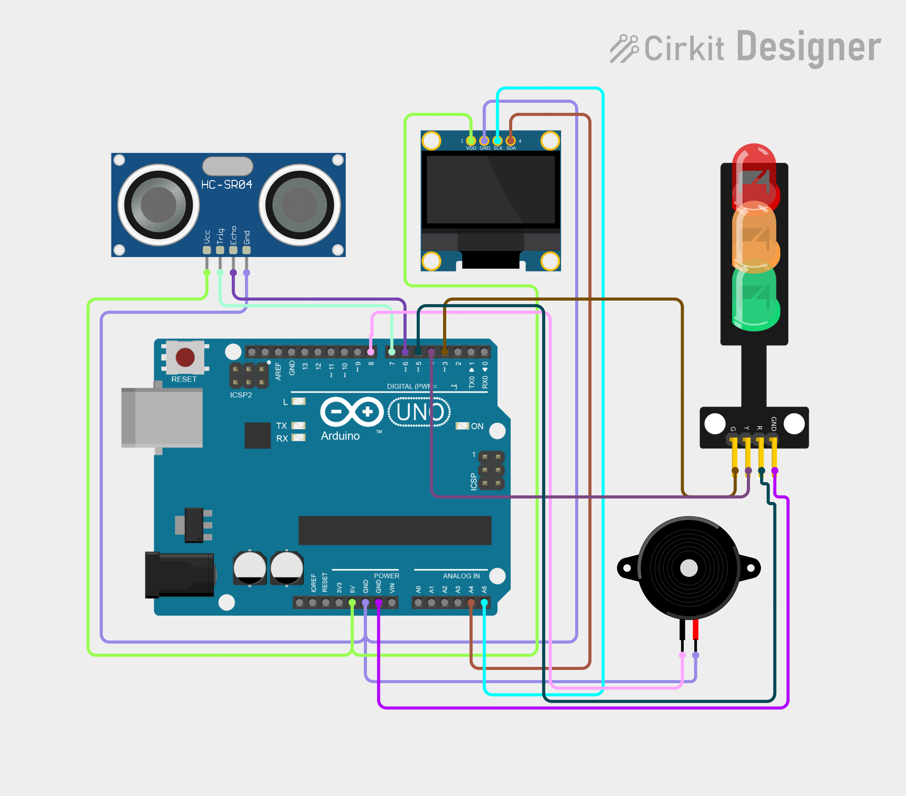

# Project 11 — Smart Parking Indicator 🚗🔊

[](#difficulty)
[](#hardware-used)
[](#hardware-used)

## Overview

The **Smart Parking Indicator** replicates an automotive reverse parking radar system. Using an HC-SR04 ultrasonic sensor, 3 color-coded LEDs (Green, Yellow, Red), a piezo buzzer, and an OLED display, it provides visual and acoustic distance warnings as an obstacle approaches.

This project introduces:
* Multi-stage zone classification (SAFE, CAUTION, STOP)
* Non-blocking audio warning tones (`millis()` frequency modulation)
* Multi-output hardware integration (LEDs + Buzzer + OLED + Sensor)

---

## Hardware Required

| Component | Quantity | Notes |
| :--- | :---: | :--- |
| **Arduino Uno** | 1 | Microcontroller board |
| **HC-SR04 Ultrasonic Sensor** | 1 | Distance sensor |
| **5mm LEDs** | 3 | 1x Green, 1x Yellow, 1x Red |
| **220Ω Resistors** | 3 | Resistors for LEDs |
| **Piezo Buzzer** | 1 | Audio warning module (+ to D8, - to GND) |
| **0.96" I2C OLED Display** | 1 | 128x64 pixels (SSD1306 controller, address `0x3C`) |
| **Breadboard & Jumpers** | 1 | Solderless board & wires |

---

## Circuit Connections & Parking Zones

| Distance Zone | Status | Green LED (D3) | Yellow LED (D4) | Red LED (D5) | Buzzer Beep |
| :--- | :---: | :---: | :---: | :---: | :---: |
| **> 50 cm** | **SAFE** | **ON** | OFF | OFF | Silent |
| **20–50 cm** | **CAUTION** | OFF | **ON** | OFF | 1000ms slow beep |
| **< 20 cm** | **STOP!** | OFF | OFF | **ON** | 250ms fast beep |

---

## Circuit Diagram

### Wiring Diagram


### Schematic (ASCII)

```text
Arduino UNO

             ┌───────────────────────┐
      A5 ────┤ SCL                   │
      A4 ────┤ SDA   0.96" SSD1306   │
      5V ────┤ VCC   OLED Display    │
     GND ────┤ GND                   │
             └───────────────────────┘

      D7 ───────────[ HC-SR04 TRIG ]
      D6 ───────────[ HC-SR04 ECHO ]
      D3 ────[ 220Ω ]───> Green LED ────> GND
      D4 ────[ 220Ω ]───> Yellow LED ───> GND
      D5 ────[ 220Ω ]───> Red LED ──────> GND
      D8 ───────────[ Piezo Buzzer (+) ]─> GND
```

---

## Arduino Code

Available in [`11_parking_indicator.ino`](11_parking_indicator.ino).

```cpp
#include <Wire.h>
#include <Adafruit_GFX.h>
#include <Adafruit_SSD1306.h>

#define SCREEN_WIDTH 128
#define SCREEN_HEIGHT 64
#define OLED_RESET -1

Adafruit_SSD1306 display(SCREEN_WIDTH, SCREEN_HEIGHT, &Wire, OLED_RESET);

#define TRIG 7
#define ECHO 6
#define GREEN 3
#define YELLOW 4
#define RED 5
#define BUZZER 8

unsigned long lastBeep = 0;

void setup() {
  pinMode(TRIG, OUTPUT); pinMode(ECHO, INPUT);
  pinMode(GREEN, OUTPUT); pinMode(YELLOW, OUTPUT); pinMode(RED, OUTPUT); pinMode(BUZZER, OUTPUT);
  display.begin(SSD1306_SWITCHCAPVCC, 0x3C);
  display.setTextColor(SSD1306_WHITE);
}

void loop() {
  digitalWrite(TRIG, LOW);  delayMicroseconds(2);
  digitalWrite(TRIG, HIGH); delayMicroseconds(10);
  digitalWrite(TRIG, LOW);

  long duration = pulseIn(ECHO, HIGH, 30000);
  float distance = duration * 0.0343 / 2.0;

  digitalWrite(GREEN, LOW); digitalWrite(YELLOW, LOW); digitalWrite(RED, LOW);

  display.clearDisplay();
  display.setTextSize(1); display.setCursor(25, 0); display.println("PARKING INDICATOR");
  display.setTextSize(2); display.setCursor(15, 20);

  if (duration == 0 || distance > 400) {
    display.println("NO OBJECT");
    digitalWrite(GREEN, HIGH);
    noTone(BUZZER);
  } else if (distance > 50) {
    digitalWrite(GREEN, HIGH);
    display.println("SAFE");
    noTone(BUZZER);
  } else if (distance >= 20) {
    digitalWrite(YELLOW, HIGH);
    display.println("CAUTION");
    if (millis() - lastBeep >= 1000) {
      tone(BUZZER, 1000, 150);
      lastBeep = millis();
    }
  } else {
    digitalWrite(RED, HIGH);
    display.println("STOP!");
    if (millis() - lastBeep >= 250) {
      tone(BUZZER, 1500, 100);
      lastBeep = millis();
    }
  }

  display.setTextSize(1); display.setCursor(35, 48);
  if (duration != 0 && distance <= 400) {
    display.print(distance, 1); display.println(" cm");
  }
  display.display();
  delay(50);
}
```
