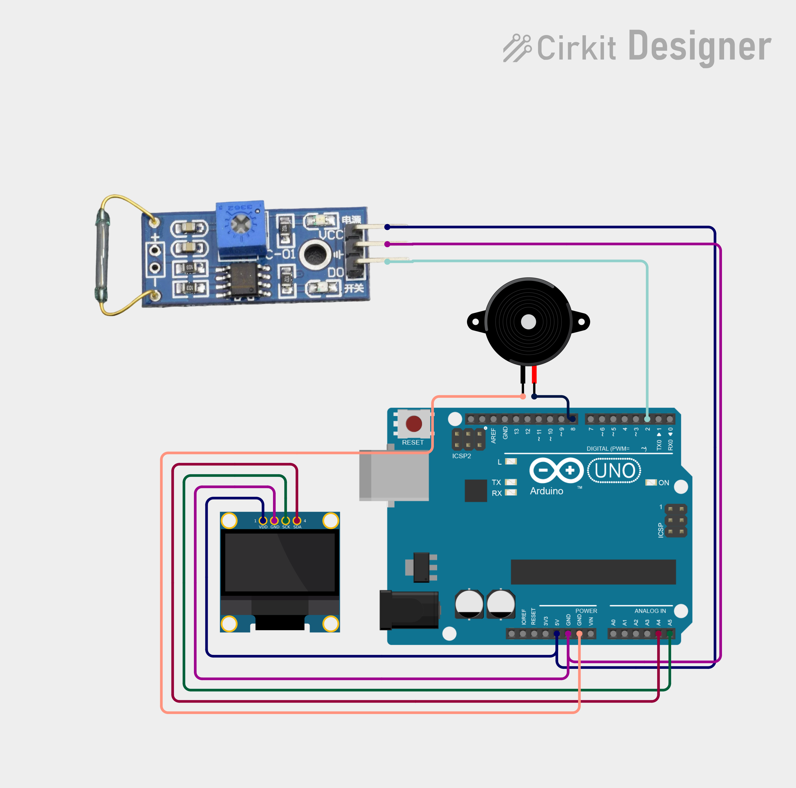

# Project 13 — Door Alarm (Reed Switch + Buzzer + OLED) 🚪🔔

[](#difficulty)
[](#hardware-used)
[](#hardware-used)

## Overview

The **Door Alarm** is a magnetic contact security monitor. Using a **Magnetic Reed Switch Module**, it detects whether a door or window is open or closed based on proximity to a magnet. When the door opens (magnet moves away), the sensor output switches to `HIGH`, triggering the **Piezo Buzzer** to sound an alarm and showing `"DOOR OPEN"` on the 0.96" SSD1306 OLED screen. When closed, the buzzer turns off and the screen displays `"DOOR CLOSED"`.

This project introduces:
* Magnetic reed switch operation and proximity detection
* Security and anti-theft intrusion monitoring logic
* Digital input polling and real-time state alerts on an OLED screen

---

## Hardware Required

| Component | Quantity | Notes |
| :--- | :---: | :--- |
| **Arduino Uno** | 1 | Microcontroller board |
| **Magnetic Reed Switch Module** | 1 | Contact switch with digital output (`DO`) |
| **Piezo Buzzer** | 1 | Audio warning module (+ to D8, - to GND) |
| **0.96" I2C OLED Display** | 1 | 128x64 pixels (SSD1306 controller, address `0x3C`) |
| **Breadboard & Jumpers** | 1 | Prototyping board & connecting wires |

---

## Circuit Connections

| Component Pin | Arduino Pin | Description |
| :--- | :--- | :--- |
| **Reed Module DO** | **Digital Pin 2** | Digital output (`HIGH` = Door Open / Magnet away) |
| **Reed Module VCC** | **5V** | Power (+5V) |
| **Reed Module GND** | **GND** | Ground |
| **Buzzer (+)** | **Digital Pin 8** | Audio alarm trigger |
| **Buzzer (−)** | **GND** | Ground |
| **OLED VCC** | **5V** | Display Power (+5V) |
| **OLED GND** | **GND** | Display Ground |
| **OLED SDA** | **Analog Pin A4** | I2C Data Line |
| **OLED SCL** | **Analog Pin A5** | I2C Clock Line |

---

## Circuit Diagram

### Wiring Diagram


### Schematic (ASCII)

```text
Arduino UNO

             ┌───────────────────────┐
      A5 ────┤ SCL                   │
      A4 ────┤ SDA   0.96" SSD1306   │
      5V ────┤ VCC   OLED Display    │
     GND ────┤ GND                   │
             └───────────────────────┘

      D2 ───────────[ Reed Switch DO ] (VCC -> 5V, GND -> GND)
      D8 ───────────[ Piezo Buzzer (+) ] ────> GND
```

---

## Arduino Code

Available in [`13_door_alarm.ino`](13_door_alarm.ino).

```cpp
#include <Wire.h>
#include <Adafruit_GFX.h>
#include <Adafruit_SSD1306.h>

#define REED_PIN 2
#define BUZZER_PIN 8

#define SCREEN_WIDTH 128
#define SCREEN_HEIGHT 64
#define OLED_RESET -1

Adafruit_SSD1306 display(
  SCREEN_WIDTH,
  SCREEN_HEIGHT,
  &Wire,
  OLED_RESET
);

void setup() {
  pinMode(REED_PIN, INPUT);
  pinMode(BUZZER_PIN, OUTPUT);

  display.begin(SSD1306_SWITCHCAPVCC, 0x3C);
  display.setTextColor(SSD1306_WHITE);
}

void loop() {

  int reedState = digitalRead(REED_PIN);

  display.clearDisplay();

  display.setTextSize(1);
  display.setCursor(30, 5);
  display.println("DOOR ALARM");

  display.setTextSize(2);

  if (reedState == HIGH) {
    // Door open
    digitalWrite(BUZZER_PIN, HIGH);

    display.setCursor(10, 28);
    display.println("DOOR OPEN");
  }
  else {
    // Door closed
    digitalWrite(BUZZER_PIN, LOW);

    display.setCursor(5, 28);
    display.println("DOOR CLOSED");
  }

  display.display();

  delay(100);
}
```

---

## How It Works

1. **Contact Detection**: The reed switch module detects the magnetic field from an accompanying magnet attached to a door or frame.
2. **Door Open State**: When the door opens, the magnet moves away. The module output on pin `D2` reads `HIGH`. The buzzer activates on pin `D8`, and the OLED displays `"DOOR OPEN"`.
3. **Door Closed State**: When the door is shut, the magnet pulls the reed switch contacts closed. The module output reads `LOW`, turning off the buzzer and displaying `"DOOR CLOSED"`.
