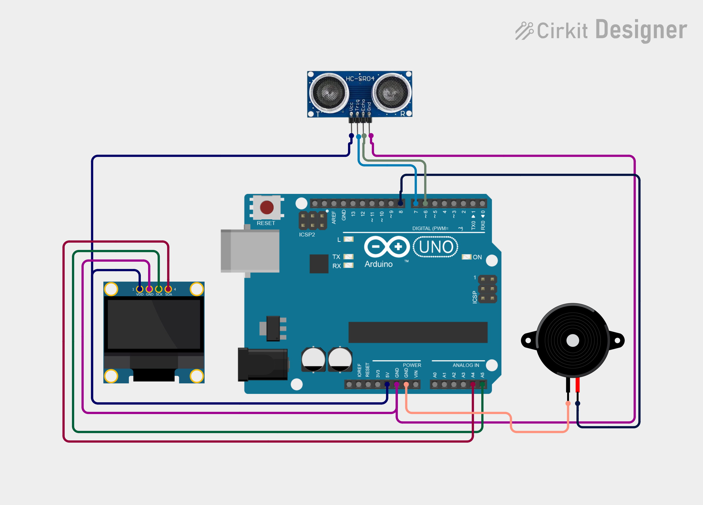

# Project 14 — Touchless Doorbell (Ultrasonic Sensor + Buzzer + OLED) 🔔🖐️

[](#difficulty)
[](#hardware-used)
[](#hardware-used)

## Overview

The **Touchless Doorbell** is a hygienic, contact-free visitor alert system. Utilizing an **HC-SR04 Ultrasonic Sensor**, it detects when a visitor brings their hand near the sensor within a 10 cm proximity threshold. Upon detection, a pleasant chime tone plays through the **Piezo Buzzer** using Arduino's `tone()` function and `"DING! DOORBELL"` is displayed on the 0.96" SSD1306 OLED screen.

This project introduces:
* Ultrasonic distance measurement and pulse timing with `pulseIn()`
* Non-contact proximity triggering
* Generating tone frequencies on a piezo buzzer with `tone()`
* Responsive UI status updates on an OLED display

---

## Hardware Required

| Component | Quantity | Notes |
| :--- | :---: | :--- |
| **Arduino Uno** | 1 | Microcontroller board |
| **HC-SR04 Ultrasonic Sensor** | 1 | Non-contact distance sensor |
| **Piezo Buzzer** | 1 | Audio chime module (+ to D8, - to GND) |
| **0.96" I2C OLED Display** | 1 | 128x64 pixels (SSD1306 controller, address `0x3C`) |
| **Breadboard & Jumpers** | 1 | Prototyping board & connecting wires |

---

## Circuit Connections

| Component Pin | Arduino Pin | Description |
| :--- | :--- | :--- |
| **HC-SR04 Trig** | **Digital Pin 7** | Ultrasonic trigger pulse output |
| **HC-SR04 Echo** | **Digital Pin 6** | Echo return pulse input |
| **HC-SR04 VCC** | **5V** | Sensor Power (+5V) |
| **HC-SR04 GND** | **GND** | Sensor Ground |
| **Buzzer (+)** | **Digital Pin 8** | Audio tone signal |
| **Buzzer (−)** | **GND** | Ground |
| **OLED VCC** | **5V** | Display Power (+5V) |
| **OLED GND** | **GND** | Display Ground |
| **OLED SDA** | **Analog Pin A4** | I2C Data Line |
| **OLED SCL** | **Analog Pin A5** | I2C Clock Line |

---

## Circuit Diagram

### Wiring Diagram


### Schematic (ASCII)

```text
Arduino UNO

             ┌───────────────────────┐
      A5 ────┤ SCL                   │
      A4 ────┤ SDA   0.96" SSD1306   │
      5V ────┤ VCC   OLED Display    │
     GND ────┤ GND                   │
             └───────────────────────┘

      D7 ───────────[ HC-SR04 TRIG ] (VCC -> 5V, GND -> GND)
      D6 ───────────[ HC-SR04 ECHO ]
      D8 ───────────[ Piezo Buzzer (+) ] ────> GND
```

---

## Arduino Code

Available in [`14_touchless_doorbell.ino`](14_touchless_doorbell.ino).

```cpp
#include <Wire.h>
#include <Adafruit_GFX.h>
#include <Adafruit_SSD1306.h>

#define TRIG_PIN 7
#define ECHO_PIN 6
#define BUZZER_PIN 8

#define SCREEN_WIDTH 128
#define SCREEN_HEIGHT 64
#define OLED_RESET -1

Adafruit_SSD1306 display(
  SCREEN_WIDTH,
  SCREEN_HEIGHT,
  &Wire,
  OLED_RESET
);

void setup() {
  pinMode(TRIG_PIN, OUTPUT);
  pinMode(ECHO_PIN, INPUT);
  pinMode(BUZZER_PIN, OUTPUT);

  display.begin(SSD1306_SWITCHCAPVCC, 0x3C);
  display.setTextColor(SSD1306_WHITE);
}

void loop() {

  // Send ultrasonic pulse
  digitalWrite(TRIG_PIN, LOW);
  delayMicroseconds(2);

  digitalWrite(TRIG_PIN, HIGH);
  delayMicroseconds(10);
  digitalWrite(TRIG_PIN, LOW);

  long duration = pulseIn(ECHO_PIN, HIGH, 30000);

  float distance = duration * 0.0343 / 2;

  display.clearDisplay();
  display.setTextSize(1);
  display.setCursor(30, 5);
  display.println("TOUCHLESS");

  display.setTextSize(2);

  if (distance > 0 && distance <= 10) {

    tone(BUZZER_PIN, 1500, 500);

    display.setCursor(20, 25);
    display.println("DING!");

    display.setCursor(15, 48);
    display.setTextSize(1);
    display.println("DOORBELL");

    delay(1000);

  } else {

    noTone(BUZZER_PIN);

    display.setCursor(30, 28);
    display.println("READY");
  }

  display.display();

  delay(100);
}
```

---

## How It Works

1. **Pulse Transmission & Measurement**: The Arduino triggers a 10 µs high-frequency acoustic burst from the HC-SR04 `TRIG` pin. The sensor calculates echo reflection time on the `ECHO` pin via `pulseIn()`.
2. **Distance Calculation**: Distance in cm is calculated using the speed of sound: `distance = (duration * 0.0343) / 2`.
3. **Proximity Trigger**: If an object (such as a hand) is detected within range (`0 < distance <= 10 cm`):
   - The buzzer emits a 1500 Hz chime tone for 500 ms.
   - The OLED display presents `"DING! DOORBELL"`.
   - A 1-second pause prevents repeated re-triggering.
4. **Idle State**: When no hand is detected within 10 cm, the buzzer remains off and the screen displays `"READY"`.
