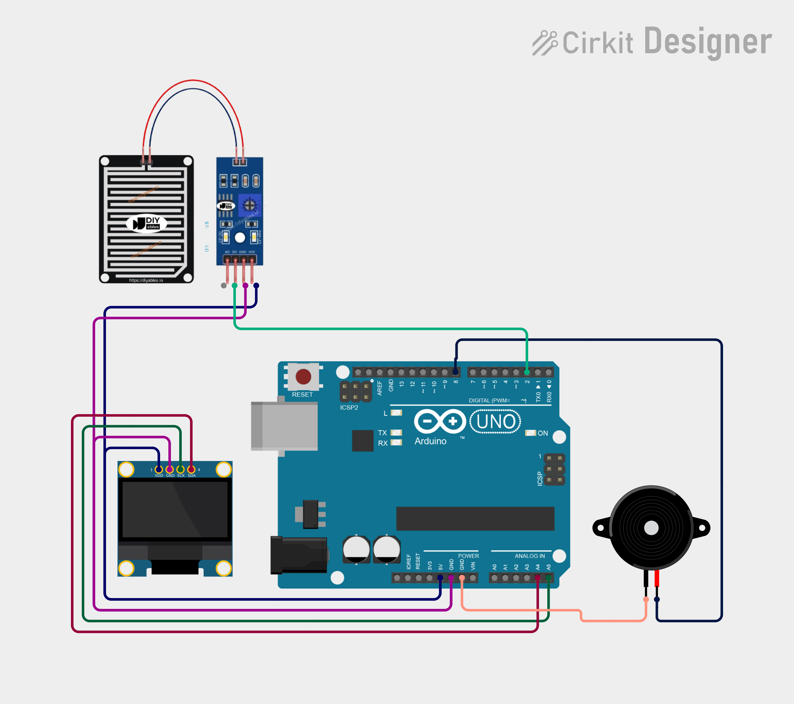

# Project 15 — Rain Alarm (Raindrop Sensor + Buzzer + OLED) 🌧️🔔

[](#difficulty)
[](#hardware-used)
[](#hardware-used)

## Overview

The **Rain Alarm** is an environmental warning and weather monitoring system. Utilizing a **Raindrop Sensor Module** (comprising a nickel-plated sensing board and an LM393 comparator driver), it detects moisture or rainfall precipitation. When water drops hit the sensor board, the comparator switches its digital output to `LOW`, which activates the **Piezo Buzzer** alarm and prompts `"RAIN DETECTED!"` on the 0.96" SSD1306 OLED screen.

This project introduces:
* Resistive moisture sensing principles using conductive traces
* Digital threshold configuration via LM393 potentiometer
* Inverted active-LOW logic evaluation (`rainState == LOW`)
* Alert notification interfaces with OLED display and buzzer

---

## Hardware Required

| Component | Quantity | Notes |
| :--- | :---: | :--- |
| **Arduino Uno** | 1 | Microcontroller board |
| **Raindrop Sensor Module** | 1 | Sensing plate + LM393 comparator module |
| **Piezo Buzzer** | 1 | Sound alert module (+ to D8, - to GND) |
| **0.96" I2C OLED Display** | 1 | 128x64 pixels (SSD1306 controller, address `0x3C`) |
| **Breadboard & Jumpers** | 1 | Prototyping board & connecting wires |

---

## Circuit Connections

| Component Pin | Arduino Pin | Description |
| :--- | :--- | :--- |
| **Rain Module DO** | **Digital Pin 2** | Digital output (`LOW` = Rain detected) |
| **Rain Module VCC** | **5V** | Power (+5V) |
| **Rain Module GND** | **GND** | Ground |
| **Buzzer (+)** | **Digital Pin 8** | Audio alarm pin |
| **Buzzer (−)** | **GND** | Ground |
| **OLED VCC** | **5V** | Display Power (+5V) |
| **OLED GND** | **GND** | Display Ground |
| **OLED SDA** | **Analog Pin A4** | I2C Data Line |
| **OLED SCL** | **Analog Pin A5** | I2C Clock Line |

---

## Circuit Diagram

### Wiring Diagram


### Schematic (ASCII)

```text
Arduino UNO

             ┌───────────────────────┐
      A5 ────┤ SCL                   │
      A4 ────┤ SDA   0.96" SSD1306   │
      5V ────┤ VCC   OLED Display    │
     GND ────┤ GND                   │
             └───────────────────────┘

      D2 ───────────[ Rain Module DO ] (VCC -> 5V, GND -> GND)
      D8 ───────────[ Piezo Buzzer (+) ] ────> GND
```

---

## Arduino Code

Available in [`15_rain_alarm.ino`](15_rain_alarm.ino).

```cpp
#include <Wire.h>
#include <Adafruit_GFX.h>
#include <Adafruit_SSD1306.h>

#define RAIN_PIN 2
#define BUZZER_PIN 8

#define SCREEN_WIDTH 128
#define SCREEN_HEIGHT 64
#define OLED_RESET -1

Adafruit_SSD1306 display(
  SCREEN_WIDTH,
  SCREEN_HEIGHT,
  &Wire,
  OLED_RESET
);

void setup() {
  pinMode(RAIN_PIN, INPUT);
  pinMode(BUZZER_PIN, OUTPUT);

  display.begin(SSD1306_SWITCHCAPVCC, 0x3C);
  display.setTextColor(SSD1306_WHITE);
}

void loop() {

  int rainState = digitalRead(RAIN_PIN);

  display.clearDisplay();

  display.setTextSize(1);
  display.setCursor(30, 5);
  display.println("RAIN ALARM");

  display.setTextSize(2);

  // Most rain sensor modules give LOW when rain is detected
  if (rainState == LOW) {

    digitalWrite(BUZZER_PIN, HIGH);

    display.setCursor(5, 25);
    display.println("RAIN");

    display.setCursor(5, 45);
    display.println("DETECTED!");

  } else {

    digitalWrite(BUZZER_PIN, LOW);

    display.setCursor(20, 30);
    display.println("NO RAIN");
  }

  display.display();

  delay(200);
}
```

---

## How It Works

1. **Resistance Measurement**: When water droplets land across the interleaved conductive traces of the sensor plate, electrical resistance between the tracks drops significantly.
2. **Comparator Switching**: The LM393 comparator detects this drop compared to the potentiometer threshold and pulls the digital output pin (`DO`) `LOW`.
3. **Alarm Triggering**: When the Arduino reads `LOW` on digital pin `D2`:
   - Pin `D8` drives `HIGH`, sounding the piezo buzzer.
   - The OLED display presents `"RAIN DETECTED!"`.
4. **Dry / Idle Condition**: When no rain is present (or the plate is dried), resistance remains high, `DO` outputs `HIGH`, the buzzer silences, and the screen displays `"NO RAIN"`.
