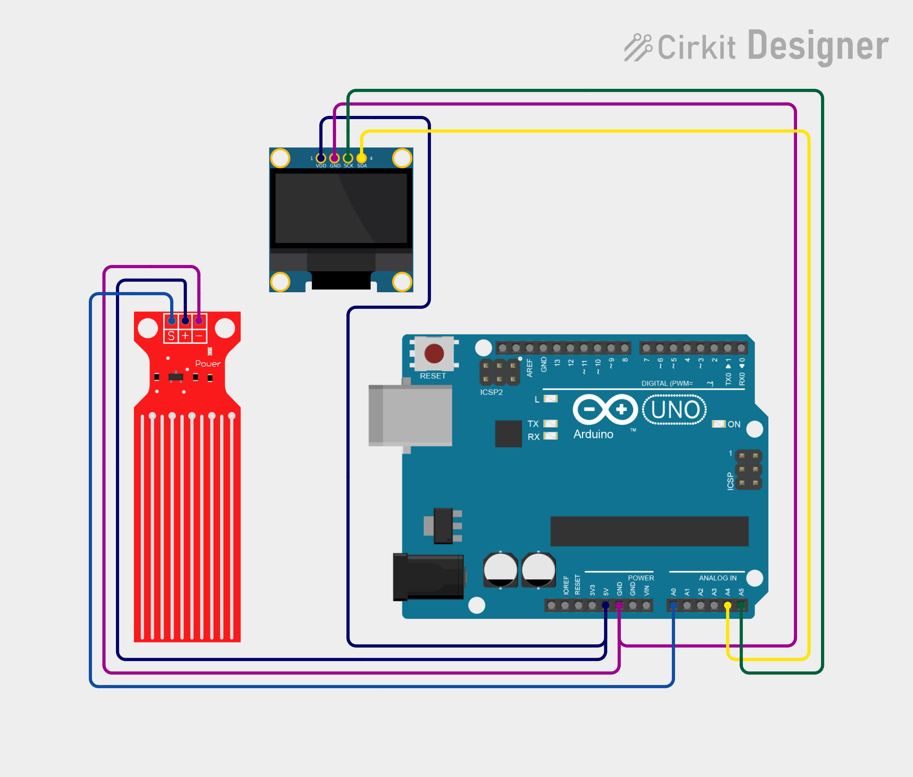

# Project 16 — Water Level Indicator (Water Level Sensor + OLED) 💧📊

[](#difficulty)
[](#hardware-used)
[](#hardware-used)

## Overview

The **Water Level Indicator** is an analog fluid level detection and monitoring system. Using a **Submersible Water Level Sensor Module** with exposed parallel conductive traces, it detects the depth of water by measuring changes in electrical resistance. The Arduino Uno reads this analog voltage, converts it into a calibrated percentage (`0% - 100%`), and presents both the percentage and a descriptive status (`LOW`, `MEDIUM`, `HIGH`, `VERY HIGH`, or `FULL`) on a 0.96" SSD1306 I2C OLED display.

This project introduces:
* Analog resistance measurement across exposed conductive traces
* Data mapping (`map()` and `constrain()`) for proportional percentage calculation
* Dynamic multi-level categorization and display formatting on an OLED screen

---

## Hardware Required

| Component | Quantity | Notes |
| :--- | :---: | :--- |
| **Arduino Uno** | 1 | Microcontroller board |
| **Water Level Sensor Module** | 1 | Analog resistive depth sensor board |
| **0.96" I2C OLED Display** | 1 | 128x64 pixels (SSD1306 controller, address `0x3C`) |
| **Breadboard & Jumpers** | 1 | Prototyping board & connecting wires |

---

## Circuit Connections

| Component Pin | Arduino Pin | Description |
| :--- | :--- | :--- |
| **Water Sensor Signal (S)** | **Analog Pin A0** | Analog output voltage proportional to water submersion |
| **Water Sensor VCC (+)** | **5V** | Power (+5V) |
| **Water Sensor GND (-)** | **GND** | Ground |
| **OLED VCC** | **5V** | Display Power (+5V) |
| **OLED GND** | **GND** | Display Ground |
| **OLED SDA** | **Analog Pin A4** | I2C Data Line |
| **OLED SCL** | **Analog Pin A5** | I2C Clock Line |

---

## Circuit Diagram

### Wiring Diagram


### Schematic (ASCII)

```text
Arduino UNO

             ┌───────────────────────┐
      A5 ────┤ SCL                   │
      A4 ────┤ SDA   0.96" SSD1306   │
      5V ────┤ VCC   OLED Display    │
     GND ────┤ GND                   │
             └───────────────────────┘

      A0 ───────────[ Sensor Signal (S) ]
      5V ───────────[ Sensor VCC (+)    ] Water Level Sensor
     GND ───────────[ Sensor GND (-)    ]
```

---

## Arduino Code

Available in [`16_water_level.ino`](16_water_level.ino).

```cpp
#include <Wire.h>
#include <Adafruit_GFX.h>
#include <Adafruit_SSD1306.h>

#define SENSOR A0

#define SCREEN_WIDTH 128
#define SCREEN_HEIGHT 64
#define OLED_RESET -1

Adafruit_SSD1306 display(
  SCREEN_WIDTH, SCREEN_HEIGHT,
  &Wire, OLED_RESET
);

void setup() {
  display.begin(SSD1306_SWITCHCAPVCC, 0x3C);
  display.setTextColor(SSD1306_WHITE);
}

void loop() {
  int value = analogRead(SENSOR);

  int level = map(value, 0, 1023, 0, 100);
  level = constrain(level, 0, 100);

  display.clearDisplay();

  display.setTextSize(1);
  display.setCursor(30, 5);
  display.println("WATER LEVEL");

  display.setTextSize(2);
  display.setCursor(35, 22);
  display.print(level);
  display.println("%");

  display.setTextSize(1);
  display.setCursor(35, 48);

  if (level < 25)
    display.println("LOW");
  else if (level < 50)
    display.println("MEDIUM");
  else if (level < 75)
    display.println("HIGH");
  else if (level < 90)
    display.println("VERY HIGH");
  else
    display.println("FULL");

  display.display();

  delay(500);
}
```

---

## How It Works

1. **Resistance Sensing**: The sensor consists of parallel exposed copper traces. When immersed in water, the conductive liquid acts as a variable resistor between the traces. As the water level rises, more traces are submerged, decreasing resistance and increasing the analog voltage output.
2. **Analog-to-Digital Conversion**: The Arduino's ADC reads the voltage at analog pin `A0` as an integer between `0` (dry) and `1023` (fully submerged).
3. **Scaling & Constraining**: The `map(value, 0, 1023, 0, 100)` function translates the raw 10-bit reading into a percentage (`0% - 100%`), and `constrain()` keeps it within safe bounds.
4. **Display & Threshold Categorization**: The OLED screen clears and updates every 500ms, displaying:
   - Header title: `"WATER LEVEL"`
   - Current percentage in large font: e.g., `45%`
   - Classification tier:
     - `< 25%`: `LOW`
     - `25% - 49%`: `MEDIUM`
     - `50% - 74%`: `HIGH`
     - `75% - 89%`: `VERY HIGH`
     - `≥ 90%`: `FULL`
