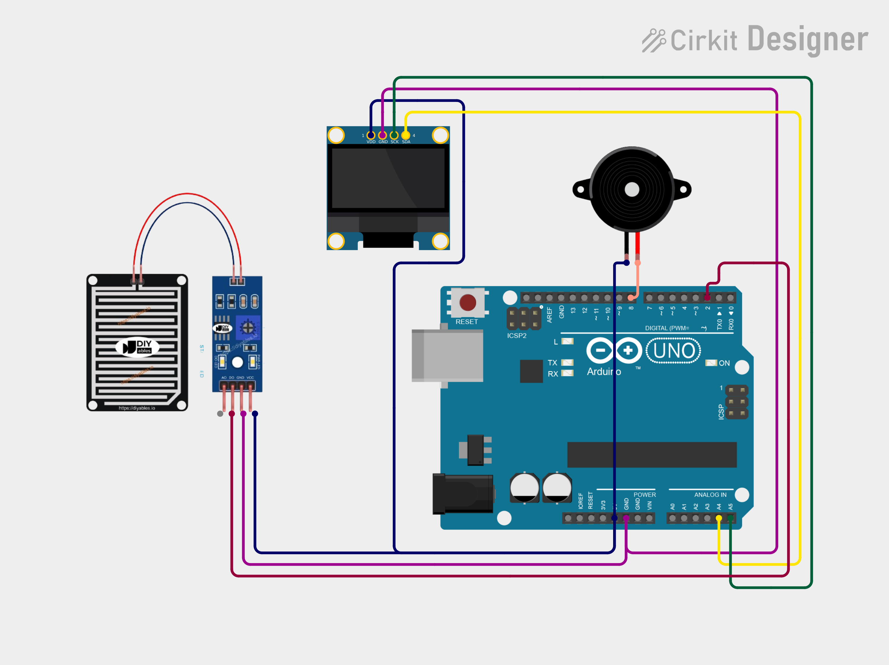

# Project 17 — Water Leakage Alarm (Water Leak Sensor + Buzzer + OLED) 🚰🚨

[](#difficulty)
[](#hardware-used)
[](#hardware-used)

## Overview

The **Water Leakage Alarm** is an early-warning flood and pipe-leak prevention device. Using a **Water Leak / Droplet Detection Sensor Module** paired with an onboard LM393 comparator, it monitors surfaces (such as under sinks, near water heaters, or in basements) for unexpected moisture or flooding. When water touches the detection grid, the digital output triggers `LOW`, driving the **Piezo Buzzer** to sound an urgent alarm and presenting `"WATER LEAK!"` on the 0.96" SSD1306 OLED display. When dry, the screen indicates `"NO LEAK"` and the buzzer remains silent.

This project introduces:
* Interleaved trace resistive leak sensing with comparator modules
* Active-LOW digital threshold switching logic
* Dual alert integration (auditory buzzer alert + visual OLED state)

---

## Hardware Required

| Component | Quantity | Notes |
| :--- | :---: | :--- |
| **Arduino Uno** | 1 | Microcontroller board |
| **Water Leak Sensor Module** | 1 | Sensing plate + LM393 comparator module with digital output (`DO`) |
| **Piezo Buzzer** | 1 | Audio warning module (+ to D8, - to GND) |
| **0.96" I2C OLED Display** | 1 | 128x64 pixels (SSD1306 controller, address `0x3C`) |
| **Breadboard & Jumpers** | 1 | Prototyping board & connecting wires |

---

## Circuit Connections

| Component Pin | Arduino Pin | Description |
| :--- | :--- | :--- |
| **Water Module DO** | **Digital Pin 2** | Digital output (`LOW` = Water leak detected) |
| **Water Module VCC** | **5V** | Power (+5V) |
| **Water Module GND** | **GND** | Ground |
| **Buzzer (+)** | **Digital Pin 8** | Audio alarm pin |
| **Buzzer (−)** | **GND** | Ground |
| **OLED VCC** | **5V** | Display Power (+5V) |
| **OLED GND** | **GND** | Display Ground |
| **OLED SDA** | **Analog Pin A4** | I2C Data Line |
| **OLED SCL** | **Analog Pin A5** | I2C Clock Line |

---

## Circuit Diagram

### Wiring Diagram


### Schematic (ASCII)

```text
Arduino UNO

             ┌───────────────────────┐
      A5 ────┤ SCL                   │
      A4 ────┤ SDA   0.96" SSD1306   │
      5V ────┤ VCC   OLED Display    │
     GND ────┤ GND                   │
             └───────────────────────┘

      D2 ───────────[ Water Module DO ] (VCC -> 5V, GND -> GND)
      D8 ───────────[ Piezo Buzzer (+) ] ────> GND
```

---

## Arduino Code

Available in [`17_water_leakage_alarm.ino`](17_water_leakage_alarm.ino).

```cpp
#include <Wire.h>
#include <Adafruit_GFX.h>
#include <Adafruit_SSD1306.h>

#define SENSOR_PIN 2
#define BUZZER_PIN 8

#define SCREEN_WIDTH 128
#define SCREEN_HEIGHT 64
#define OLED_RESET -1

Adafruit_SSD1306 display(
  SCREEN_WIDTH, SCREEN_HEIGHT,
  &Wire, OLED_RESET
);

void setup() {
  pinMode(SENSOR_PIN, INPUT);
  pinMode(BUZZER_PIN, OUTPUT);

  display.begin(SSD1306_SWITCHCAPVCC, 0x3C);
  display.setTextColor(SSD1306_WHITE);
}

void loop() {
  int water = digitalRead(SENSOR_PIN);

  display.clearDisplay();
  display.setTextSize(1);
  display.setCursor(30, 5);
  display.println("LEAK ALARM");

  display.setTextSize(2);

  // Most modules output LOW when water is detected
  if (water == LOW) {
    digitalWrite(BUZZER_PIN, HIGH);

    display.setCursor(15, 28);
    display.println("WATER");
    display.setCursor(25, 48);
    display.println("LEAK!");
  } else {
    digitalWrite(BUZZER_PIN, LOW);

    display.setCursor(25, 32);
    display.println("NO LEAK");
  }

  display.display();
  delay(200);
}
```

---

## How It Works

1. **Conductivity Trigger**: Under normal conditions, the open circuits between adjacent traces on the sensor probe maintain high electrical resistance. When water accumulates on or touches the probe, water acts as a conductor, closing the circuit.
2. **Comparator Digital Output**: The LM393 comparator compares the probe's voltage against an adjustable threshold set by the trimmer potentiometer. When water is detected, the comparator output pin (`DO`) switches to `LOW`.
3. **Emergency Alarm Activation**: The Arduino reads `LOW` on digital pin `D2`:
   - Digital pin `D8` is driven `HIGH`, triggering the piezo buzzer.
   - The OLED display clears and flashes `"WATER LEAK!"`.
4. **Normal Standby State**: When the leak is cleared or the sensor dries, `DO` returns to `HIGH`, the buzzer shuts off, and the display returns to `"NO LEAK"`.
