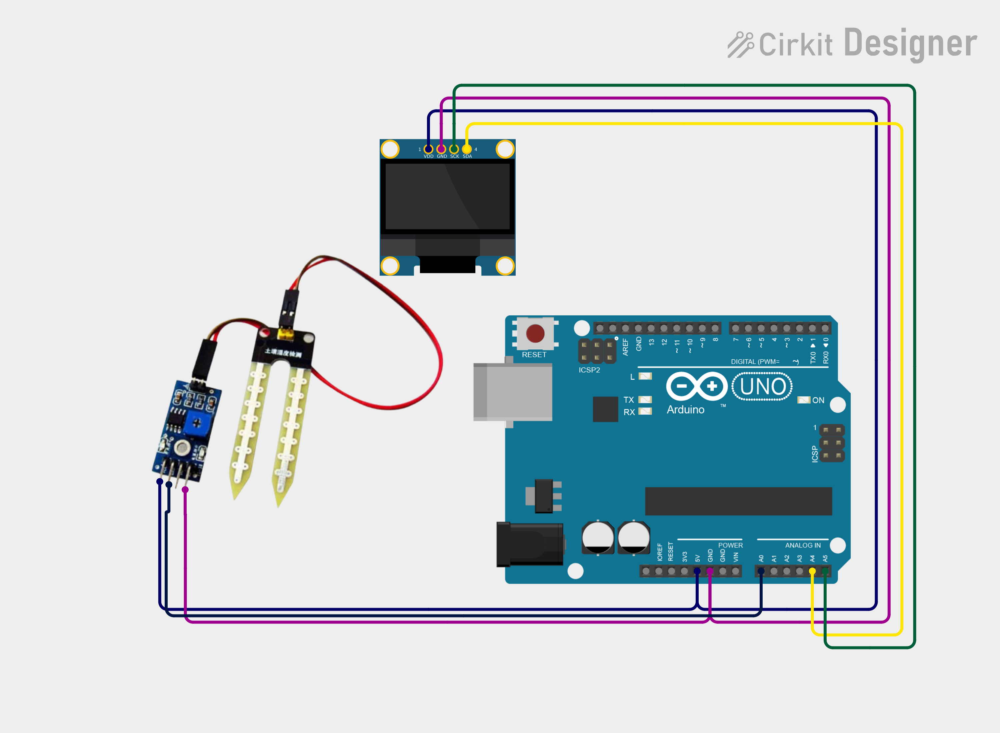

# Project 18 — Soil Moisture Meter (Soil Moisture Sensor + OLED) 🌱💧

[](#difficulty)
[](#hardware-used)
[](#hardware-used)

## Overview

The **Soil Moisture Meter** is an automated plant and agricultural hydration monitoring system. Utilizing a **Resistive Soil Moisture Sensor Probe**, it measures the electrical conductivity of surrounding soil. Because moisture conducts electricity, higher moisture levels result in lower electrical resistance, producing a lower raw analog voltage reading. The Arduino Uno applies inverse calibration mapping to calculate the moisture percentage (`0% - 100%`) and displays the percentage alongside an intuitive category (`DRY`, `MOIST`, or `WET`) on a 0.96" SSD1306 OLED screen.

This project introduces:
* Soil conductivity and volumetric water content measurement
* Inverted analog mapping (`map(value, 1023, 0, 0, 100)`)
* Smart agriculture and plant health monitoring display

---

## Hardware Required

| Component | Quantity | Notes |
| :--- | :---: | :--- |
| **Arduino Uno** | 1 | Microcontroller board |
| **Soil Moisture Sensor Module** | 1 | Two-prong probe with signal conditioning board (Analog Pin `AO`) |
| **0.96" I2C OLED Display** | 1 | 128x64 pixels (SSD1306 controller, address `0x3C`) |
| **Breadboard & Jumpers** | 1 | Prototyping board & connecting wires |

---

## Circuit Connections

| Component Pin | Arduino Pin | Description |
| :--- | :--- | :--- |
| **Soil Sensor AO** | **Analog Pin A0** | Analog output voltage inversely proportional to soil moisture |
| **Soil Sensor VCC** | **5V** | Power (+5V) |
| **Soil Sensor GND** | **GND** | Ground |
| **OLED VCC** | **5V** | Display Power (+5V) |
| **OLED GND** | **GND** | Display Ground |
| **OLED SDA** | **Analog Pin A4** | I2C Data Line |
| **OLED SCL** | **Analog Pin A5** | I2C Clock Line |

---

## Circuit Diagram

### Wiring Diagram


### Schematic (ASCII)

```text
Arduino UNO

             ┌───────────────────────┐
      A5 ────┤ SCL                   │
      A4 ────┤ SDA   0.96" SSD1306   │
      5V ────┤ VCC   OLED Display    │
     GND ────┤ GND                   │
             └───────────────────────┘

      A0 ───────────[ Soil Module AO  ]
      5V ───────────[ Soil Module VCC ] Soil Moisture Sensor
     GND ───────────[ Soil Module GND ]
```

---

## Arduino Code

Available in [`18_soil_moisture.ino`](18_soil_moisture.ino).

```cpp
#include <Wire.h>
#include <Adafruit_GFX.h>
#include <Adafruit_SSD1306.h>

#define SENSOR A0

#define SCREEN_WIDTH 128
#define SCREEN_HEIGHT 64
#define OLED_RESET -1

Adafruit_SSD1306 display(
  SCREEN_WIDTH, SCREEN_HEIGHT,
  &Wire, OLED_RESET
);

void setup() {
  display.begin(SSD1306_SWITCHCAPVCC, 0x3C);
  display.setTextColor(SSD1306_WHITE);
}

void loop() {
  int value = analogRead(SENSOR);

  // Most sensors: higher reading = drier soil
  int moisture = map(value, 1023, 0, 0, 100);
  moisture = constrain(moisture, 0, 100);

  display.clearDisplay();

  display.setTextSize(1);
  display.setCursor(28, 5);
  display.println("SOIL MOISTURE");

  display.setTextSize(2);
  display.setCursor(35, 22);
  display.print(moisture);
  display.println("%");

  display.setTextSize(1);
  display.setCursor(40, 48);

  if (moisture < 30)
    display.println("DRY");
  else if (moisture < 70)
    display.println("MOIST");
  else
    display.println("WET");

  display.display();

  delay(500);
}
```

---

## How It Works

1. **Conductivity & Probe Resistance**: Two exposed prongs inserted into the soil form a variable resistor in a voltage divider circuit. Water dissolved with soil minerals acts as an electrolyte. When soil is wet, electrical resistance between the prongs is low; when dry, resistance is very high.
2. **Inverted Mapping Logic**: The sensor module outputs an analog voltage where dry air or dry soil produces values near `1023`, while saturation produces values closer to `0`. The formula `map(value, 1023, 0, 0, 100)` inverts this reading so that `0%` corresponds to bone-dry and `100%` represents fully saturated soil.
3. **Condition Classification**:
   - `< 30%`: Classified as `"DRY"` (irrigation recommended)
   - `30% - 69%`: Classified as `"MOIST"` (optimal hydration range)
   - `≥ 70%`: Classified as `"WET"` (saturated / recently watered)
4. **OLED Visual Refresh**: Every 500ms, the screen updates the title, current percentage, and state classification for continuous real-time plant care monitoring.
