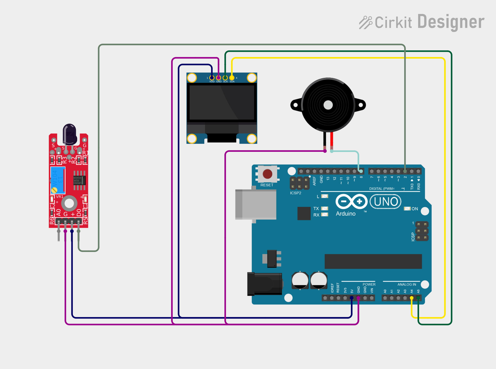

# Project 19 — Flame Alarm (IR Flame Sensor + Buzzer + OLED) 🔥🔔

[](#difficulty)
[](#hardware-used)
[](#hardware-used)

## Overview

The **Flame Alarm** is an optical fire detection and life safety alert system. Utilizing an **Infrared (IR) Flame Sensor Module**, it detects electromagnetic radiation emitted in the shortwave infrared spectrum (typically wavelengths between 760nm and 1100nm) produced by open fires and naked flames. When a flame is introduced near the sensor, the onboard LM393 comparator pulls the digital output `LOW`, instantly triggering the **Piezo Buzzer** alarm and flashing `"FLAME DETECTED!"` across the 0.96" SSD1306 OLED screen.

This project introduces:
* Infrared phototransistor optical sensing principles
* High-speed fire and ember detection interfacing
* Active-LOW comparator logic with simultaneous audiovisual alerting

---

## Hardware Required

| Component | Quantity | Notes |
| :--- | :---: | :--- |
| **Arduino Uno** | 1 | Microcontroller board |
| **IR Flame Sensor Module** | 1 | High-sensitivity infrared receiver + LM393 comparator (Digital Output `DO`) |
| **Piezo Buzzer** | 1 | Audio warning module (+ to D8, - to GND) |
| **0.96" I2C OLED Display** | 1 | 128x64 pixels (SSD1306 controller, address `0x3C`) |
| **Breadboard & Jumpers** | 1 | Prototyping board & connecting wires |

---

## Circuit Connections

| Component Pin | Arduino Pin | Description |
| :--- | :--- | :--- |
| **Flame Module DO** | **Digital Pin 2** | Digital output (`LOW` = Flame detected) |
| **Flame Module VCC** | **5V** | Power (+5V) |
| **Flame Module GND** | **GND** | Ground |
| **Buzzer (+)** | **Digital Pin 8** | Audio alarm pin |
| **Buzzer (−)** | **GND** | Ground |
| **OLED VCC** | **5V** | Display Power (+5V) |
| **OLED GND** | **GND** | Display Ground |
| **OLED SDA** | **Analog Pin A4** | I2C Data Line |
| **OLED SCL** | **Analog Pin A5** | I2C Clock Line |

---

## Circuit Diagram

### Wiring Diagram


### Schematic (ASCII)

```text
Arduino UNO

             ┌───────────────────────┐
      A5 ────┤ SCL                   │
      A4 ────┤ SDA   0.96" SSD1306   │
      5V ────┤ VCC   OLED Display    │
     GND ────┤ GND                   │
             └───────────────────────┘

      D2 ───────────[ Flame Module DO ] (VCC -> 5V, GND -> GND)
      D8 ───────────[ Piezo Buzzer (+) ] ────> GND
```

---

## Arduino Code

Available in [`19_flame_alarm.ino`](19_flame_alarm.ino).

```cpp
#include <Wire.h>
#include <Adafruit_GFX.h>
#include <Adafruit_SSD1306.h>

#define FLAME_PIN 2
#define BUZZER_PIN 8

#define SCREEN_WIDTH 128
#define SCREEN_HEIGHT 64
#define OLED_RESET -1

Adafruit_SSD1306 display(
  SCREEN_WIDTH, SCREEN_HEIGHT,
  &Wire, OLED_RESET
);

void setup() {
  pinMode(FLAME_PIN, INPUT);
  pinMode(BUZZER_PIN, OUTPUT);

  display.begin(SSD1306_SWITCHCAPVCC, 0x3C);
  display.setTextColor(SSD1306_WHITE);
}

void loop() {
  int flame = digitalRead(FLAME_PIN);

  display.clearDisplay();
  display.setTextSize(1);
  display.setCursor(35, 5);
  display.println("FLAME ALARM");

  display.setTextSize(2);

  // Most flame modules output LOW when flame is detected
  if (flame == LOW) {
    digitalWrite(BUZZER_PIN, HIGH);

    display.setCursor(5, 28);
    display.println("FLAME");
    display.setCursor(5, 48);
    display.println("DETECTED!");
  } else {
    digitalWrite(BUZZER_PIN, LOW);

    display.setCursor(25, 32);
    display.println("NO FLAME");
  }

  display.display();
  delay(200);
}
```

---

## How It Works

1. **Infrared Radiation Detection**: Fire emits distinctive infrared wavelengths (760nm - 1100nm). The black receiver photodiode on the front of the module changes conductance when exposed to IR radiation in this band.
2. **Comparator Sensitivity Adjustment**: The onboard LM393 comparator evaluates the photodiode signal against an adjustable reference voltage tuned by the blue potentiometer. When the IR light intensity exceeds the set threshold, `DO` drops to `LOW`.
3. **Emergency Alarm Triggering**:
   - The Arduino reads digital pin `D2`.
   - If `flame == LOW`, `D8` goes `HIGH`, activating the piezo buzzer siren.
   - The OLED display displays `"FLAME DETECTED!"` in double-sized font.
4. **Safe Quenching / Standby**: When the flame is removed or extinguished, `DO` returns to `HIGH`, silencing the buzzer and displaying `"NO FLAME"`.
