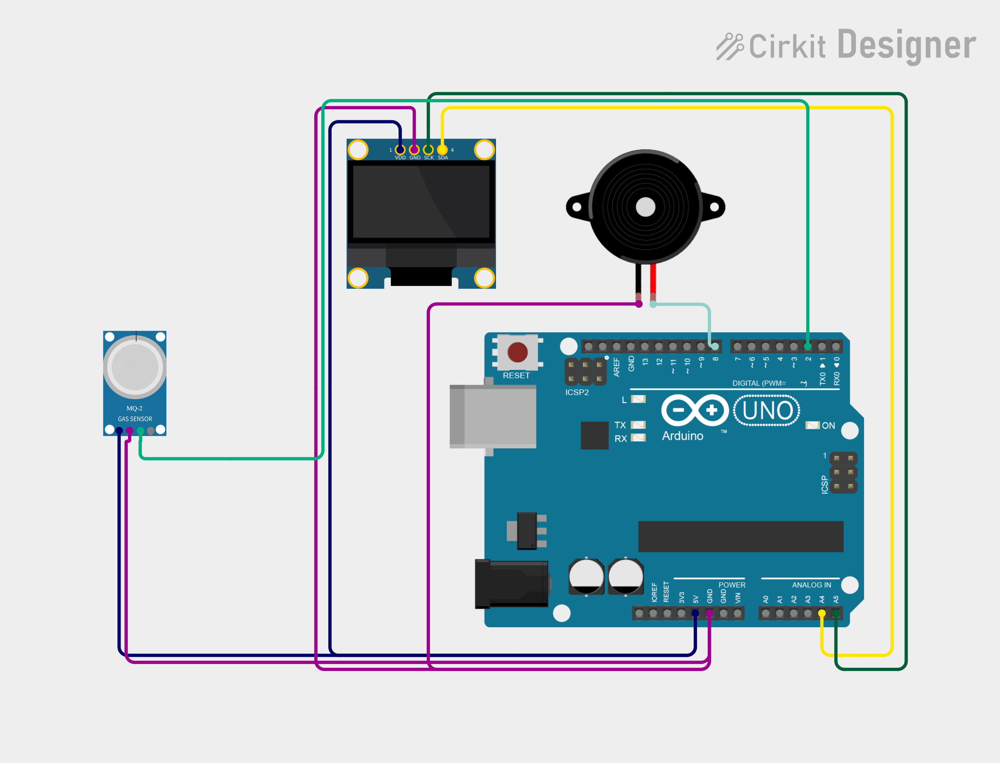

# Project 20 — Gas & Smoke Alarm (MQ-2 Gas Sensor + Buzzer + OLED) ⚠️💨

[](#difficulty)
[](#hardware-used)
[](#hardware-used)

## Overview

The **Gas & Smoke Alarm** is an indoor air safety monitor designed to detect combustible gases and airborne smoke particulates. Utilizing an **MQ-2 Semiconductor Gas Sensor Module**, it detects liquefied petroleum gas (LPG), methane, butane, alcohol, and smoke emissions. When gas or smoke concentration exceeds the trigger threshold, the module's digital output switches to `LOW`, activating the **Piezo Buzzer** siren and displaying `"GAS DETECTED!"` on the 0.96" SSD1306 OLED screen. When air is safe, the buzzer silences and the screen shows `"SAFE"`.

This project introduces:
* Metal oxide semiconductor (SnO2) gas sensing principles
* Preheating and warm-up requirements for electrochemical sensors
* Threshold calibration via LM393 trimmer potentiometer
* Emergency audio warning and status display

---

## Hardware Required

| Component | Quantity | Notes |
| :--- | :---: | :--- |
| **Arduino Uno** | 1 | Microcontroller board |
| **MQ-2 Gas / Smoke Sensor Module** | 1 | Electrochemical sensor + LM393 comparator board (`DO`) |
| **Piezo Buzzer** | 1 | Audio warning module (+ to D8, - to GND) |
| **0.96" I2C OLED Display** | 1 | 128x64 pixels (SSD1306 controller, address `0x3C`) |
| **Breadboard & Jumpers** | 1 | Prototyping board & connecting wires |

---

## Circuit Connections

| Component Pin | Arduino Pin | Description |
| :--- | :--- | :--- |
| **Gas Module DO** | **Digital Pin 2** | Digital output (`LOW` = Gas/Smoke detected) |
| **Gas Module VCC** | **5V** | Power (+5V, ~150mA for heater) |
| **Gas Module GND** | **GND** | Ground |
| **Buzzer (+)** | **Digital Pin 8** | Audio alarm pin |
| **Buzzer (−)** | **GND** | Ground |
| **OLED VCC** | **5V** | Display Power (+5V) |
| **OLED GND** | **GND** | Display Ground |
| **OLED SDA** | **Analog Pin A4** | I2C Data Line |
| **OLED SCL** | **Analog Pin A5** | I2C Clock Line |

---

## Circuit Diagram

### Wiring Diagram


### Schematic (ASCII)

```text
Arduino UNO

             ┌───────────────────────┐
      A5 ────┤ SCL                   │
      A4 ────┤ SDA   0.96" SSD1306   │
      5V ────┤ VCC   OLED Display    │
     GND ────┤ GND                   │
             └───────────────────────┘

      D2 ───────────[ Gas Module DO ] (VCC -> 5V, GND -> GND)
      D8 ───────────[ Piezo Buzzer (+) ] ────> GND
```

---

## Arduino Code

Available in [`20_gas_smoke_alarm.ino`](20_gas_smoke_alarm.ino).

```cpp
#include <Wire.h>
#include <Adafruit_GFX.h>
#include <Adafruit_SSD1306.h>

#define GAS_PIN 2
#define BUZZER_PIN 8

#define SCREEN_WIDTH 128
#define SCREEN_HEIGHT 64
#define OLED_RESET -1

Adafruit_SSD1306 display(
  SCREEN_WIDTH, SCREEN_HEIGHT,
  &Wire, OLED_RESET
);

void setup() {
  pinMode(GAS_PIN, INPUT);
  pinMode(BUZZER_PIN, OUTPUT);

  display.begin(SSD1306_SWITCHCAPVCC, 0x3C);
  display.setTextColor(SSD1306_WHITE);
}

void loop() {
  int gas = digitalRead(GAS_PIN);

  display.clearDisplay();

  display.setTextSize(1);
  display.setCursor(35, 5);
  display.println("GAS ALARM");

  display.setTextSize(2);

  // Most MQ-2 modules output LOW when gas exceeds threshold
  if (gas == LOW) {
    digitalWrite(BUZZER_PIN, HIGH);

    display.setCursor(5, 28);
    display.println("GAS");
    display.setCursor(5, 48);
    display.println("DETECTED!");
  } else {
    digitalWrite(BUZZER_PIN, LOW);

    display.setCursor(35, 32);
    display.println("SAFE");
  }

  display.display();
  delay(200);
}
```

---

## How It Works

1. **Tin Dioxide (SnO2) Sensing Element**: The MQ-2 sensor houses an internal micro-heater and an electro-ceramic cylinder coated with tin dioxide. In clean air, oxygen atoms adsorb onto the surface, impeding electric current.
2. **Conductivity Modulation**: When reducing gases (LPG, methane, butane) or smoke are present, they react with adsorbed oxygen, releasing electrons back into the semiconductor and causing electrical conductivity to jump substantially.
3. **Threshold Detection**: An LM393 comparator compares the sensor resistance to the potentiometer reference level. When gas concentration crosses the user-set threshold, the `DO` pin pulls `LOW`.
4. **Emergency Alarm Triggering**:
   - The Arduino reads `LOW` on pin `D2`.
   - The piezo buzzer is driven `HIGH` on pin `D8`.
   - The OLED screen shows `"GAS DETECTED!"`.
5. **Clear Condition**: Once clean air circulates and gas dissipates below the threshold, `DO` returns to `HIGH`, the buzzer turns off, and the OLED displays `"SAFE"`.

> [!NOTE]
> MQ-series sensors require an initial burn-in warm-up time (20–30 seconds during bench testing, up to 24–48 hours for precise analog gas calibration) for the internal heating element to reach operating temperature and stabilize readings.
