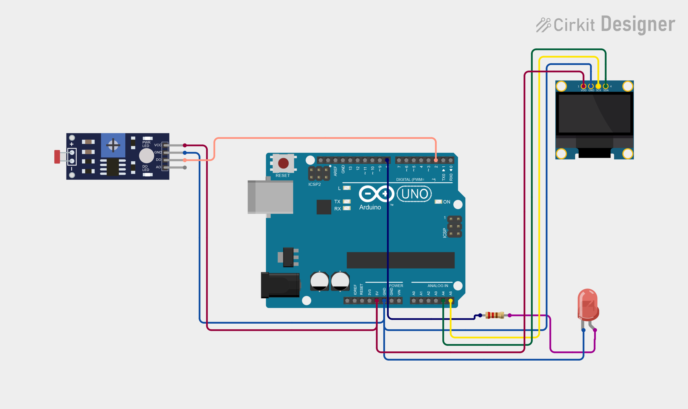

# Project 21 — Automatic Night Lamp (LDR Sensor + LED + OLED) 🌙💡

[](#difficulty)
[](#hardware-used)
[](#hardware-used)

## Overview

The **Automatic Night Lamp** is an intelligent illumination and smart street lighting system. Utilizing a **Light Dependent Resistor (LDR / Photoresistor) Module** equipped with an LM393 comparator, it monitors ambient room or outdoor lighting levels. When ambient light drops below the configured threshold (darkness or nighttime), the module's digital output transitions to `LOW`. The Arduino Uno detects this transition, automatically turns **ON** the night lamp LED on pin `D8`, and displays `"NIGHT"` and `"LIGHT ON"` on the 0.96" SSD1306 OLED screen. During the day, the LED shuts off and the display reads `"DAYLIGHT"`.

This project introduces:
* Photoelectric sensing and ambient lux variation using CdS photoresistors
* Threshold calibration via LM393 trimmer potentiometer
* Active-LOW digital input state detection
* Automated energy-saving lighting control with status OLED feedback

---

## Hardware Required

| Component | Quantity | Notes |
| :--- | :---: | :--- |
| **Arduino Uno** | 1 | Microcontroller board (powered via USB cable) |
| **LDR Light Sensor Module** | 1 | Photoresistor + LM393 comparator module with digital output (`DO`) |
| **5mm LED** | 1 | White, Yellow, or Red LED (or standard LED module) |
| **0.96" I2C OLED Display** | 1 | 128x64 pixels (SSD1306 controller, address `0x3C`) |
| **Breadboard & Jumpers** | 1 | Prototyping board & connecting wires |

---

## Circuit Connections

| Component Pin | Arduino Pin | Description |
| :--- | :--- | :--- |
| **LDR Module DO** | **Digital Pin 2** | Digital output (`LOW` = Darkness / Night detected) |
| **LDR Module VCC** | **5V** | Power (+5V) |
| **LDR Module GND** | **GND** | Ground |
| **LED Anode (+)** | **Digital Pin 8** | Digital control output (5V = ON, 0V = OFF) |
| **LED Cathode (−)** | **GND** | Ground |
| **OLED VCC** | **5V** | Display Power (+5V) |
| **OLED GND** | **GND** | Display Ground |
| **OLED SDA** | **Analog Pin A4** | I2C Data Line |
| **OLED SCL** | **Analog Pin A5** | I2C Clock Line |

---

## Circuit Diagram

### Wiring Diagram


### Schematic (ASCII)

```text
Arduino UNO

             ┌───────────────────────┐
      A5 ────┤ SCL                   │
      A4 ────┤ SDA   0.96" SSD1306   │
      5V ────┤ VCC   OLED Display    │
     GND ────┤ GND                   │
             └───────────────────────┘

      D2 ───────────[ LDR Module DO ] (VCC -> 5V, GND -> GND)
      D8 ───────────[ LED Anode (+) ] ────> LED Cathode (-) -> GND
```

---

## Arduino Code

Available in [`21_night_lamp.ino`](21_night_lamp.ino).

```cpp
#include <Wire.h>
#include <Adafruit_GFX.h>
#include <Adafruit_SSD1306.h>

#define LDR_PIN 2
#define LED_PIN 8

#define SCREEN_WIDTH 128
#define SCREEN_HEIGHT 64
#define OLED_RESET -1

Adafruit_SSD1306 display(
  SCREEN_WIDTH,
  SCREEN_HEIGHT,
  &Wire,
  OLED_RESET
);

void setup() {
  pinMode(LDR_PIN, INPUT);
  pinMode(LED_PIN, OUTPUT);

  display.begin(SSD1306_SWITCHCAPVCC, 0x3C);
  display.setTextColor(SSD1306_WHITE);
}

void loop() {

  int lightState = digitalRead(LDR_PIN);

  display.clearDisplay();

  display.setTextSize(1);
  display.setCursor(25, 5);
  display.println("AUTOMATIC LIGHT");

  display.setTextSize(2);

  // Most LDR modules give LOW in darkness
  if (lightState == LOW) {

    digitalWrite(LED_PIN, HIGH);

    display.setCursor(5, 28);
    display.println("NIGHT");

    display.setCursor(5, 48);
    display.println("LIGHT ON");

  } else {

    digitalWrite(LED_PIN, LOW);

    display.setCursor(15, 35);
    display.println("DAYLIGHT");
  }

  display.display();

  delay(200);
}
```

---

## How It Works

1. **Photoconductivity Principle**: The LDR (Light Dependent Resistor) is made of a high-resistance semiconductor material (Cadmium Sulfide). In bright sunlight or ambient daylight, photons hit the semiconductor, releasing free electrons and causing electrical resistance to drop dramatically. In dark conditions, resistance increases to hundreds of kilo-ohms.
2. **Comparator Switching**: The onboard LM393 comparator compares the voltage from the LDR divider against a reference voltage set by the sensitivity potentiometer. When ambient light drops below the threshold, the digital output (`DO`) pulls `LOW`.
3. **Automatic Illumination**:
   - The Arduino reads `LOW` on digital pin `D2`.
   - Digital pin `D8` goes `HIGH` (+5V), turning ON the night lamp LED.
   - The OLED display updates with `"NIGHT"` and `"LIGHT ON"`.
4. **Daytime Conservation**: When ambient light returns above the threshold, `DO` returns to `HIGH`. Pin `D8` switches to `LOW` (shutting off the LED to conserve power) and the OLED displays `"DAYLIGHT"`.
