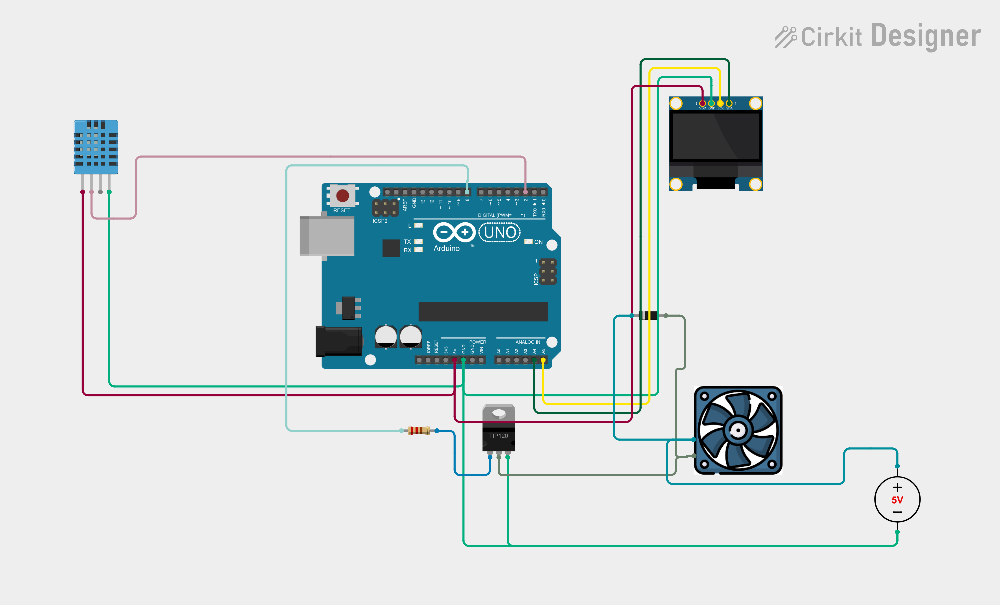

# Project 22 — Automatic Temperature-Controlled Fan (DHT11 + Fan Module + OLED) 🌡️💨

[](#difficulty)
[](#hardware-used)
[](#hardware-used)

## Overview

The **Automatic Temperature-Controlled Fan** is a smart HVAC climate control and automated cooling system. Using a **DHT11 Digital Temperature & Humidity Sensor**, it continuously samples ambient room temperature and displays the live reading in Celsius on a 0.96" SSD1306 OLED screen. When ambient temperature reaches or exceeds the threshold of **30.0°C**, digital pin `D8` turns **ON** the DC cooling fan module (or 5V relay). When the ambient temperature falls below 30.0°C, the fan automatically turns **OFF**.

This project introduces:
* Real-time temperature measurement with single-bus digital communication
* Threshold-based closed-loop automation logic
* Sensor fault tolerance handling (`isnan()` detection)
* Actuator control with OLED status monitoring

---

## Hardware Required

| Component | Quantity | Notes |
| :--- | :---: | :--- |
| **Arduino Uno** | 1 | Microcontroller board (powered via USB) |
| **DHT11 Sensor Module** | 1 | Digital temperature & humidity sensor |
| **5V DC Fan / Relay Module** | 1 | Cooling fan or driver module (Signal to Pin 8) |
| **0.96" I2C OLED Display** | 1 | 128x64 pixels (SSD1306 controller, address `0x3C`) |
| **Breadboard & Jumpers** | 1 | Prototyping board & connecting wires |

---

## Circuit Connections

| Component Pin | Arduino Pin | Description |
| :--- | :--- | :--- |
| **DHT11 Data** | **Digital Pin 2** | One-Wire sensor data signal |
| **DHT11 VCC** | **5V** | Power (+5V) |
| **DHT11 GND** | **GND** | Ground |
| **Fan / Relay IN** | **Digital Pin 8** | Digital control output (HIGH = ON, LOW = OFF) |
| **OLED VCC** | **5V** | Display Power (+5V) |
| **OLED GND** | **GND** | Display Ground |
| **OLED SDA** | **Analog Pin A4** | I2C Data Line |
| **OLED SCL** | **Analog Pin A5** | I2C Clock Line |

---

## Circuit Diagram

### Wiring Diagram


### Schematic (ASCII)

```text
Arduino UNO

             ┌───────────────────────┐
      A5 ────┤ SCL                   │
      A4 ────┤ SDA   0.96" SSD1306   │
      5V ────┤ VCC   OLED Display    │
     GND ────┤ GND                   │
             └───────────────────────┘

      D2 ───────────[ DHT11 Data ] (VCC -> 5V, GND -> GND)
      D8 ───────────[ Fan Module IN ] (VCC -> 5V, GND -> GND)
```

---

## Arduino Code

Available in [`22_automatic_fan.ino`](22_automatic_fan.ino).

```cpp
#include <Wire.h>
#include <Adafruit_GFX.h>
#include <Adafruit_SSD1306.h>
#include <DHT.h>

#define DHT_PIN 2
#define DHT_TYPE DHT11
#define FAN_PIN 8

#define SCREEN_WIDTH 128
#define SCREEN_HEIGHT 64
#define OLED_RESET -1

DHT dht(DHT_PIN, DHT_TYPE);

Adafruit_SSD1306 display(
  SCREEN_WIDTH,
  SCREEN_HEIGHT,
  &Wire,
  OLED_RESET
);

#define TEMP_LIMIT 30.0

void setup() {
  pinMode(FAN_PIN, OUTPUT);
  digitalWrite(FAN_PIN, LOW);

  dht.begin();

  display.begin(SSD1306_SWITCHCAPVCC, 0x3C);
  display.setTextColor(SSD1306_WHITE);
}

void loop() {

  float temperature = dht.readTemperature();

  display.clearDisplay();

  display.setTextSize(1);
  display.setCursor(30, 5);
  display.println("AUTOMATIC FAN");

  if (isnan(temperature)) {

    digitalWrite(FAN_PIN, LOW);

    display.setTextSize(2);
    display.setCursor(20, 25);
    display.println("SENSOR");

    display.setCursor(30, 45);
    display.println("ERROR");

  } 
  else {

    display.setTextSize(1);
    display.setCursor(10, 20);
    display.print("Temperature: ");

    display.setTextSize(2);
    display.setCursor(30, 32);
    display.print(temperature, 1);
    display.print(" C");

    if (temperature >= TEMP_LIMIT) {
      digitalWrite(FAN_PIN, HIGH);

      display.setTextSize(1);
      display.setCursor(40, 52);
      display.println("FAN: ON");
    }
    else {
      digitalWrite(FAN_PIN, LOW);

      display.setTextSize(1);
      display.setCursor(40, 52);
      display.println("FAN: OFF");
    }
  }

  display.display();

  delay(2000);
}
```

---

## How It Works

1. **Temperature Sampling**: Every 2 seconds, the DHT11 reads the current temperature via digital pin `D2`.
2. **Error Guard**: If communication fails, `isnan(temperature)` triggers, safely shutting off the fan and showing `"SENSOR ERROR"`.
3. **Threshold Evaluation**: If `temperature >= 30.0°C`, pin `D8` goes `HIGH` to engage the fan, and the OLED displays `"FAN: ON"`. Otherwise, the fan remains `OFF`.
