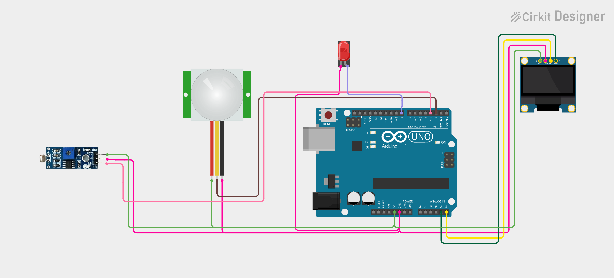

# Project 23 — Smart Automatic Room Light (PIR Motion + LDR + LED + OLED) 💡🚶‍♂️

[](#difficulty)
[](#hardware-used)
[](#hardware-used)

## Overview

The **Smart Automatic Room Light** is an intelligent, energy-saving smart home automation project. Instead of turning lights on simply when motion is detected, this system combines two sensors: a **PIR Motion Sensor (HC-SR501)** and a **Light Dependent Resistor (LDR) Module**. The room light turns **ON** only when **BOTH** conditions are satisfied:
1. The room is dark (natural light is insufficient)
2. A human presence / motion is detected

If it is broad daylight, or if no one is in the room, the LED stays **OFF**, preventing wasted electricity. The 0.96" SSD1306 OLED screen provides live status feedback indicating ambient light condition (`DARK` or `BRIGHT`) and the lighting state (`LIGHT ON` or `LIGHT OFF`).

This project introduces:
* Multi-sensor logical fusion (Boolean `AND` logic: `dark && personDetected`)
* Dual digital sensor input polling on separate GPIO pins
* Smart building energy conservation principles
* Informative dual-status OLED display formatting

---

## Hardware Required

| Component | Quantity | Notes |
| :--- | :---: | :--- |
| **Arduino Uno** | 1 | Microcontroller board (powered via USB) |
| **HC-SR501 PIR Motion Sensor** | 1 | Passive Infrared motion detection module |
| **LDR Light Sensor Module** | 1 | Photoresistor + LM393 comparator module (`DO`) |
| **5mm LED** | 1 | White, Warm White, or Red LED (or LED module) |
| **0.96" I2C OLED Display** | 1 | 128x64 pixels (SSD1306 controller, address `0x3C`) |
| **Breadboard & Jumpers** | 1 | Prototyping board & connecting wires |

---

## Circuit Connections

| Component Pin | Arduino Pin | Description |
| :--- | :--- | :--- |
| **PIR Sensor OUT** | **Digital Pin 2** | Motion detection output (`HIGH` = Motion detected) |
| **PIR Sensor VCC** | **5V** | Power (+5V) |
| **PIR Sensor GND** | **GND** | Ground |
| **LDR Module DO** | **Digital Pin 3** | Light threshold output (`LOW` = Dark room) |
| **LDR Module VCC** | **5V** | Power (+5V) |
| **LDR Module GND** | **GND** | Ground |
| **LED Anode (+)** | **Digital Pin 8** | Digital control output (5V = ON, 0V = OFF) |
| **LED Cathode (−)** | **GND** | Ground |
| **OLED VCC** | **5V** | Display Power (+5V) |
| **OLED GND** | **GND** | Display Ground |
| **OLED SDA** | **Analog Pin A4** | I2C Data Line |
| **OLED SCL** | **Analog Pin A5** | I2C Clock Line |

---

## Circuit Diagram

### Wiring Diagram


### Schematic (ASCII)

```text
Arduino UNO

             ┌───────────────────────┐
      A5 ────┤ SCL                   │
      A4 ────┤ SDA   0.96" SSD1306   │
      5V ────┤ VCC   OLED Display    │
     GND ────┤ GND                   │
             └───────────────────────┘

      D2 ───────────[ PIR Sensor OUT ] (VCC -> 5V, GND -> GND)
      D3 ───────────[ LDR Module DO  ] (VCC -> 5V, GND -> GND)
      D8 ───────────[ LED Anode (+)  ] ────> LED Cathode (-) -> GND
```

---

## Logic Truth Table

| Ambient Light (LDR) | Person Detected (PIR) | Room Light (LED Pin 8) | OLED Status |
| :---: | :---: | :---: | :---: |
| **Bright** (`DO = HIGH`) | No (`OUT = LOW`) | **OFF** | `LIGHT OFF` / `BRIGHT` |
| **Bright** (`DO = HIGH`) | Yes (`OUT = HIGH`) | **OFF** | `LIGHT OFF` / `BRIGHT` |
| **Dark** (`DO = LOW`) | No (`OUT = LOW`) | **OFF** | `LIGHT OFF` / `DARK` |
| **Dark** (`DO = LOW`) | **Yes** (`OUT = HIGH`) | **ON** | `LIGHT ON` / `DARK` |

---

## Arduino Code

Available in [`23_automatic_room_light.ino`](23_automatic_room_light.ino).

```cpp
#include <Wire.h>
#include <Adafruit_GFX.h>
#include <Adafruit_SSD1306.h>

#define PIR_PIN 2
#define LDR_PIN 3
#define LED_PIN 8

#define SCREEN_WIDTH 128
#define SCREEN_HEIGHT 64
#define OLED_RESET -1

Adafruit_SSD1306 display(
  SCREEN_WIDTH,
  SCREEN_HEIGHT,
  &Wire,
  OLED_RESET
);

void setup() {
  pinMode(PIR_PIN, INPUT);
  pinMode(LDR_PIN, INPUT);
  pinMode(LED_PIN, OUTPUT);

  display.begin(SSD1306_SWITCHCAPVCC, 0x3C);
  display.setTextColor(SSD1306_WHITE);
}

void loop() {

  int motion = digitalRead(PIR_PIN);
  int light = digitalRead(LDR_PIN);

  // Most LDR modules: LOW = dark
  bool dark = (light == LOW);
  bool personDetected = (motion == HIGH);

  display.clearDisplay();

  display.setTextSize(1);
  display.setCursor(25, 5);
  display.println("ROOM LIGHT");

  display.setTextSize(2);

  if (dark && personDetected) {

    digitalWrite(LED_PIN, HIGH);

    display.setCursor(20, 25);
    display.println("LIGHT ON");

  } else {

    digitalWrite(LED_PIN, LOW);

    display.setCursor(15, 25);
    display.println("LIGHT OFF");
  }

  display.setTextSize(1);
  display.setCursor(25, 50);

  if (dark)
    display.println("DARK");
  else
    display.println("BRIGHT");

  display.display();

  delay(200);
}
```

---

## How It Works

1. **Light Level Assessment**: The LDR sensor monitors ambient illumination. In darkness, its comparator output pin `DO` (connected to `D3`) drops `LOW`, setting `dark = true`.
2. **Infrared Motion Sensing**: The PIR sensor detects infrared radiation shifts caused by moving warm human bodies. When motion is sensed, pin `OUT` (connected to `D2`) outputs `HIGH`, setting `personDetected = true`.
3. **Compound Decision Logic**: The system checks `if (dark && personDetected)`.
   - If true: The Arduino supplies +5V to pin `D8`, turning on the LED, and displays `"LIGHT ON"`.
   - If false: Pin `D8` remains `LOW`, keeping the LED off, and displays `"LIGHT OFF"`.
4. **OLED Feedback**: Line 3 updates whether the environment is currently assessed as `"DARK"` or `"BRIGHT"`.
