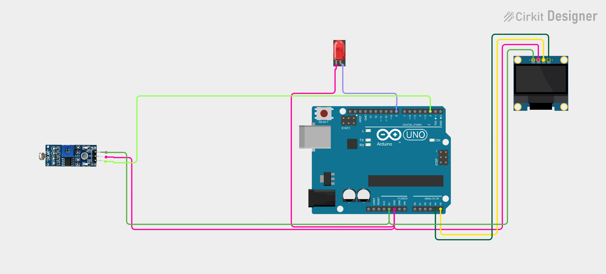

# Project 24 — Smart Street Light (LDR Sensor + LED + OLED) 🛣️💡

[](#difficulty)
[](#hardware-used)
[](#hardware-used)

## Overview

The **Smart Street Light** is an intelligent public utility and smart city infrastructure project. Utilizing a **Light Dependent Resistor (LDR) Module** with an LM393 comparator, it automatically regulates street illumination based on natural ambient solar levels. When sunlight fades at dusk or during nighttime, the module output drops to `LOW`. The Arduino Uno detects nightfall, automatically turns **ON** the street light LED on pin `D8`, and displays `"LIGHT ON"` and `"NIGHT"` on the 0.96" SSD1306 OLED display. At dawn, the system conserves municipal power by turning the lamp **OFF** and displaying `"DAYLIGHT"`.

This project introduces:
* Smart city automation and grid energy management
* Environmental optical threshold calibration via LM393 trimmer potentiometer
* Active-LOW digital switching logic
* Real-time status diagnostics on an I2C OLED display

---

## Hardware Required

| Component | Quantity | Notes |
| :--- | :---: | :--- |
| **Arduino Uno** | 1 | Microcontroller board (powered via USB) |
| **LDR Light Sensor Module** | 1 | Photoresistor + LM393 comparator module (`DO`) |
| **5mm LED** | 1 | White, Yellow, or Warm White LED (Street Light lamp) |
| **0.96" I2C OLED Display** | 1 | 128x64 pixels (SSD1306 controller, address `0x3C`) |
| **Breadboard & Jumpers** | 1 | Prototyping board & connecting wires |

---

## Circuit Connections

| Component Pin | Arduino Pin | Description |
| :--- | :--- | :--- |
| **LDR Module DO** | **Digital Pin 2** | Digital output (`LOW` = Darkness / Night) |
| **LDR Module VCC** | **5V** | Power (+5V) |
| **LDR Module GND** | **GND** | Ground |
| **LED Anode (+)** | **Digital Pin 8** | Street light control output (5V = ON, 0V = OFF) |
| **LED Cathode (−)** | **GND** | Ground |
| **OLED VCC** | **5V** | Display Power (+5V) |
| **OLED GND** | **GND** | Display Ground |
| **OLED SDA** | **Analog Pin A4** | I2C Data Line |
| **OLED SCL** | **Analog Pin A5** | I2C Clock Line |

---

## Circuit Diagram

### Wiring Diagram


### Schematic (ASCII)

```text
Arduino UNO

             ┌───────────────────────┐
      A5 ────┤ SCL                   │
      A4 ────┤ SDA   0.96" SSD1306   │
      5V ────┤ VCC   OLED Display    │
     GND ────┤ GND                   │
             └───────────────────────┘

      D2 ───────────[ LDR Module DO ] (VCC -> 5V, GND -> GND)
      D8 ───────────[ Street Light LED (+) ] ────> LED Cathode (-) -> GND
```

---

## Arduino Code

Available in [`24_smart_street_light.ino`](24_smart_street_light.ino).

```cpp
#include <Wire.h>
#include <Adafruit_GFX.h>
#include <Adafruit_SSD1306.h>

#define LDR_PIN 2
#define LED_PIN 8

#define SCREEN_WIDTH 128
#define SCREEN_HEIGHT 64
#define OLED_RESET -1

Adafruit_SSD1306 display(
  SCREEN_WIDTH,
  SCREEN_HEIGHT,
  &Wire,
  OLED_RESET
);

void setup() {
  pinMode(LDR_PIN, INPUT);
  pinMode(LED_PIN, OUTPUT);

  display.begin(SSD1306_SWITCHCAPVCC, 0x3C);
  display.setTextColor(SSD1306_WHITE);
}

void loop() {

  int lightState = digitalRead(LDR_PIN);

  display.clearDisplay();

  display.setTextSize(1);
  display.setCursor(30, 5);
  display.println("SMART STREET");

  display.setTextSize(2);

  // Most LDR modules: LOW = dark
  if (lightState == LOW) {

    digitalWrite(LED_PIN, HIGH);

    display.setCursor(5, 25);
    display.println("LIGHT ON");

    display.setTextSize(1);
    display.setCursor(30, 50);
    display.println("NIGHT");

  } else {

    digitalWrite(LED_PIN, LOW);

    display.setCursor(15, 25);
    display.println("DAYLIGHT");
  }

  display.display();

  delay(200);
}
```

---

## How It Works

1. **Light Intensity Detection**: The Cadmium Sulfide (CdS) photoresistor experiences high resistance under dark conditions and low resistance when exposed to daylight.
2. **Comparator Evaluation**: An onboard LM393 voltage comparator compares the LDR voltage against a calibrated threshold set by the trimmer potentiometer. When solar illumination drops below this threshold, the module drives pin `DO` `LOW`.
3. **Street Light Activation**:
   - The Arduino reads `lightState = digitalRead(LDR_PIN)`.
   - When `lightState == LOW` (nighttime), pin `D8` is driven `HIGH`, turning ON the lamp.
   - The OLED display presents `"LIGHT ON"` and `"NIGHT"`.
4. **Daytime Shutoff**: When daylight returns, `lightState` switches to `HIGH`. Pin `D8` pulls `LOW` to extinguish the lamp, and the screen displays `"DAYLIGHT"`.
