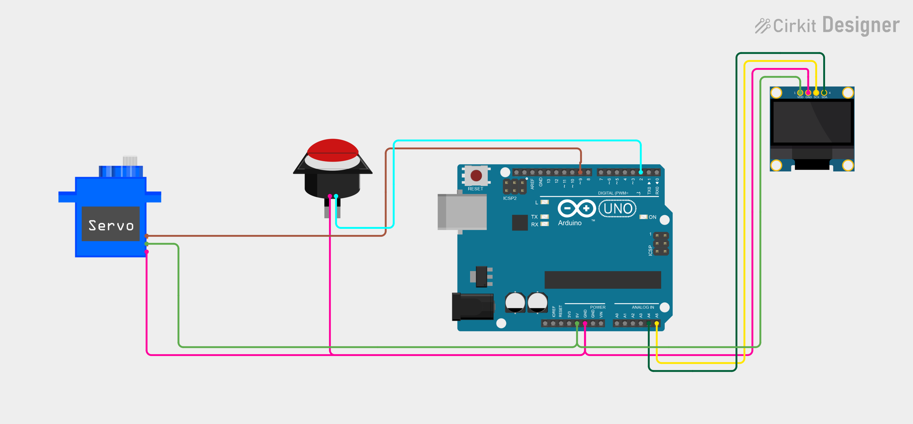

# Project 25 — Smart Servo Door (Servo Motor + Push Button + OLED) 🚪🤖

[](#difficulty)
[](#hardware-used)
[](#hardware-used)

## Overview

The **Smart Servo Door** is an automated motorized door access and barrier gate system. Using an **SG90 Micro Servo Motor** and a tactile push button, it simulates a smart entrance or automatic barrier. When the push button is pressed (active-LOW via Arduino's internal `INPUT_PULLUP`), the servo motor rotates 90 degrees to open the door, and the 0.96" SSD1306 OLED screen updates to display `"OPEN"`. After a 3-second dwell period, the servo smoothly returns to 0 degrees to re-close the door, and the display returns to `"CLOSED"`.

This project introduces:
* Precision angular actuator control using the Arduino `Servo` library
* Pulse Width Modulation (PWM) signal generation for servo positioning
* Push button input handling with internal pull-up resistors (no external resistors needed)
* Real-time access state visualization on an I2C OLED display

---

## Hardware Required

| Component | Quantity | Notes |
| :--- | :---: | :--- |
| **Arduino Uno** | 1 | Microcontroller board (powered via USB) |
| **SG90 Micro Servo Motor (9g)** | 1 | 180° positional servo motor with horn accessories |
| **Tactile Push Button** | 1 | 6x6mm mini momentary switch |
| **0.96" I2C OLED Display** | 1 | 128x64 pixels (SSD1306 controller, address `0x3C`) |
| **Breadboard & Jumpers** | 1 | Prototyping board & connecting wires |

---

## Circuit Connections

| Component Pin | Arduino Pin | Description |
| :--- | :--- | :--- |
| **Button Terminal 1** | **Digital Pin 2** | Digital input with internal `INPUT_PULLUP` |
| **Button Terminal 2** | **GND** | Ground reference |
| **Servo Signal (Orange/Yellow)** | **Digital Pin 9** | PWM control signal line |
| **Servo Power (Red)** | **5V** | Power (+5V) |
| **Servo Ground (Brown/Black)** | **GND** | Ground |
| **OLED VCC** | **5V** | Display Power (+5V) |
| **OLED GND** | **GND** | Display Ground |
| **OLED SDA** | **Analog Pin A4** | I2C Data Line |
| **OLED SCL** | **Analog Pin A5** | I2C Clock Line |

---

## Circuit Diagram

### Wiring Diagram


### Schematic (ASCII)

```text
Arduino UNO

             ┌───────────────────────┐
      A5 ────┤ SCL                   │
      A4 ────┤ SDA   0.96" SSD1306   │
      5V ────┤ VCC   OLED Display    │
     GND ────┤ GND                   │
             └───────────────────────┘

      D2 ───────────[ Push Button ] ────> GND
      D9 ───────────[ Servo Signal (PWM) ] (VCC -> 5V, GND -> GND)
```

---

## Arduino Code

Available in [`25_servo_door.ino`](25_servo_door.ino).

```cpp
#include <Wire.h>
#include <Servo.h>
#include <Adafruit_GFX.h>
#include <Adafruit_SSD1306.h>

#define BUTTON_PIN 2
#define SERVO_PIN 9

#define SCREEN_WIDTH 128
#define SCREEN_HEIGHT 64
#define OLED_RESET -1

Servo doorServo;

Adafruit_SSD1306 display(
  SCREEN_WIDTH, SCREEN_HEIGHT,
  &Wire, OLED_RESET
);

void showMessage(const char* message) {
  display.clearDisplay();

  display.setTextSize(1);
  display.setCursor(35, 5);
  display.println("SERVO DOOR");

  display.setTextSize(2);
  display.setCursor(15, 30);
  display.println(message);

  display.display();
}

void setup() {
  pinMode(BUTTON_PIN, INPUT_PULLUP);

  doorServo.attach(SERVO_PIN);
  doorServo.write(0);

  display.begin(SSD1306_SWITCHCAPVCC, 0x3C);
  display.setTextColor(SSD1306_WHITE);

  showMessage("CLOSED");
}

void loop() {

  if (digitalRead(BUTTON_PIN) == LOW) {

    doorServo.write(90);
    showMessage("OPEN");

    delay(3000);

    doorServo.write(0);
    showMessage("CLOSED");

    delay(500);
  }
}
```

---

## How It Works

1. **Initialization (`setup()`)**:
   - The push button is initialized with `pinMode(BUTTON_PIN, INPUT_PULLUP)`, enabling the internal 20kΩ pull-up resistor.
   - The servo attaches to pin `D9` and writes `0°`, establishing the default closed position.
   - The OLED screen displays `"CLOSED"`.
2. **Door Triggering**:
   - When someone presses the push button, pin `D2` connects directly to `GND`, dropping the reading to `LOW`.
3. **Open Action & Dwell**:
   - The Arduino calls `doorServo.write(90)`, commanding the servo gear to rotate 90 degrees to open the gate or unlatch the door.
   - `showMessage("OPEN")` updates the OLED screen.
   - `delay(3000)` keeps the door open for 3 seconds, allowing passage.
4. **Automatic Close**:
   - `doorServo.write(0)` rotates the servo back to 0 degrees to re-close and lock the door.
   - The OLED updates to `"CLOSED"`.
   - A short `delay(500)` prevents accidental double-triggering.
