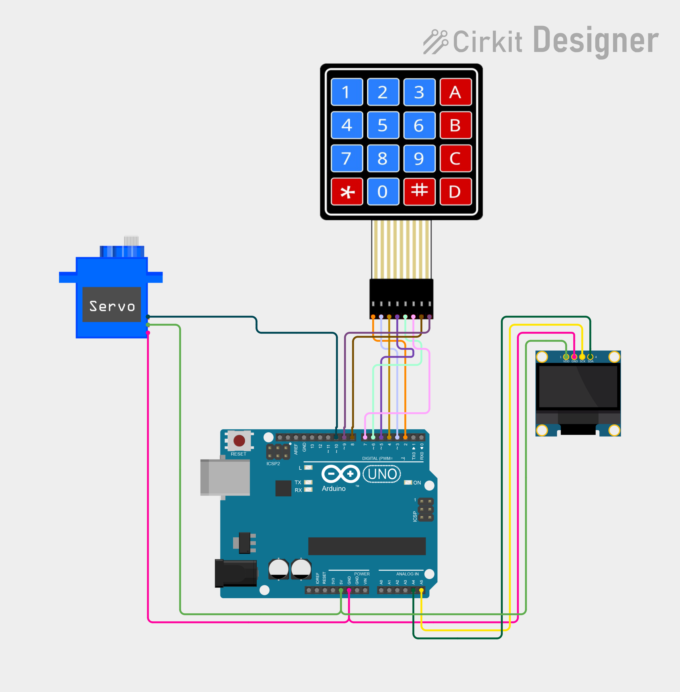

# Project 26 — Keypad Door Lock (4x4 Matrix Keypad + Servo + OLED) 🔐🚪

[](#difficulty)
[](#hardware-used)
[](#hardware-used)
[](#hardware-used)

## Overview

The **Keypad Door Lock** is a digital security and access control system. Using a **4x4 matrix membrane keypad**, an **SG90 micro servo motor**, and a **0.96" SSD1306 I2C OLED display**, it implements a standalone passcode-protected door lock mechanism.

Users enter a 4-digit PIN (default `"1234"`). As keys are pressed, the OLED display masks the input with asterisks (`*`) for visual privacy. Pressing `#` confirms the PIN: if matched, the screen displays `"GRANTED"` and the servo motor turns 90 degrees to unlock the latch for 3 seconds before automatically resetting to 0 degrees (`"LOCKED"`). If the code is wrong, the screen alerts `"DENIED"`. Pressing `*` resets the buffer so the user can re-enter their PIN cleanly.

This project introduces:
* Matrix keypad multiplexing and scanning using the `Keypad` library
* Dynamic passcode collection, buffer management, and string validation
* Masked user-input feedback on an I2C OLED screen
* Micro servo angular positioning for motorized latching/unlatching

---

## Hardware Required

| Component | Quantity | Notes |
| :--- | :---: | :--- |
| **Arduino Uno** | 1 | Microcontroller board (powered via USB) |
| **4x4 Matrix Membrane Keypad** | 1 | 16-key matrix (4 rows x 4 columns, 8-pin connector) |
| **SG90 Micro Servo Motor (9g)** | 1 | 180° positional servo with horn accessories |
| **0.96" I2C OLED Display** | 1 | 128x64 pixels (SSD1306 driver, address `0x3C`) |
| **Breadboard & Jumpers** | 1 | Prototyping breadboard & male-to-male / male-to-female jumper wires |

---

## Circuit Connections

### 4x4 Matrix Keypad Pinout

The 8-pin connector of the 4x4 keypad corresponds to Rows 1–4 and Columns 1–4 (from left to right when viewing the keypad front):

| Keypad Pin | Function | Arduino Pin | Description |
| :--- | :--- | :--- | :--- |
| **Pin 1 (R1)** | Row 1 (Keys 1, 2, 3, A) | **Digital Pin 2** | Row scan line |
| **Pin 2 (R2)** | Row 2 (Keys 4, 5, 6, B) | **Digital Pin 3** | Row scan line |
| **Pin 3 (R3)** | Row 3 (Keys 7, 8, 9, C) | **Digital Pin 4** | Row scan line |
| **Pin 4 (R4)** | Row 4 (Keys *, 0, #, D) | **Digital Pin 5** | Row scan line |
| **Pin 5 (C1)** | Column 1 (Keys 1, 4, 7, *) | **Digital Pin 6** | Column sense line |
| **Pin 6 (C2)** | Column 2 (Keys 2, 5, 8, 0) | **Digital Pin 7** | Column sense line |
| **Pin 7 (C3)** | Column 3 (Keys 3, 6, 9, #) | **Digital Pin 8** | Column sense line |
| **Pin 8 (C4)** | Column 4 (Keys A, B, C, D) | **Digital Pin 9** | Column sense line |

### Actuator & Display Connections

| Component Pin | Arduino Pin | Description |
| :--- | :--- | :--- |
| **Servo Signal (Orange/Yellow)** | **Digital Pin 10** | PWM servo control line |
| **Servo Power (Red)** | **5V** | Power (+5V) |
| **Servo Ground (Brown/Black)** | **GND** | Ground |
| **OLED VCC** | **5V** | Display Power (+5V) |
| **OLED GND** | **GND** | Display Ground |
| **OLED SDA** | **Analog Pin A4** | I2C Data Line |
| **OLED SCL** | **Analog Pin A5** | I2C Clock Line |

---

## Circuit Diagram

### Wiring Diagram


### Schematic (ASCII)

```text
Arduino UNO

             ┌───────────────────────┐
      A5 ────┤ SCL                   │
      A4 ────┤ SDA   0.96" SSD1306   │
      5V ────┤ VCC   OLED Display    │
     GND ────┤ GND                   │
             └───────────────────────┘

      D10 ──────────[ Servo Signal (PWM) ] (VCC -> 5V, GND -> GND)

             ┌──────────────────────────────┐
      D2 ────┤ Row 1 (R1)                   │
      D3 ────┤ Row 2 (R2)                   │
      D4 ────┤ Row 3 (R3)    4x4 Matrix     │
      D5 ────┤ Row 4 (R4)    Keypad         │
      D6 ────┤ Col 1 (C1)                   │
      D7 ────┤ Col 2 (C2)                   │
      D8 ────┤ Col 3 (C3)                   │
      D9 ────┤ Col 4 (C4)                   │
             └──────────────────────────────┘
```

---

## Arduino Code

Available in [`26_keypad_door_lock.ino`](26_keypad_door_lock.ino).

```cpp
#include <Wire.h>
#include <Keypad.h>
#include <Servo.h>
#include <Adafruit_GFX.h>
#include <Adafruit_SSD1306.h>

#define SERVO_PIN 10

#define SCREEN_WIDTH 128
#define SCREEN_HEIGHT 64
#define OLED_RESET -1

Adafruit_SSD1306 display(
  SCREEN_WIDTH, SCREEN_HEIGHT,
  &Wire, OLED_RESET
);

Servo doorServo;

// 4x4 keypad
char keys[4][4] = {
  {'1','2','3','A'},
  {'4','5','6','B'},
  {'7','8','9','C'},
  {'*','0','#','D'}
};

byte rowPins[4] = {2, 3, 4, 5};
byte colPins[4] = {6, 7, 8, 9};

Keypad keypad = Keypad(
  makeKeymap(keys),
  rowPins,
  colPins,
  4,
  4
);

String password = "1234";
String input = "";

void showMessage(const char* message) {
  display.clearDisplay();

  display.setTextSize(1);
  display.setCursor(35, 5);
  display.println("DOOR LOCK");

  display.setTextSize(2);
  display.setCursor(10, 30);
  display.println(message);

  display.display();
}

void setup() {
  doorServo.attach(SERVO_PIN);
  doorServo.write(0);

  display.begin(SSD1306_SWITCHCAPVCC, 0x3C);
  display.setTextColor(SSD1306_WHITE);

  showMessage("ENTER PIN");
}

void loop() {

  char key = keypad.getKey();

  if (key) {

    if (key == '#') {

      if (input == password) {

        showMessage("GRANTED");

        doorServo.write(90);
        delay(3000);

        doorServo.write(0);
        showMessage("LOCKED");

      } else {

        showMessage("DENIED");
        delay(1500);
        showMessage("ENTER PIN");
      }

      input = "";
    }

    else if (key == '*') {
      input = "";
      showMessage("ENTER PIN");
    }

    else if (input.length() < 4) {
      input += key;

      display.clearDisplay();

      display.setTextSize(1);
      display.setCursor(35, 5);
      display.println("ENTER PIN");

      display.setTextSize(2);
      display.setCursor(40, 30);

      for (int i = 0; i < input.length(); i++) {
        display.print("*");
      }

      display.display();
    }
  }
}
```

---

## How It Works

1. **Initialization (`setup()`)**:
   - The micro servo attaches to pin `D10` and drives to `0°` (locked position).
   - The SSD1306 OLED display initializes over I2C at address `0x3C` and prompts `"ENTER PIN"`.
   - The `Keypad` library configures Row pins (`D2`–`D5`) and Column pins (`D6`–`D9`) with internal pull-ups for non-blocking matrix scanning.
2. **Keypad Matrix Scanning**:
   - In each `loop()` cycle, `keypad.getKey()` non-blockingly scans row and column intersections to detect pressed keys.
3. **PIN Entry & Masking**:
   - When a numeric key is pressed, if the input buffer has fewer than 4 characters, the key is appended to `input`.
   - The display updates with a row of asterisks (`*`) corresponding to `input.length()`.
4. **Validation (`#` Key)**:
   - Pressing `#` triggers authentication:
     - **Access Granted (`input == "1234"`)**: The screen shows `"GRANTED"`, the servo rotates 90° to open the door mechanism, holds for 3 seconds, returns to 0° to re-lock, and displays `"LOCKED"`.
     - **Access Denied (`input != "1234"`)**: The screen displays `"DENIED"` for 1.5 seconds, then reverts back to `"ENTER PIN"`.
   - The input string is cleared for the next entry.
5. **Clear / Reset (`*` Key)**:
   - Pressing `*` resets the input buffer `input = ""` immediately and prompts `"ENTER PIN"`.
