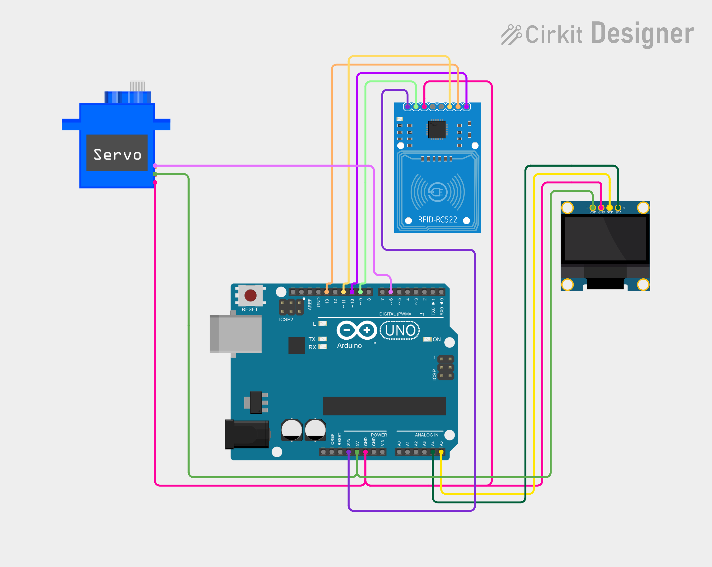

# Project 27 — Smart RFID Door (RC522 RFID Reader + Servo + OLED) 🪪🚪

[](#difficulty)
[](#hardware-used)
[](#hardware-used)
[](#hardware-used)

## Overview

The **Smart RFID Door** is an automated contactless access control and electronic lock system. Using the **RC522 13.56 MHz RFID Reader**, an **SG90 micro servo motor**, and a **0.96" SSD1306 I2C OLED display**, it authenticates MIFARE RFID cards and key fobs to grant or deny door access.

When an RFID card or key fob is swiped across the RC522 reader:
1. The unique 4-byte identifier (UID) is read via the Serial Peripheral Interface (SPI) bus and printed to the Arduino Serial Monitor.
2. The Arduino compares the scanned UID against the stored master key (`authorizedUID`).
3. If authorized, the OLED displays `"GRANTED"`, and the SG90 servo motor rotates 90 degrees to unlock/open the door for 3 seconds before automatically resetting to 0 degrees (`"SCAN CARD"`).
4. If unauthorized, the OLED alerts `"DENIED"`, keeping the door securely locked.

This project introduces:
* High-speed SPI peripheral communication with the MFRC522 transponder IC
* Reading ISO/IEC 14443 Type A contactless smart cards and key fobs
* Array byte comparison for hardware authorization logic
* Dual power bus management (3.3V logic for RFID, 5V for servo and OLED)

---

## Hardware Required

| Component | Quantity | Notes |
| :--- | :---: | :--- |
| **Arduino Uno** | 1 | Microcontroller board (powered via USB) |
| **RC522 RFID Reader Module** | 1 | 13.56 MHz RFID / NFC reader board with SPI interface |
| **RFID Card / Key Fob (13.56MHz)** | 1–2 | MIFARE Classic 1K RFID tag or key fob |
| **SG90 Micro Servo Motor (9g)** | 1 | 180° positional servo with horn accessories |
| **0.96" I2C OLED Display** | 1 | 128x64 pixels (SSD1306 controller, address `0x3C`) |
| **Breadboard & Jumpers** | 1 | Prototyping breadboard & connecting jumper wires |

---

## Circuit Connections

> [!CAUTION]
> **Voltage Warning for RC522 Module:**  
> The RC522 RFID module **must be connected to 3.3V**, NOT 5V! Connecting its VCC to 5V will permanently damage the RC522 chip.

### 1. RC522 RFID Reader (SPI Interface)

| RC522 Pin | Arduino Pin | Description |
| :--- | :--- | :--- |
| **3.3V (VCC)** | **3.3V** | Power (+3.3V Only!) |
| **RST** | **Digital Pin 9** | Reset control line |
| **GND** | **GND** | Ground reference |
| **IRQ** | *Not Connected* | Interrupt request (unused) |
| **MISO** | **Digital Pin 12** | Master In Slave Out (SPI) |
| **MOSI** | **Digital Pin 11** | Master Out Slave In (SPI) |
| **SCK** | **Digital Pin 13** | SPI Clock |
| **SDA (SS)** | **Digital Pin 10** | Slave Select / Chip Select (SPI) |

### 2. SG90 Micro Servo & OLED Display

| Component Pin | Arduino Pin | Description |
| :--- | :--- | :--- |
| **Servo Signal (Orange/Yellow)** | **Digital Pin 6** | PWM control signal |
| **Servo Power (Red)** | **5V** | Power (+5V) |
| **Servo Ground (Brown/Black)** | **GND** | Ground |
| **OLED VCC** | **5V** | Display Power (+5V) |
| **OLED GND** | **GND** | Display Ground |
| **OLED SDA** | **Analog Pin A4** | I2C Data Line |
| **OLED SCL** | **Analog Pin A5** | I2C Clock Line |

---

## Circuit Diagram

### Wiring Diagram


### Schematic (ASCII)

```text
Arduino UNO

             ┌───────────────────────┐
      A5 ────┤ SCL                   │
      A4 ────┤ SDA   0.96" SSD1306   │
      5V ────┤ VCC   OLED Display    │
     GND ────┤ GND                   │
             └───────────────────────┘

      D6 ───────────[ Servo Signal (PWM) ] (VCC -> 5V, GND -> GND)

             ┌──────────────────────────────┐
    3.3V ────┤ 3.3V (VCC)                   │
      D9 ────┤ RST                          │
     GND ────┤ GND                          │
     D12 ────┤ MISO          RC522 RFID     │
     D11 ────┤ MOSI          Reader         │
     D13 ────┤ SCK                          │
     D10 ────┤ SDA (SS)                     │
             └──────────────────────────────┘
```

---

## Configuring Your Card UID

1. Upload the code and open the **Arduino Serial Monitor** at **9600 baud**.
2. Tap your card or key fob against the RC522 reader.
3. The Serial Monitor will print your card's UID:
   ```text
   UID: 3B A4 12 7C
   ```
4. Update the `authorizedUID` array in [`27_rfid_door.ino`](27_rfid_door.ino):
   ```cpp
   byte authorizedUID[] = {0x3B, 0xA4, 0x12, 0x7C};
   ```
5. Re-upload the sketch. Your card will now grant entry!

---

## Arduino Code

Available in [`27_rfid_door.ino`](27_rfid_door.ino).

```cpp
#include <SPI.h>
#include <MFRC522.h>
#include <Servo.h>
#include <Wire.h>
#include <Adafruit_GFX.h>
#include <Adafruit_SSD1306.h>

#define SS_PIN 10
#define RST_PIN 9
#define SERVO_PIN 6

MFRC522 rfid(SS_PIN, RST_PIN);
Servo doorServo;

#define SCREEN_WIDTH 128
#define SCREEN_HEIGHT 64
#define OLED_RESET -1

Adafruit_SSD1306 display(
  SCREEN_WIDTH, SCREEN_HEIGHT,
  &Wire, OLED_RESET
);

// Replace this with your card's UID
byte authorizedUID[] = {0xDE, 0xAD, 0xBE, 0xEF};

void showMessage(const char* message) {
  display.clearDisplay();

  display.setTextSize(1);
  display.setCursor(35, 5);
  display.println("RFID DOOR");

  display.setTextSize(2);
  display.setCursor(10, 30);
  display.println(message);

  display.display();
}

bool checkCard() {
  if (rfid.uid.size != 4)
    return false;

  for (byte i = 0; i < 4; i++) {
    if (rfid.uid.uidByte[i] != authorizedUID[i])
      return false;
  }

  return true;
}

void setup() {
  Serial.begin(9600);

  SPI.begin();
  rfid.PCD_Init();

  doorServo.attach(SERVO_PIN);
  doorServo.write(0);

  display.begin(SSD1306_SWITCHCAPVCC, 0x3C);
  display.setTextColor(SSD1306_WHITE);

  showMessage("SCAN CARD");
}

void loop() {

  if (!rfid.PICC_IsNewCardPresent())
    return;

  if (!rfid.PICC_ReadCardSerial())
    return;

  // Print UID to Serial Monitor
  Serial.print("UID: ");

  for (byte i = 0; i < rfid.uid.size; i++) {
    Serial.print(rfid.uid.uidByte[i], HEX);
    Serial.print(" ");
  }

  Serial.println();

  if (checkCard()) {

    showMessage("GRANTED");

    doorServo.write(90);
    delay(3000);

    doorServo.write(0);
    showMessage("SCAN CARD");

  } else {

    showMessage("DENIED");
    delay(1500);
    showMessage("SCAN CARD");
  }

  rfid.PICC_HaltA();
  rfid.PCD_StopCrypto1();
}
```

---

## How It Works

1. **Initialization (`setup()`)**:
   - `SPI.begin()` and `rfid.PCD_Init()` power up the transponder IC and configure SPI communication.
   - The servo attaches to pin `D6` and drives to `0°` (locked position).
   - The OLED initializes via I2C at address `0x3C` and prompts `"SCAN CARD"`.
2. **Contactless Detection**:
   - In each `loop()` iteration, `rfid.PICC_IsNewCardPresent()` checks if a tag has entered the 13.56 MHz RF field.
   - If detected, `rfid.PICC_ReadCardSerial()` reads the card's 4-byte serial number (UID).
3. **Authentication**:
   - `checkCard()` loops through all 4 bytes of `rfid.uid.uidByte` and verifies them against `authorizedUID`.
   - **Access Granted**: If all 4 bytes match, the OLED displays `"GRANTED"`, the servo turns 90° to open the door, waits for 3 seconds, returns to 0°, and reverts to `"SCAN CARD"`.
   - **Access Denied**: If any byte differs, `"DENIED"` is displayed for 1.5 seconds, keeping the door locked.
4. **Card Release**:
   - `rfid.PICC_HaltA()` puts the card into a halt state to prevent redundant duplicate reads until it is removed and re-presented.
