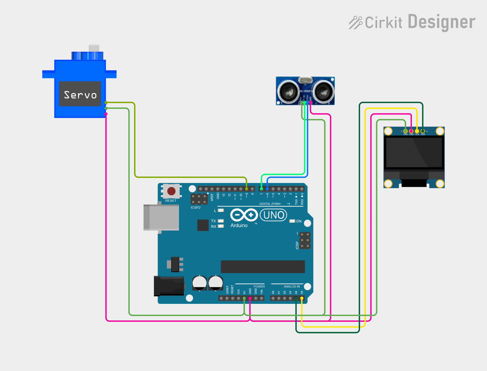

# Project 28 — Smart Touchless Dustbin (Ultrasonic Sensor + Servo + OLED) 🗑️🤖

[](#difficulty)
[](#hardware-used)
[](#hardware-used)
[](#hardware-used)

## Overview

The **Smart Touchless Dustbin** is an automated, hygienic waste management system. Using an **HC-SR04 ultrasonic distance sensor**, an **SG90 micro servo motor**, and a **0.96" SSD1306 I2C OLED display**, it detects an approaching hand or trash item and opens the bin lid automatically without requiring any physical contact.

When an object is detected within **15 cm**:
1. The micro servo rotates 90 degrees to lift the lid open.
2. The OLED screen displays `"OPEN"`.
3. The lid stays open for **3 seconds**, providing ample time to deposit trash.
4. The servo smoothly rotates back to 0 degrees to re-close the lid, and the display resets to `"CLOSED"`.

This project introduces:
* Ultrasonic distance calculation via high-frequency sound wave reflection
* Proximity threshold detection and hysteresis timing
* Servo motor angular positioning for mechanical lid lifting
* Real-time bin status visualization on an I2C OLED display

---

## Hardware Required

| Component | Quantity | Notes |
| :--- | :---: | :--- |
| **Arduino Uno** | 1 | Microcontroller board (powered via USB) |
| **HC-SR04 Ultrasonic Sensor** | 1 | 4-pin distance sensor (VCC, Trig, Echo, GND) |
| **SG90 Micro Servo Motor (9g)** | 1 | 180° positional servo with horn accessories |
| **0.96" I2C OLED Display** | 1 | 128x64 pixels (SSD1306 controller, address `0x3C`) |
| **Breadboard & Jumpers** | 1 | Prototyping breadboard & connecting jumper wires |

---

## Circuit Connections

| Component Pin | Arduino Pin | Description |
| :--- | :--- | :--- |
| **HC-SR04 VCC** | **5V** | Sensor Power (+5V) |
| **HC-SR04 GND** | **GND** | Sensor Ground |
| **HC-SR04 TRIG** | **Digital Pin 7** | Ultrasonic trigger pulse output |
| **HC-SR04 ECHO** | **Digital Pin 6** | Echo pulse input |
| **Servo Signal (Orange/Yellow)** | **Digital Pin 9** | PWM servo control line |
| **Servo Power (Red)** | **5V** | Power (+5V) |
| **Servo Ground (Brown/Black)** | **GND** | Ground |
| **OLED VCC** | **5V** | Display Power (+5V) |
| **OLED GND** | **GND** | Display Ground |
| **OLED SDA** | **Analog Pin A4** | I2C Data Line |
| **OLED SCL** | **Analog Pin A5** | I2C Clock Line |

---

## Circuit Diagram

### Wiring Diagram


### Schematic (ASCII)

```text
Arduino UNO

             ┌───────────────────────┐
      A5 ────┤ SCL                   │
      A4 ────┤ SDA   0.96" SSD1306   │
      5V ────┤ VCC   OLED Display    │
     GND ────┤ GND                   │
             └───────────────────────┘

      D9 ───────────[ Servo Signal (PWM) ] (VCC -> 5V, GND -> GND)

             ┌──────────────────────────────┐
      5V ────┤ VCC                          │
      D7 ────┤ TRIG          HC-SR04        │
      D6 ────┤ ECHO          Ultrasonic     │
     GND ────┤ GND           Sensor         │
             └──────────────────────────────┘
```

---

## Arduino Code

Available in [`28_smart_dustbin.ino`](28_smart_dustbin.ino).

```cpp
#include <Wire.h>
#include <Servo.h>
#include <Adafruit_GFX.h>
#include <Adafruit_SSD1306.h>

#define TRIG_PIN 7
#define ECHO_PIN 6
#define SERVO_PIN 9

#define SCREEN_WIDTH 128
#define SCREEN_HEIGHT 64
#define OLED_RESET -1

Servo lidServo;

Adafruit_SSD1306 display(
  SCREEN_WIDTH, SCREEN_HEIGHT,
  &Wire, OLED_RESET
);

void showMessage(const char* message) {
  display.clearDisplay();

  display.setTextSize(1);
  display.setCursor(35, 5);
  display.println("DUSTBIN");

  display.setTextSize(2);
  display.setCursor(30, 30);
  display.println(message);

  display.display();
}

long getDistance() {
  digitalWrite(TRIG_PIN, LOW);
  delayMicroseconds(2);

  digitalWrite(TRIG_PIN, HIGH);
  delayMicroseconds(10);
  digitalWrite(TRIG_PIN, LOW);

  long duration = pulseIn(ECHO_PIN, HIGH, 30000);

  return duration * 0.0343 / 2;
}

void setup() {
  pinMode(TRIG_PIN, OUTPUT);
  pinMode(ECHO_PIN, INPUT);

  lidServo.attach(SERVO_PIN);
  lidServo.write(0);

  display.begin(SSD1306_SWITCHCAPVCC, 0x3C);
  display.setTextColor(SSD1306_WHITE);

  showMessage("CLOSED");
}

void loop() {

  long distance = getDistance();

  if (distance > 0 && distance <= 15) {

    lidServo.write(90);
    showMessage("OPEN");

    delay(3000);

    lidServo.write(0);
    showMessage("CLOSED");

    delay(500);

  } else {

    lidServo.write(0);
    showMessage("CLOSED");
  }

  delay(100);
}
```

---

## How It Works

1. **Initialization (`setup()`)**:
   - The ultrasonic pins are configured (`TRIG` as `OUTPUT`, `ECHO` as `INPUT`).
   - The servo attaches to pin `D9` and drives to `0°` (bin lid closed).
   - The OLED initializes via I2C at address `0x3C` and displays `"CLOSED"`.
2. **Proximity Measurement (`getDistance()`)**:
   - The Arduino transmits a 10 µs high pulse on `TRIG_PIN`, causing the sensor to emit an 8-cycle ultrasonic burst at 40 kHz.
   - `pulseIn()` measures the time (in microseconds) until the echo bounces back from an approaching hand.
   - Distance in centimeters is calculated using the speed of sound:  
     $$\text{Distance (cm)} = \frac{\text{Duration } (\mu\text{s}) \times 0.0343}{2}$$
3. **Threshold Detection & Lid Actuation**:
   - If `distance > 0 && distance <= 15` cm, a user is preparing to throw waste.
   - `lidServo.write(90)` rotates the servo arm 90 degrees to mechanically push the lid open.
   - The OLED updates with `"OPEN"`.
   - `delay(3000)` pauses execution to keep the lid open for 3 seconds.
4. **Auto-Closure**:
   - `lidServo.write(0)` rotates the servo back to 0 degrees, closing the bin lid to keep odors sealed inside.
   - The OLED returns to `"CLOSED"`, and a brief `500 ms` buffer delay prevents flutter.
