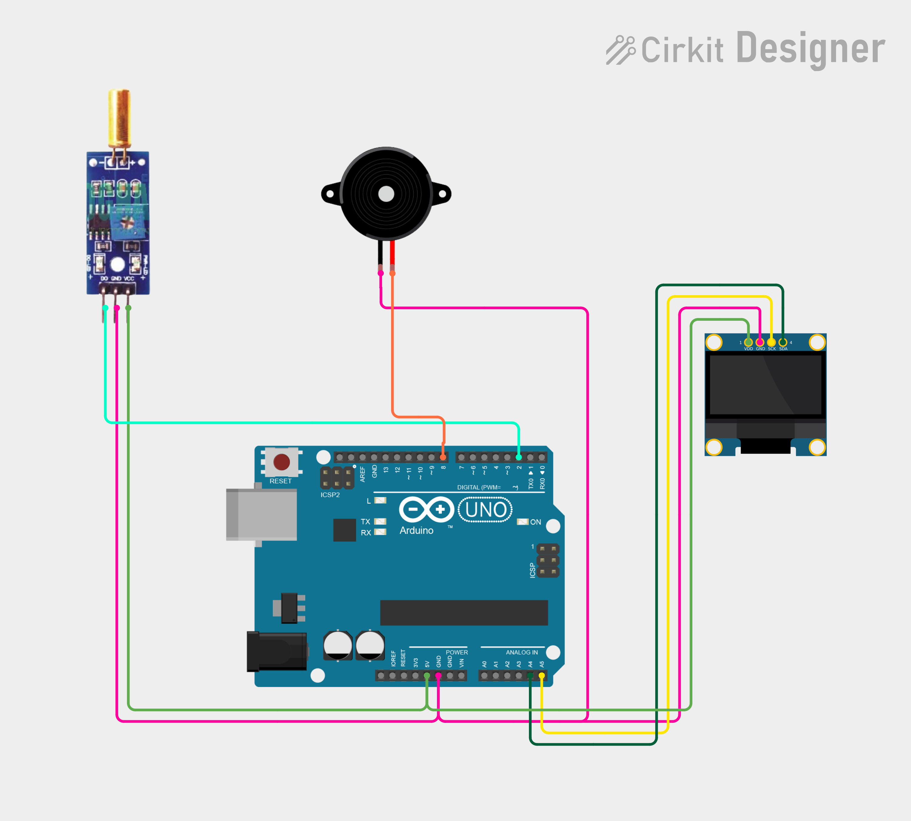

# Project 29 — Tilt Alarm (Ball Tilt Sensor + Buzzer + OLED) 📐🔔

[](#difficulty)
[](#hardware-used)
[](#hardware-used)
[](#hardware-used)

## Overview

The **Tilt Alarm** is an inclination detection and anti-tamper security system. Using an **SW-520D ball tilt sensor module**, an **active 5V piezo buzzer**, and a **0.96" SSD1306 I2C OLED display**, it detects sudden angle shifts, rollover, or unauthorized movement of equipment or enclosures.

Inside the cylindrical sensor, a pair of conductive rolling metallic balls bridge internal contact pins when upright. When tilted beyond a critical angle (typically 15°–45° depending on orientation), the balls roll away from the terminals, triggering the comparator circuit to output `LOW`:
1. The Arduino detects `digitalRead(TILT_PIN) == LOW`.
2. The active piezo buzzer sounds an audible alarm (`digitalWrite(BUZZER_PIN, HIGH)`).
3. The OLED screen prominently warns `"TILT DETECTED!"`.
4. When returned to a stable, level orientation, the buzzer silences, and the display returns to `"NORMAL"`.

This project introduces:
* Mechanical inclination and orientation sensing using ball tilt switches
* Digital comparator module interfacing with adjustable sensitivity potentiometer
* Real-time audio and visual multi-output alarm management

---

## Hardware Required

| Component | Quantity | Notes |
| :--- | :---: | :--- |
| **Arduino Uno** | 1 | Microcontroller board (powered via USB) |
| **SW-520D Tilt Sensor Module** | 1 | Ball-switch tilt sensor with onboard LM393 comparator (`DO`) |
| **Active 5V Piezo Buzzer** | 1 | 5V continuous audio buzzer (+ and - pins) |
| **0.96" I2C OLED Display** | 1 | 128x64 pixels (SSD1306 controller, address `0x3C`) |
| **Breadboard & Jumpers** | 1 | Prototyping breadboard & connecting jumper wires |

---

## Circuit Connections

| Component Pin | Arduino Pin | Description |
| :--- | :--- | :--- |
| **Tilt Sensor VCC** | **5V** | Sensor Power (+5V) |
| **Tilt Sensor GND** | **GND** | Sensor Ground |
| **Tilt Sensor DO** | **Digital Pin 2** | Digital tilt state output |
| **Buzzer Positive (+)** | **Digital Pin 8** | Digital output to trigger buzzer |
| **Buzzer Negative (-)** | **GND** | Ground reference |
| **OLED VCC** | **5V** | Display Power (+5V) |
| **OLED GND** | **GND** | Display Ground |
| **OLED SDA** | **Analog Pin A4** | I2C Data Line |
| **OLED SCL** | **Analog Pin A5** | I2C Clock Line |

---

## Circuit Diagram

### Wiring Diagram


### Schematic (ASCII)

```text
Arduino UNO

             ┌───────────────────────┐
      A5 ────┤ SCL                   │
      A4 ────┤ SDA   0.96" SSD1306   │
      5V ────┤ VCC   OLED Display    │
     GND ────┤ GND                   │
             └───────────────────────┘

      D8 ───────────(+) [ Active Buzzer ] (-) ────> GND

             ┌──────────────────────────────┐
      5V ────┤ VCC                          │
     GND ────┤ GND           SW-520D Tilt   │
      D2 ────┤ DO            Sensor Module  │
             └──────────────────────────────┘
```

---

## Arduino Code

Available in [`29_tilt_alarm.ino`](29_tilt_alarm.ino).

```cpp
#include <Wire.h>
#include <Adafruit_GFX.h>
#include <Adafruit_SSD1306.h>

#define TILT_PIN 2
#define BUZZER_PIN 8

#define SCREEN_WIDTH 128
#define SCREEN_HEIGHT 64
#define OLED_RESET -1

Adafruit_SSD1306 display(
  SCREEN_WIDTH, SCREEN_HEIGHT,
  &Wire, OLED_RESET
);

void setup() {
  pinMode(TILT_PIN, INPUT);
  pinMode(BUZZER_PIN, OUTPUT);

  display.begin(SSD1306_SWITCHCAPVCC, 0x3C);
  display.setTextColor(SSD1306_WHITE);
}

void loop() {

  int tilt = digitalRead(TILT_PIN);

  display.clearDisplay();

  display.setTextSize(1);
  display.setCursor(35, 5);
  display.println("TILT ALARM");

  display.setTextSize(2);

  // Most tilt modules output LOW when tilted
  if (tilt == LOW) {

    digitalWrite(BUZZER_PIN, HIGH);

    display.setCursor(5, 28);
    display.println("TILT");
    display.setCursor(5, 48);
    display.println("DETECTED!");

  } else {

    digitalWrite(BUZZER_PIN, LOW);

    display.setCursor(30, 32);
    display.println("NORMAL");
  }

  display.display();

  delay(200);
}
```

---

## How It Works

1. **Initialization (`setup()`)**:
   - `TILT_PIN` (pin 2) is configured as a digital `INPUT`.
   - `BUZZER_PIN` (pin 8) is configured as a digital `OUTPUT` to drive the piezo buzzer.
   - The SSD1306 OLED display initializes over I2C at address `0x3C` with white text.
2. **Tilt Sensing Principle**:
   - In upright/level position, the metallic balls rest across both lead contacts, completing the circuit. The LM393 comparator outputs `HIGH`.
   - When tilted beyond the threshold, gravity causes the ball to roll away, opening the circuit. The module comparator pulls `DO` to `LOW`.
3. **Alarm Condition (`tilt == LOW`)**:
   - `digitalWrite(BUZZER_PIN, HIGH)` activates the buzzer for an immediate audible alert.
   - The OLED screen is cleared and updated with two large lines of text: `"TILT"` and `"DETECTED!"`.
4. **Normal Condition (`tilt == HIGH`)**:
   - When the device is restored to a stable, horizontal position, the buzzer is turned off (`LOW`).
   - The display shows `"NORMAL"`.
   - A short `200 ms` delay stabilizes display refreshing without introducing noticeable lag.
