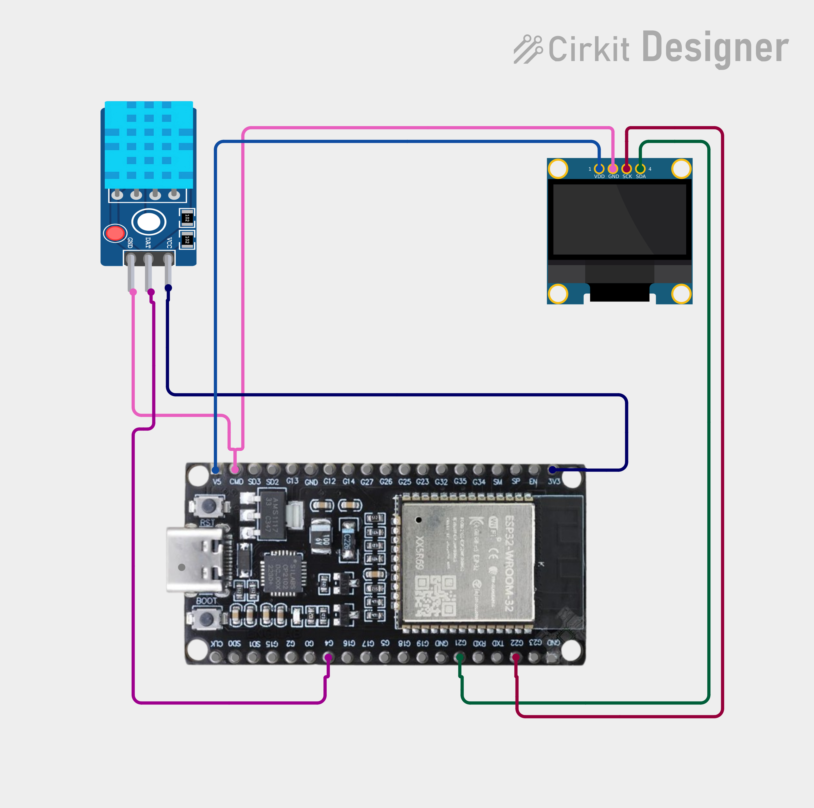

# Project 30 — Wi-Fi Temperature & Humidity Monitor (ESP32 + DHT11 + OLED) 🌡️🌐

[](#difficulty)
[](#hardware-used)
[](#hardware-used)
[](#hardware-used)

## Overview

The **Wi-Fi Temperature & Humidity Monitor** is an IoT-connected smart weather and climate monitoring station. Built around the powerful **ESP32 microcontroller**, a **DHT11 sensor**, and a **0.96" SSD1306 I2C OLED display**, it delivers both local and remote visibility of ambient conditions.

Key features:
* **Local OLED Display**: Continuously displays current temperature (°C) in large font along with humidity (%) and project header.
* **Embedded Web Server**: Hosts a lightweight HTTP web server directly on the ESP32 (Port 80).
* **Wireless Live Dashboard**: Accessing the ESP32's local IP address from any smartphone, laptop, or tablet on the same Wi-Fi network displays an auto-refreshing (every 2s) HTML webpage with live climate metrics.

This project introduces:
* Interfacing sensors and I2C displays with the 32-bit ESP32 platform
* Connecting to 2.4 GHz 802.11 b/g/n Wi-Fi networks in Station (`WIFI_STA`) mode
* Building embedded HTTP REST/HTML web servers with the ESP32 `WebServer` library
* HTML meta-refresh headers for live client-side data updates without manual page reloading

---

## Hardware Required

| Component | Quantity | Notes |
| :--- | :---: | :--- |
| **ESP32 Dev Module (30-pin)** | 1 | Dual-core Wi-Fi + Bluetooth microcontroller board |
| **DHT11 Temperature & Humidity Sensor** | 1 | 3-pin digital climate sensor module |
| **0.96" I2C OLED Display** | 1 | 128x64 pixels (SSD1306 controller, address `0x3C`) |
| **Breadboard & Jumpers** | 1 | Prototyping breadboard & connecting jumper wires |
| **Micro-USB / Type-C Cable** | 1 | Programming and 5V USB power delivery cable |

---

## Circuit Connections

| Component Pin | ESP32 Pin | Description |
| :--- | :--- | :--- |
| **DHT11 VCC** | **3V3** | Sensor Power (+3.3V) |
| **DHT11 GND** | **GND** | Sensor Ground |
| **DHT11 DAT / OUT** | **GPIO 4 (G4)** | Digital sensor single-bus communication line |
| **OLED VDD / VCC** | **3V3** | Display Power (+3.3V) |
| **OLED GND** | **GND** | Display Ground |
| **OLED SCK / SCL** | **GPIO 22 (G22)** | Hardware I2C Clock Line |
| **OLED SDA** | **GPIO 21 (G21)** | Hardware I2C Data Line |

---

## Circuit Diagram

### Wiring Diagram


### Schematic (ASCII)

```text
ESP32 Dev Module (30-Pin)

             ┌───────────────────────┐
     G22 ────┤ SCL / SCK             │
     G21 ────┤ SDA   0.96" SSD1306   │
     3V3 ────┤ VDD   OLED Display    │
     GND ────┤ GND                   │
             └───────────────────────┘

             ┌──────────────────────────────┐
     3V3 ────┤ VCC                          │
     GND ────┤ GND           DHT11 Sensor   │
      G4 ────┤ DAT (Data)    Module         │
             └──────────────────────────────┘
```

---

## Setup & Configuration

1. In [`30_wifi_temperature_monitor.ino`](30_wifi_temperature_monitor.ino), update your Wi-Fi credentials:
   ```cpp
   const char* ssid = "YOUR_WIFI_SSID";
   const char* password = "YOUR_WIFI_PASSWORD";
   ```
2. In Arduino IDE:
   - Select Board: `Tools -> Board -> ESP32 Arduino -> DOIT ESP32 DEVKIT V1` (or your ESP32 board variant).
   - Set Baud Rate: `115200`.
3. Click **Upload**.
4. Open the Serial Monitor. Once connected to Wi-Fi, the ESP32 will output its local IP address:
   ```text
   Connecting WiFi.....
   IP Address: 192.168.1.105
   ```
5. Open any web browser on your phone or PC (connected to the same Wi-Fi) and navigate to:
   ```text
   http://192.168.1.105
   ```
   The live temperature and humidity monitor webpage will appear and automatically refresh every 2 seconds!

---

## Arduino Code

Available in [`30_wifi_temperature_monitor.ino`](30_wifi_temperature_monitor.ino).

```cpp
#include <WiFi.h>
#include <WebServer.h>
#include <Wire.h>
#include <Adafruit_GFX.h>
#include <Adafruit_SSD1306.h>
#include <DHT.h>

#define DHT_PIN 4
#define DHT_TYPE DHT11

#define SCREEN_WIDTH 128
#define SCREEN_HEIGHT 64
#define OLED_RESET -1

const char* ssid = "YOUR_WIFI";
const char* password = "YOUR_PASSWORD";

DHT dht(DHT_PIN, DHT_TYPE);
WebServer server(80);

Adafruit_SSD1306 display(
  SCREEN_WIDTH,
  SCREEN_HEIGHT,
  &Wire,
  OLED_RESET
);

float temperature = 0;
float humidity = 0;

void updateSensor() {
  float t = dht.readTemperature();
  float h = dht.readHumidity();

  if (!isnan(t) && !isnan(h)) {
    temperature = t;
    humidity = h;
  }
}

void handleRoot() {
  updateSensor();

  String html = "<!DOCTYPE html><html>";
  html += "<head><meta http-equiv='refresh' content='2'>";
  html += "<meta name='viewport' content='width=device-width, initial-scale=1'>";
  html += "<title>Temperature Monitor</title></head>";
  html += "<body><h2>Wi-Fi Temperature Monitor</h2>";
  html += "<p>Temperature: <b>" + String(temperature, 1) + " °C</b></p>";
  html += "<p>Humidity: <b>" + String(humidity, 1) + " %</b></p>";
  html += "</body></html>";

  server.send(200, "text/html", html);
}

void setup() {
  Serial.begin(115200);
  dht.begin();

  display.begin(SSD1306_SWITCHCAPVCC, 0x3C);
  display.setTextColor(SSD1306_WHITE);

  display.clearDisplay();
  display.setTextSize(1);
  display.setCursor(20, 25);
  display.println("Connecting WiFi...");
  display.display();

  WiFi.begin(ssid, password);

  while (WiFi.status() != WL_CONNECTED) {
    delay(500);
    Serial.print(".");
  }

  Serial.println();
  Serial.print("IP Address: ");
  Serial.println(WiFi.localIP());

  server.on("/", handleRoot);
  server.begin();
}

void loop() {
  updateSensor();

  display.clearDisplay();

  display.setTextSize(1);
  display.setCursor(25, 2);
  display.println("TEMP MONITOR");

  display.setTextSize(2);
  display.setCursor(5, 20);
  display.print(temperature, 1);
  display.println(" C");

  display.setTextSize(1);
  display.setCursor(5, 47);
  display.print("Humidity: ");
  display.print(humidity, 1);
  display.println("%");

  display.display();

  server.handleClient();

  delay(2000);
}
```

---

## How It Works

1. **Sensor & Wi-Fi Initialization**:
   - `dht.begin()` initializes the one-wire communication bus with the DHT11 sensor.
   - `WiFi.begin(ssid, password)` starts association with the local wireless access point.
   - The SSD1306 OLED displays `"Connecting WiFi..."` until an IP address is assigned by the router via DHCP.
2. **Web Server Setup**:
   - `server.on("/", handleRoot)` registers the HTTP GET handler for root path requests.
   - `server.begin()` starts listening for client HTTP requests on port 80.
3. **Data Sampling & Screen Update**:
   - `updateSensor()` reads temperature in Celsius and relative humidity in percentage from the DHT11 sensor, guarding against `NaN` transmission anomalies.
   - The OLED displays temperature prominently in size 2 font and humidity below in size 1 font.
4. **Wireless Dashboard Serving**:
   - When any browser connects to the ESP32 IP, `handleRoot()` constructs a responsive HTML5 page containing `<meta http-equiv='refresh' content='2'>`.
   - The browser automatically reloads and displays updated temperature and humidity values every 2 seconds without requiring manual page refresh.
