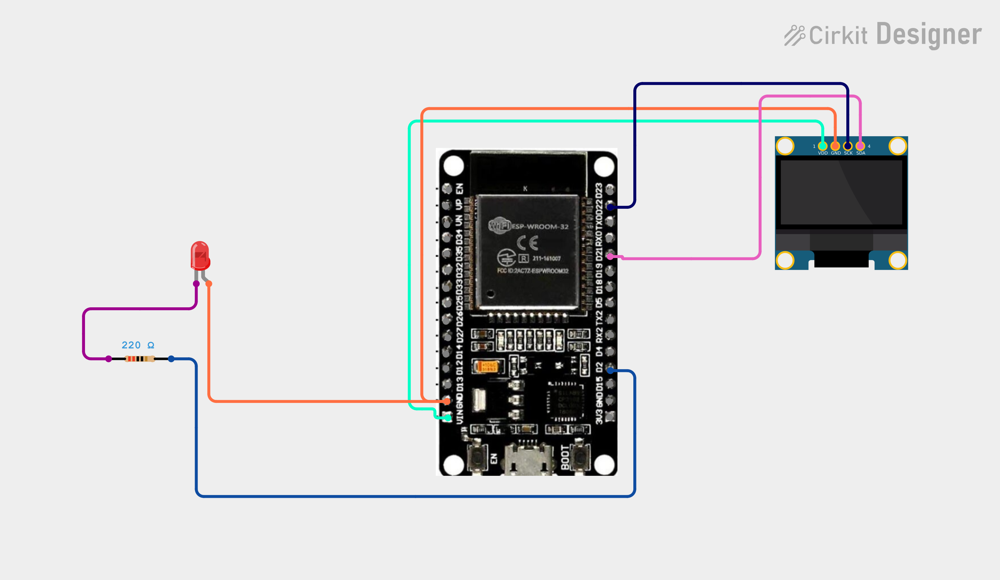

# Project 31 — Wi-Fi LED Controller (ESP32 + WebServer + OLED) 💡🌐

[](#difficulty)
[](#hardware-used)
[](#hardware-used)
[](#hardware-used)

## Overview

The **Wi-Fi LED Controller** is a foundational IoT smart home automation project. Using an **ESP32 microcontroller**, a **5mm LED**, a **220Ω current-limiting resistor**, and a **0.96" SSD1306 I2C OLED display**, it demonstrates how to remotely control a physical actuator over a local wireless network using standard HTTP requests.

The ESP32 connects to your local Wi-Fi router and hosts an embedded web server on port 80. When a user navigates to the ESP32's assigned IP address from any browser on their phone, laptop, or tablet:
1. The web interface provides interactive **ON** and **OFF** buttons.
2. Clicking **ON** sends a GET request to `/on`, setting GPIO 2 `HIGH`, illuminating the LED, and updating the OLED screen to display `"LED ON"`.
3. Clicking **OFF** sends a GET request to `/off`, setting GPIO 2 `LOW`, turning off the LED, and updating the OLED screen to `"LED OFF"`.

This project introduces:
* Creating an embedded HTTP web server on ESP32 using the `WebServer` library
* Handling RESTful URL routes (`/`, `/on`, `/off`) for bidirectional device control
* Combining wireless remote network actions with immediate local OLED visual feedback
* Current-limiting resistor protection for LEDs connected to 3.3V logic GPIO pins

---

## Hardware Required

| Component | Quantity | Notes |
| :--- | :---: | :--- |
| **ESP32 Dev Module (30-pin)** | 1 | 32-bit Wi-Fi + Bluetooth microcontroller board |
| **5mm Red LED** | 1 | Standard indicator LED |
| **220Ω Resistor** | 1 | 1/4W through-hole current-limiting resistor |
| **0.96" I2C OLED Display** | 1 | 128x64 pixels (SSD1306 driver, address `0x3C`) |
| **Breadboard & Jumpers** | 1 | Prototyping breadboard & connecting jumper wires |
| **Micro-USB / Type-C Cable** | 1 | USB power and serial flashing cable |

---

## Circuit Connections

| Component Pin | ESP32 Pin | Description |
| :--- | :--- | :--- |
| **LED Anode (Long Leg)** | **GPIO 2 (D2)** via **220Ω Resistor** | Digital control output (active-HIGH) |
| **LED Cathode (Short Leg)** | **GND** | Ground reference |
| **OLED VDD / VCC** | **VIN (5V) / 3V3** | Display Power |
| **OLED GND** | **GND** | Display Ground |
| **OLED SCK / SCL** | **GPIO 22 (D22)** | Hardware I2C Clock Line |
| **OLED SDA** | **GPIO 21 (D21)** | Hardware I2C Data Line |

---

## Circuit Diagram

### Wiring Diagram


### Schematic (ASCII)

```text
ESP32 Dev Module (30-Pin)

             ┌───────────────────────┐
     D22 ────┤ SCL / SCK             │
     D21 ────┤ SDA   0.96" SSD1306   │
     VIN ────┤ VDD   OLED Display    │
     GND ────┤ GND                   │
             └───────────────────────┘

      D2 ────[ 220Ω Resistor ]────[+ LED -]────> GND
```

---

## Setup & Configuration

1. In [`31_wifi_led_control.ino`](31_wifi_led_control.ino), enter your 2.4 GHz Wi-Fi credentials:
   ```cpp
   const char* ssid = "YOUR_WIFI_SSID";
   const char* password = "YOUR_WIFI_PASSWORD";
   ```
2. In Arduino IDE:
   - Select Board: `Tools -> Board -> ESP32 Arduino -> DOIT ESP32 DEVKIT V1` (or your ESP32 board variant).
   - Set Serial Baud: `115200`.
3. Click **Upload**.
4. Open the Serial Monitor. Once connected to Wi-Fi, the ESP32 will print its local IP:
   ```text
   Connecting WiFi.....
   IP Address: 192.168.1.110
   ```
5. Open any web browser on your phone or computer connected to the same Wi-Fi network and visit:
   ```text
   http://192.168.1.110
   ```
6. Tap **ON** to turn the LED on and update the OLED display, or **OFF** to turn it off.

---

## Arduino Code

Available in [`31_wifi_led_control.ino`](31_wifi_led_control.ino).

```cpp
#include <WiFi.h>
#include <WebServer.h>
#include <Wire.h>
#include <Adafruit_GFX.h>
#include <Adafruit_SSD1306.h>

#define LED_PIN 2

#define SCREEN_WIDTH 128
#define SCREEN_HEIGHT 64
#define OLED_RESET -1

const char* ssid = "YOUR_WIFI";
const char* password = "YOUR_PASSWORD";

WebServer server(80);

Adafruit_SSD1306 display(
  SCREEN_WIDTH,
  SCREEN_HEIGHT,
  &Wire,
  OLED_RESET
);

void showStatus(bool state) {
  display.clearDisplay();

  display.setTextSize(1);
  display.setCursor(35, 5);
  display.println("WI-FI LED");

  display.setTextSize(2);
  display.setCursor(25, 30);

  if (state) {
    display.println("LED ON");
  } else {
    display.println("LED OFF");
  }

  display.display();
}

void handleRoot() {
  String html = "<!DOCTYPE html><html>";
  html += "<head>";
  html += "<meta name='viewport' content='width=device-width,initial-scale=1'>";
  html += "<title>Wi-Fi LED</title>";
  html += "</head><body>";
  html += "<h2>Wi-Fi LED Controller</h2>";
  html += "<p><a href='/on'><button>ON</button></a></p>";
  html += "<p><a href='/off'><button>OFF</button></a></p>";
  html += "</body></html>";

  server.send(200, "text/html", html);
}

void turnOn() {
  digitalWrite(LED_PIN, HIGH);
  showStatus(true);
  server.send(200, "text/html",
              "<h2>LED ON</h2><a href='/'>Back</a>");
}

void turnOff() {
  digitalWrite(LED_PIN, LOW);
  showStatus(false);
  server.send(200, "text/html",
              "<h2>LED OFF</h2><a href='/'>Back</a>");
}

void setup() {
  Serial.begin(115200);

  pinMode(LED_PIN, OUTPUT);
  digitalWrite(LED_PIN, LOW);

  display.begin(SSD1306_SWITCHCAPVCC, 0x3C);
  display.setTextColor(SSD1306_WHITE);

  display.clearDisplay();
  display.setTextSize(1);
  display.setCursor(20, 25);
  display.println("Connecting WiFi...");
  display.display();

  WiFi.begin(ssid, password);

  while (WiFi.status() != WL_CONNECTED) {
    delay(500);
    Serial.print(".");
  }

  Serial.println();
  Serial.print("IP Address: ");
  Serial.println(WiFi.localIP());

  showStatus(false);

  server.on("/", handleRoot);
  server.on("/on", turnOn);
  server.on("/off", turnOff);

  server.begin();
}

void loop() {
  server.handleClient();
}
```

---

## How It Works

1. **Initialization (`setup()`)**:
   - `pinMode(LED_PIN, OUTPUT)` configures GPIO 2 to drive the indicator LED.
   - The SSD1306 OLED display initializes via I2C at address `0x3C` and prompts `"Connecting WiFi..."`.
   - `WiFi.begin(ssid, password)` establishes connection with the local 2.4 GHz network.
2. **HTTP Route Registration**:
   - `server.on("/", handleRoot)`: Serves the main HTML webpage containing navigation buttons.
   - `server.on("/on", turnOn)`: Invoked when the user clicks ON; sets `digitalWrite(LED_PIN, HIGH)`, calls `showStatus(true)` to display `"LED ON"` on the OLED, and replies with confirmation HTML.
   - `server.on("/off", turnOff)`: Invoked when the user clicks OFF; sets `digitalWrite(LED_PIN, LOW)`, calls `showStatus(false)` to display `"LED OFF"` on the OLED, and replies with confirmation HTML.
3. **Request Handling (`loop()`)**:
   - `server.handleClient()` non-blockingly listens for and handles incoming HTTP socket connections from web browsers on the local network.
