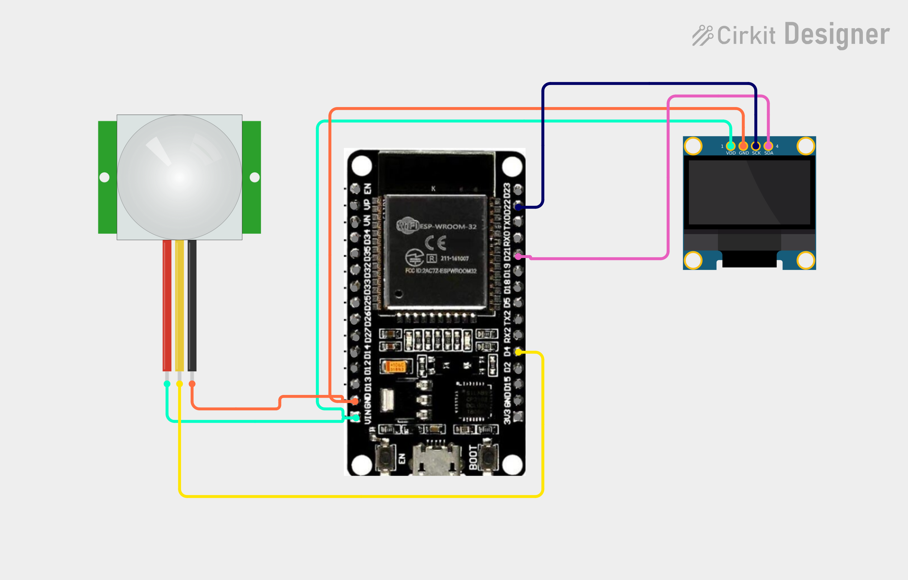

# Project 32 — Wi-Fi Motion Monitor (ESP32 + PIR Sensor + OLED) 🚶‍♂️🌐

[](#difficulty)
[](#hardware-used)
[](#hardware-used)
[](#hardware-used)

## Overview

The **Wi-Fi Motion Monitor** is an IoT-enabled wireless surveillance and occupancy monitoring station. Powered by the **ESP32 microcontroller**, an **HC-SR501 Passive Infrared (PIR) motion sensor**, and a **0.96" SSD1306 I2C OLED display**, it detects infrared heat radiated by moving bodies and broadcasts security status across a local wireless network.

Key capabilities:
* **Real-Time Local OLED Screen**: Constantly visualizes presence (`"MOTION DETECTED!"` vs. `"NO MOTION"`).
* **Embedded IoT Web Server**: Direct HTTP hosting on port 80.
* **Auto-Refreshing Wireless Dashboard**: Any smartphone or PC browser on the same Wi-Fi network viewing the ESP32's IP receives a live webpage that automatically refreshes every second (`content='1'`), providing instant intruder or occupancy awareness.

This project introduces:
* Interfacing pyroelectric infrared sensors with 32-bit ESP32 microcontrollers
* Establishing 2.4 GHz Wi-Fi Station connections and local IP assignment
* Serving dynamic, auto-refreshing client-side HTML without third-party cloud brokers
* Synchronous multi-target UI updates (local I2C display and remote network clients)

---

## Hardware Required

| Component | Quantity | Notes |
| :--- | :---: | :--- |
| **ESP32 Dev Module (30-pin)** | 1 | Dual-core Wi-Fi + Bluetooth microcontroller board |
| **HC-SR501 PIR Motion Sensor** | 1 | Passive Infrared pyroelectric body sensor module |
| **0.96" I2C OLED Display** | 1 | 128x64 pixels (SSD1306 controller, address `0x3C`) |
| **Breadboard & Jumpers** | 1 | Prototyping breadboard & connecting jumper wires |
| **Micro-USB / Type-C Cable** | 1 | 5V USB power delivery and programming cable |

---

## Circuit Connections

| Component Pin | ESP32 Pin | Description |
| :--- | :--- | :--- |
| **PIR Sensor VCC** | **VIN (5V)** | Sensor Power (+5V recommended for HC-SR501) |
| **PIR Sensor GND** | **GND** | Sensor Ground |
| **PIR Sensor OUT** | **GPIO 4 (D4)** | Digital motion trigger output (3.3V logic) |
| **OLED VDD / VCC** | **VIN (5V) / 3V3** | Display Power |
| **OLED GND** | **GND** | Display Ground |
| **OLED SCK / SCL** | **GPIO 22 (D22)** | Hardware I2C Clock Line |
| **OLED SDA** | **GPIO 21 (D21)** | Hardware I2C Data Line |

---

## Circuit Diagram

### Wiring Diagram


### Schematic (ASCII)

```text
ESP32 Dev Module (30-Pin)

             ┌───────────────────────┐
     D22 ────┤ SCL / SCK             │
     D21 ────┤ SDA   0.96" SSD1306   │
     VIN ────┤ VDD   OLED Display    │
     GND ────┤ GND                   │
             └───────────────────────┘

             ┌──────────────────────────────┐
     VIN ────┤ VCC                          │
     GND ────┤ GND           HC-SR501 PIR   │
      D4 ────┤ OUT (Data)    Motion Sensor  │
             └──────────────────────────────┘
```

---

## Setup & Configuration

1. In [`32_wifi_motion_monitor.ino`](32_wifi_motion_monitor.ino), configure your Wi-Fi network credentials:
   ```cpp
   const char* ssid = "YOUR_WIFI_SSID";
   const char* password = "YOUR_WIFI_PASSWORD";
   ```
2. In Arduino IDE:
   - Select Board: `Tools -> Board -> ESP32 Arduino -> DOIT ESP32 DEVKIT V1` (or your ESP32 board variant).
   - Set Serial Baud Rate: `115200`.
3. Click **Upload**.
4. Open the Serial Monitor. Once connected to your wireless network, the ESP32 outputs its assigned local IP:
   ```text
   Connecting WiFi.....
   IP Address: 192.168.1.115
   ```
5. Open any web browser on your phone, tablet, or laptop (connected to the same Wi-Fi) and navigate to:
   ```text
   http://192.168.1.115
   ```
   The dashboard will continuously refresh every 1 second and alert you the instant motion is detected!

---

## Arduino Code

Available in [`32_wifi_motion_monitor.ino`](32_wifi_motion_monitor.ino).

```cpp
#include <WiFi.h>
#include <WebServer.h>
#include <Wire.h>
#include <Adafruit_GFX.h>
#include <Adafruit_SSD1306.h>

#define PIR_PIN 4

#define SCREEN_WIDTH 128
#define SCREEN_HEIGHT 64
#define OLED_RESET -1

const char* ssid = "YOUR_WIFI";
const char* password = "YOUR_PASSWORD";

WebServer server(80);

Adafruit_SSD1306 display(
  SCREEN_WIDTH, SCREEN_HEIGHT,
  &Wire, OLED_RESET
);

void updateDisplay(bool motion) {
  display.clearDisplay();

  display.setTextSize(1);
  display.setCursor(25, 5);
  display.println("MOTION MONITOR");

  display.setTextSize(2);

  if (motion) {
    display.setCursor(5, 28);
    display.println("MOTION");
    display.setCursor(5, 48);
    display.println("DETECTED!");
  } else {
    display.setCursor(20, 35);
    display.println("NO MOTION");
  }

  display.display();
}

void handleRoot() {
  bool motion = digitalRead(PIR_PIN);

  String html = "<!DOCTYPE html><html>";
  html += "<head>";
  html += "<meta http-equiv='refresh' content='1'>";
  html += "<meta name='viewport' content='width=device-width,initial-scale=1'>";
  html += "<title>IoT Motion Monitor</title>";
  html += "</head><body>";
  html += "<h2>IoT Motion Monitor</h2>";

  if (motion == HIGH)
    html += "<h1>MOTION DETECTED</h1>";
  else
    html += "<h1>NO MOTION</h1>";

  html += "</body></html>";

  server.send(200, "text/html", html);
}

void setup() {
  Serial.begin(115200);

  pinMode(PIR_PIN, INPUT);

  display.begin(SSD1306_SWITCHCAPVCC, 0x3C);
  display.setTextColor(SSD1306_WHITE);

  display.clearDisplay();
  display.setTextSize(1);
  display.setCursor(20, 25);
  display.println("Connecting WiFi...");
  display.display();

  WiFi.begin(ssid, password);

  while (WiFi.status() != WL_CONNECTED) {
    delay(500);
    Serial.print(".");
  }

  Serial.println();
  Serial.print("IP Address: ");
  Serial.println(WiFi.localIP());

  server.on("/", handleRoot);
  server.begin();
}

void loop() {
  bool motion = digitalRead(PIR_PIN);

  updateDisplay(motion);

  server.handleClient();

  delay(200);
}
```

---

## How It Works

1. **Initialization (`setup()`)**:
   - `pinMode(PIR_PIN, INPUT)` configures GPIO 4 as a digital input to capture the high pulse from the PIR sensor's BISS0001 controller.
   - The SSD1306 OLED display initializes over I2C at address `0x3C` and prompts `"Connecting WiFi..."`.
   - `WiFi.begin(ssid, password)` establishes connection with the local 2.4 GHz network.
2. **Motion Sensing Principle**:
   - The HC-SR501 uses a dual-element pyroelectric sensor behind a Fresnel lens array. Moving human thermal radiation shifts the infrared balance between elements, driving the `OUT` pin `HIGH`.
3. **Local Screen Rendering (`updateDisplay()`)**:
   - If `motion == HIGH`, the screen displays `"MOTION DETECTED!"` in large font.
   - When motion ceases, the display returns to `"NO MOTION"`.
4. **Wireless Dashboard Serving (`handleRoot()`)**:
   - Incoming HTTP GET requests are answered with an HTML5 page containing `<meta http-equiv='refresh' content='1'>`.
   - The client browser automatically re-fetches the live status every 1 second, functioning as a real-time web surveillance monitor.
