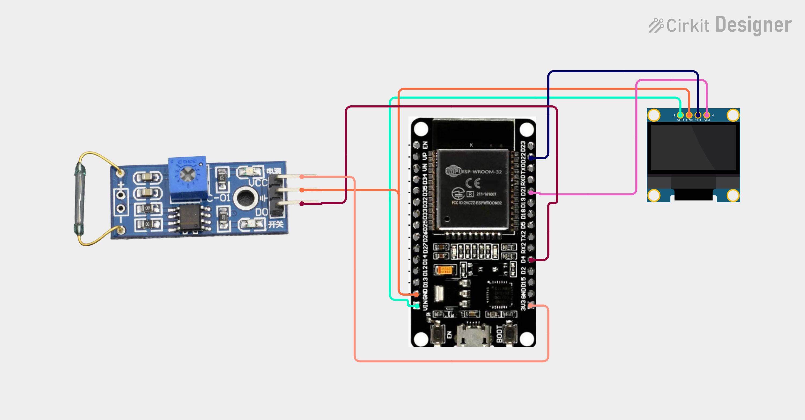

# Project 33 — Wi-Fi Door Monitor (ESP32 + Reed Switch + OLED) 🚪🌐

[](#difficulty)
[](#hardware-used)
[](#hardware-used)
[](#hardware-used)

## Overview

The **Wi-Fi Door Monitor** is an IoT-enabled smart entry security system. Powered by the **ESP32 microcontroller**, a **magnetic reed switch sensor module**, and a **0.96" SSD1306 I2C OLED display**, it tracks whether a door, window, or cabinet is open or closed, providing local visual feedback and remote wireless monitoring.

Inside the glass envelope of the reed switch are two ferromagnetic flexible contact blades (reeds). When the companion permanent magnet is nearby (door closed), the magnetic field pulls the blades together, bringing the module's comparator output `LOW`. When the door opens, the magnet moves away, releasing the contacts and switching the digital output (`DO`) to `HIGH`:
1. The OLED screen displays `"DOOR OPEN"` or `"DOOR CLOSED"` in bold text.
2. The embedded web server running on the ESP32 serves a live HTML page that automatically refreshes every second (`content='1'`), allowing real-time status checking from any smartphone or browser on the local Wi-Fi network.

This project introduces:
* Magnetic contact sensor interfacing with the ESP32 platform
* Serving live web dashboards without external cloud subscriptions
* Auto-refreshing browser interfaces using standard HTML meta headers
* Real-time synchronous local OLED display updates

---

## Hardware Required

| Component | Quantity | Notes |
| :--- | :---: | :--- |
| **ESP32 Dev Module (30-pin)** | 1 | Dual-core Wi-Fi + Bluetooth microcontroller board |
| **Magnetic Reed Switch Module** | 1 | Normally-open magnetic contact sensor with LM393 comparator (`DO`) |
| **Companion Bar Magnet** | 1 | Neodymium or ferrite permanent bar magnet |
| **0.96" I2C OLED Display** | 1 | 128x64 pixels (SSD1306 controller, address `0x3C`) |
| **Breadboard & Jumpers** | 1 | Prototyping breadboard & connecting jumper wires |
| **Micro-USB / Type-C Cable** | 1 | 5V USB power delivery and programming cable |

---

## Circuit Connections

| Component Pin | ESP32 Pin | Description |
| :--- | :--- | :--- |
| **Reed Switch Module VCC** | **3V3** | Sensor Power (+3.3V) |
| **Reed Switch Module GND** | **GND** | Sensor Ground |
| **Reed Switch Module DO** | **GPIO 4 (D4)** | Digital contact state output (HIGH = open, LOW = closed) |
| **OLED VDD / VCC** | **VIN (5V) / 3V3** | Display Power |
| **OLED GND** | **GND** | Display Ground |
| **OLED SCK / SCL** | **GPIO 22 (D22)** | Hardware I2C Clock Line |
| **OLED SDA** | **GPIO 21 (D21)** | Hardware I2C Data Line |

---

## Circuit Diagram

### Wiring Diagram


### Schematic (ASCII)

```text
ESP32 Dev Module (30-Pin)

             ┌───────────────────────┐
     D22 ────┤ SCL / SCK             │
     D21 ────┤ SDA   0.96" SSD1306   │
     VIN ────┤ VDD   OLED Display    │
     GND ────┤ GND                   │
             └───────────────────────┘

             ┌──────────────────────────────┐
     3V3 ────┤ VCC                          │
     GND ────┤ GND           Reed Switch    │
      D4 ────┤ DO            Sensor Module  │
             └──────────────────────────────┘
```

---

## Setup & Configuration

1. In [`33_wifi_door_monitor.ino`](33_wifi_door_monitor.ino), enter your local Wi-Fi network credentials:
   ```cpp
   const char* ssid = "YOUR_WIFI_SSID";
   const char* password = "YOUR_WIFI_PASSWORD";
   ```
2. In Arduino IDE:
   - Select Board: `Tools -> Board -> ESP32 Arduino -> DOIT ESP32 DEVKIT V1` (or your ESP32 board variant).
   - Set Serial Baud Rate: `115200`.
3. Click **Upload**.
4. Open the Serial Monitor. Once connected to Wi-Fi, the ESP32 prints its assigned IP address:
   ```text
   Connecting WiFi.....
   IP Address: 192.168.1.120
   ```
5. Open any web browser on your phone, tablet, or laptop (connected to the same Wi-Fi) and navigate to:
   ```text
   http://192.168.1.120
   ```
   Move the magnet close to and away from the reed switch to observe the immediate change between `"DOOR CLOSED"` and `"DOOR OPEN"` on both the OLED screen and the web dashboard!

---

## Arduino Code

Available in [`33_wifi_door_monitor.ino`](33_wifi_door_monitor.ino).

```cpp
#include <WiFi.h>
#include <WebServer.h>
#include <Wire.h>
#include <Adafruit_GFX.h>
#include <Adafruit_SSD1306.h>

#define DOOR_PIN 4

#define SCREEN_WIDTH 128
#define SCREEN_HEIGHT 64
#define OLED_RESET -1

const char* ssid = "YOUR_WIFI";
const char* password = "YOUR_PASSWORD";

WebServer server(80);

Adafruit_SSD1306 display(
  SCREEN_WIDTH, SCREEN_HEIGHT,
  &Wire, OLED_RESET
);

void updateDisplay(bool open) {
  display.clearDisplay();

  display.setTextSize(1);
  display.setCursor(30, 5);
  display.println("DOOR MONITOR");

  display.setTextSize(2);

  if (open) {
    display.setCursor(5, 30);
    display.println("DOOR OPEN");
  } else {
    display.setCursor(5, 30);
    display.println("DOOR CLOSED");
  }

  display.display();
}

void handleRoot() {
  bool open = digitalRead(DOOR_PIN) == HIGH;

  String html = "<!DOCTYPE html><html>";
  html += "<head>";
  html += "<meta http-equiv='refresh' content='1'>";
  html += "<meta name='viewport' content='width=device-width,initial-scale=1'>";
  html += "<title>IoT Door Monitor</title>";
  html += "</head><body>";
  html += "<h2>IoT Door Monitor</h2>";

  if (open)
    html += "<h1>DOOR OPEN</h1>";
  else
    html += "<h1>DOOR CLOSED</h1>";

  html += "</body></html>";

  server.send(200, "text/html", html);
}

void setup() {
  Serial.begin(115200);

  pinMode(DOOR_PIN, INPUT);

  display.begin(SSD1306_SWITCHCAPVCC, 0x3C);
  display.setTextColor(SSD1306_WHITE);

  display.clearDisplay();
  display.setTextSize(1);
  display.setCursor(20, 25);
  display.println("Connecting WiFi...");
  display.display();

  WiFi.begin(ssid, password);

  while (WiFi.status() != WL_CONNECTED) {
    delay(500);
    Serial.print(".");
  }

  Serial.println();
  Serial.print("IP Address: ");
  Serial.println(WiFi.localIP());

  server.on("/", handleRoot);
  server.begin();
}

void loop() {
  bool open = digitalRead(DOOR_PIN) == HIGH;

  updateDisplay(open);
  server.handleClient();

  delay(200);
}
```

---

## How It Works

1. **Initialization (`setup()`)**:
   - `pinMode(DOOR_PIN, INPUT)` configures GPIO 4 as a digital input to read the status of the magnetic reed switch module.
   - The SSD1306 OLED display initializes over I2C at address `0x3C` and prompts `"Connecting WiFi..."`.
   - `WiFi.begin(ssid, password)` establishes connection with the local 2.4 GHz network.
2. **Magnetic Reed Switch Logic**:
   - When a magnet is placed adjacent to the sensor, the reed contacts close, pulling `DO` `LOW` (door closed).
   - When the door opens, the magnet separates, opening the contacts and pulling `DO` `HIGH` via the onboard pull-up resistor (door open).
3. **Local Screen Rendering (`updateDisplay()`)**:
   - Displays `"DOOR OPEN"` when `open == true`, and `"DOOR CLOSED"` when `open == false`.
4. **Wireless Dashboard Serving (`handleRoot()`)**:
   - Responds to HTTP GET requests on port 80 with an HTML5 page containing `<meta http-equiv='refresh' content='1'>`.
   - Connected browser clients automatically re-query the door state once every second, functioning as a real-time entry and security portal.
