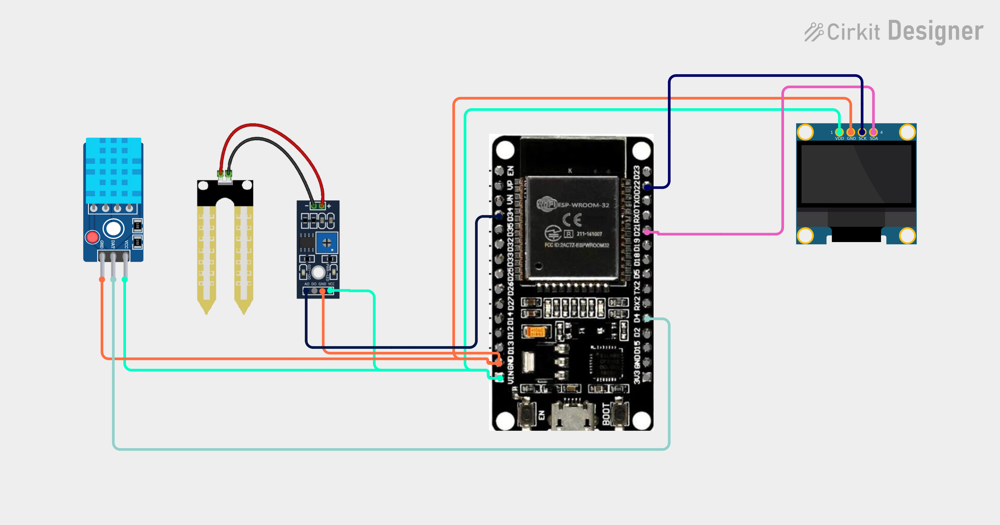

# Project 34 — IoT Smart Plant Monitor (ESP32 + Soil Moisture + DHT11 + OLED) 🌱💧🌐

[](#difficulty)
[](#hardware-used)
[](#hardware-used)
[](#hardware-used)
[](#hardware-used)

## Overview

The **IoT Smart Plant Monitor** is an agricultural telemetry and smart indoor gardening station. Powered by an **ESP32 microcontroller**, a **resistive soil moisture sensor probe**, a **DHT11 ambient temperature & humidity sensor**, and a **0.96" SSD1306 I2C OLED display**, it continuously assesses plant hydration and microclimate conditions both locally and remotely over Wi-Fi.

The ESP32 reads the analog voltage from the soil sensor using its internal 12-bit ADC (GPIO 34, `0 - 4095`) and maps the reading to a calibrated percentage (`0% - 100%`). Lower analog voltage corresponds to wetter soil because water enhances electrical conduction between the probe tines. The system automatically categorizes hydration into:
* **DRY**: Moisture < 30% (immediate watering needed)
* **MOIST**: Moisture between 30% and 70% (healthy plant hydration)
* **WET**: Moisture > 70% (saturated / risk of overwatering)

Concurrently, the DHT11 digital sensor tracks ambient temperature in °C and relative air humidity in %. All parameters are rendered live on the OLED display and broadcast through an embedded HTTP web server on port 80 with automatic 2-second browser refresh (`content='2'`).

This project introduces:
* 12-bit ADC sampling and inverted sensor calibration on the ESP32 platform
* Combining multi-sensor telemetry (soil conductivity + ambient climate)
* Dual-interface reporting: synchronous local OLED screen + asynchronous Wi-Fi HTTP web server
* Building cloud-free IoT dashboards for precision agriculture and home automation

---

## Hardware Required

| Component | Quantity | Notes |
| :--- | :---: | :--- |
| **ESP32 Dev Module (30-pin)** | 1 | Dual-core Wi-Fi + Bluetooth microcontroller board |
| **Soil Moisture Sensor Module** | 1 | 2-prong resistive probe fork + LM393 comparator driver board (`AO`) |
| **DHT11 Sensor Module** | 1 | Digital ambient temperature and relative humidity sensor (3-pin) |
| **0.96" I2C OLED Display** | 1 | 128x64 pixels (SSD1306 controller, default address `0x3C`) |
| **Breadboard & Jumpers** | 1 | Solderless prototyping breadboard & DuPont jumper wires |
| **Micro-USB / Type-C Cable** | 1 | 5V USB power delivery and programming cable |

---

## Circuit Connections

| Component Pin | ESP32 Pin | Description |
| :--- | :--- | :--- |
| **Soil Sensor Probe** | **Comparator 2-pin header** | Connects probe fork to driver module |
| **Soil Sensor VCC** | **VIN (5V)** | Module Power (+5V) |
| **Soil Sensor GND** | **GND** | Ground |
| **Soil Sensor AO** | **GPIO 34 (ADC1_CH6)** | Analog Voltage Output (Input-Only ADC pin) |
| **DHT11 VCC** | **VIN (5V) / 3V3** | Sensor Power (+3.3V to +5V) |
| **DHT11 GND** | **GND** | Ground |
| **DHT11 DAT / OUT** | **GPIO 4 (D4)** | Single-bus bidirectional digital data line |
| **OLED VDD / VCC** | **VIN (5V) / 3V3** | Display Power |
| **OLED GND** | **GND** | Ground |
| **OLED SCK / SCL** | **GPIO 22 (D22)** | Hardware I2C Clock Line |
| **OLED SDA** | **GPIO 21 (D21)** | Hardware I2C Data Line |

> [!NOTE]
> **GPIO 34** on the ESP32 belongs to the `ADC1` peripheral and is an **input-only pin** (GPI). It does not have internal pull-up/pull-down resistors, making it ideal for dedicated analog inputs like the soil sensor.

---

## Circuit Diagram

### Wiring Diagram


### Schematic (ASCII)

```text
ESP32 Dev Module (30-Pin)

             ┌───────────────────────┐
     D22 ────┤ SCL / SCK             │
     D21 ────┤ SDA   0.96" SSD1306   │
     VIN ────┤ VDD   OLED Display    │
     GND ────┤ GND                   │
             └───────────────────────┘

             ┌───────────────────────┐
     VIN ────┤ VCC                   │
     GND ────┤ GND   DHT11 Sensor    │
      D4 ────┤ DAT   Module          │
             └───────────────────────┘

             ┌──────────────────────────────┐
     VIN ────┤ VCC                          │
     GND ────┤ GND      Soil Moisture       │
    GPIO 34 ─┤ AO       Comparator Board    │
             │                              │
             │ [Probe Header] ── [ 2-Prong  │
             │                   Fork Probe]│
             └──────────────────────────────┘
```

---

## Setup & Configuration

1. In [`34_wifi_plant_monitor.ino`](34_wifi_plant_monitor.ino), enter your 2.4 GHz Wi-Fi credentials:
   ```cpp
   const char* ssid = "YOUR_WIFI_SSID";
   const char* password = "YOUR_WIFI_PASSWORD";
   ```
2. In the Arduino IDE:
   - Select Board: `Tools -> Board -> ESP32 Arduino -> DOIT ESP32 DEVKIT V1` (or your ESP32 board variant).
   - Set Serial Baud Rate: `115200`.
3. Verify required libraries are installed:
   - `Adafruit GFX Library`
   - `Adafruit SSD1306`
   - `DHT sensor library by Adafruit`
4. Click **Upload**.
5. Open the Serial Monitor. Once connected to Wi-Fi, the ESP32 prints its local IP address:
   ```text
   Connecting WiFi.....
   IP Address: 192.168.1.135
   ```
6. Open any web browser on your phone, tablet, or PC connected to the same Wi-Fi and open:
   ```text
   http://192.168.1.135
   ```
   The dashboard automatically refreshes every 2 seconds with updated soil moisture, status, temperature, and humidity readings!

---

## Arduino Code

Available in [`34_wifi_plant_monitor.ino`](34_wifi_plant_monitor.ino).

```cpp
#include <WiFi.h>
#include <WebServer.h>
#include <Wire.h>
#include <Adafruit_GFX.h>
#include <Adafruit_SSD1306.h>
#include <DHT.h>

#define SOIL_PIN 34
#define DHT_PIN 4
#define DHT_TYPE DHT11

#define SCREEN_WIDTH 128
#define SCREEN_HEIGHT 64
#define OLED_RESET -1

const char* ssid = "YOUR_WIFI";
const char* password = "YOUR_PASSWORD";

WebServer server(80);
DHT dht(DHT_PIN, DHT_TYPE);

Adafruit_SSD1306 display(
  SCREEN_WIDTH, SCREEN_HEIGHT,
  &Wire, OLED_RESET
);

int moisture = 0;
float temperature = 0;
float humidity = 0;

void readSensors() {
  int soilValue = analogRead(SOIL_PIN);

  // Higher ADC reading usually means drier soil
  moisture = map(soilValue, 4095, 0, 0, 100);
  moisture = constrain(moisture, 0, 100);

  float t = dht.readTemperature();
  float h = dht.readHumidity();

  if (!isnan(t)) temperature = t;
  if (!isnan(h)) humidity = h;
}

String plantStatus() {
  if (moisture < 30)
    return "DRY";
  else if (moisture < 70)
    return "MOIST";
  else
    return "WET";
}

void updateDisplay() {
  display.clearDisplay();

  display.setTextSize(1);
  display.setCursor(25, 0);
  display.println("PLANT MONITOR");

  display.setCursor(0, 16);
  display.print("Soil: ");
  display.print(moisture);
  display.print("% ");
  display.println(plantStatus());

  display.setCursor(0, 32);
  display.print("Temp: ");
  display.print(temperature, 1);
  display.println(" C");

  display.setCursor(0, 48);
  display.print("Hum:  ");
  display.print(humidity, 1);
  display.println("%");

  display.display();
}

void handleRoot() {
  readSensors();

  String html = "<!DOCTYPE html><html>";
  html += "<head><meta http-equiv='refresh' content='2'>";
  html += "<meta name='viewport' content='width=device-width,initial-scale=1'>";
  html += "<title>IoT Plant Monitor</title></head>";
  html += "<body><h2>IoT Plant Monitor</h2>";
  html += "<p>Soil Moisture: <b>" + String(moisture) + "%</b></p>";
  html += "<p>Status: <b>" + plantStatus() + "</b></p>";
  html += "<p>Temperature: <b>" + String(temperature, 1) + " C</b></p>";
  html += "<p>Humidity: <b>" + String(humidity, 1) + " %</b></p>";
  html += "</body></html>";

  server.send(200, "text/html", html);
}

void setup() {
  Serial.begin(115200);

  dht.begin();

  display.begin(SSD1306_SWITCHCAPVCC, 0x3C);
  display.setTextColor(SSD1306_WHITE);

  display.clearDisplay();
  display.setTextSize(1);
  display.setCursor(20, 25);
  display.println("Connecting WiFi...");
  display.display();

  WiFi.begin(ssid, password);

  while (WiFi.status() != WL_CONNECTED) {
    delay(500);
    Serial.print(".");
  }

  Serial.println();
  Serial.print("IP Address: ");
  Serial.println(WiFi.localIP());

  server.on("/", handleRoot);
  server.begin();
}

void loop() {
  readSensors();
  updateDisplay();

  server.handleClient();

  delay(2000);
}
```

---

## How It Works

1. **Hardware Initialization (`setup()`)**:
   - `Serial.begin(115200)` opens serial telemetry diagnostics.
   - `dht.begin()` powers on the internal sampling timer of the DHT11 sensor.
   - `display.begin(SSD1306_SWITCHCAPVCC, 0x3C)` starts the OLED screen over I2C (GPIO 21 & 22) and shows `"Connecting WiFi..."`.
   - `WiFi.begin(ssid, password)` establishes connection to the local 2.4 GHz access point.
   - `server.on("/", handleRoot)` attaches the web handler and `server.begin()` starts listening for HTTP clients.

2. **Analog Inversion & 12-Bit Mapping (`readSensors()`)**:
   - The ESP32's ADC has a 12-bit default resolution yielding integer values between `0` (0V) and `4095` (3.3V).
   - In dry air/soil, electrical resistance across probe prongs is maximal, keeping the analog voltage close to 3.3V (~4095).
   - When submerged in moist soil, water conducts electric charge, dropping probe resistance and lowering the output voltage.
   - `map(soilValue, 4095, 0, 0, 100)` inverts this relationship so that higher water content yields higher percentages.
   - `constrain(moisture, 0, 100)` clamps the output within realistic boundaries.

3. **Status Categorization (`plantStatus()`)**:
   - Compares the calculated moisture against agronomic thresholds:
     - `< 30%` -> `DRY`
     - `30% - 70%` -> `MOIST`
     - `> 70%` -> `WET`

4. **Local OLED Interface (`updateDisplay()`)**:
   - Renders a multi-line formatted readout showing Soil Moisture %, Plant State, Ambient Temperature in °C, and Relative Humidity in %.

5. **Self-Refreshing Web Server (`handleRoot()`)**:
   - Returns a lightweight HTML5 document to any connected HTTP browser.
   - Includes `<meta http-equiv='refresh' content='2'>` so the client refreshes automatically every 2 seconds without requiring client-side JavaScript or WebSocket connections.

---

## Calibration Tip

Soil composition varies significantly (potting mix, garden soil, sand). For optimal accuracy:
1. Hold the probe dry in air and record `analogRead(SOIL_PIN)` (typically ~`4000 - 4095`).
2. Submerge the probe in a cup of water up to the safe depth line and record the value (typically ~`1200 - 1600`).
3. Replace `4095, 0` in `map(soilValue, airValue, waterValue, 0, 100)` for tailored calibration!
