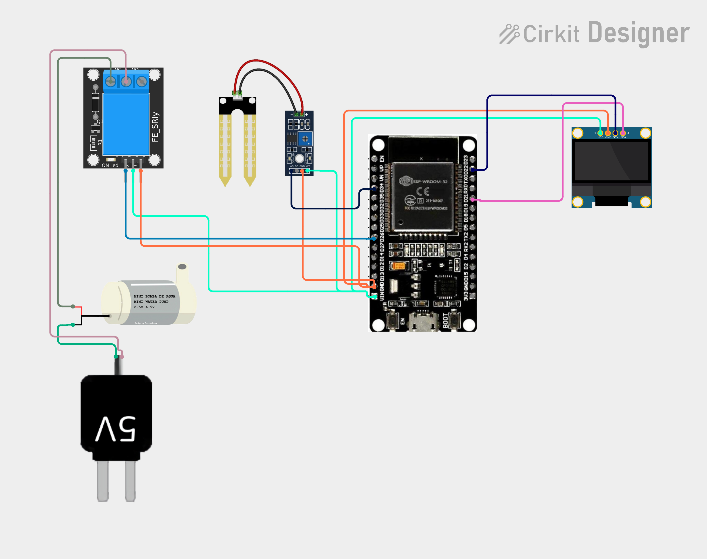

# Project 35 — Automatic Plant Watering System (ESP32 + Soil Moisture + Relay + OLED) 🌱💧🔌

[](#difficulty)
[](#hardware-used)
[](#hardware-used)
[](#hardware-used)
[](#hardware-used)

## Overview

The **Automatic Plant Watering System** is a closed-loop smart irrigation controller designed to prevent under-watering and over-watering in potted plants, hydroponic setups, or garden beds. Powered by the **ESP32 microcontroller**, a **resistive soil moisture sensor probe**, a **5V electromechanical relay module**, a **mini submersible DC water pump**, and a **0.96" SSD1306 I2C OLED display**, it autonomously waters plants whenever soil moisture drops below a critical threshold.

The ESP32 measures soil electrical conductivity from analog pin **GPIO 34 (ADC1_CH6)**. In dry soil, electrical resistance across the sensor prongs is high (yielding an ADC reading close to 4095). When water is present, ionic conduction lowers the resistance, dropping the analog voltage towards ~1500 (or lower in saturated conditions). The software applies calibrated mapping to calculate moisture from `0%` to `100%`:
1. **Hysteresis Irrigation Logic**:
   * **Start Watering**: If moisture drops below **30%** (`moisture < 30`), the controller energizes the relay by pulling **GPIO 26** `LOW` (active-LOW relay), switching on the 5V submersible water pump.
   * **Stop Watering**: The pump continues irrigating until soil moisture reaches **50%** or higher (`moisture >= 50`). This deadband hysteresis prevents the pump from rapidly short-cycling (oscillating on/off) around a single setpoint.
2. **Local OLED Monitoring**:
   * Displays the system title `"AUTO WATERING"`.
   * Shows the live calculated soil moisture percentage (`Moisture: XX%`).
   * Renders the bold pump actuation state: `"PUMP ON"` (watering active) or `"PUMP OFF"` (quiescent).

This project introduces:
* Interfacing electromechanical relay switches with ESP32 microcontrollers
* Safe electrical isolation for DC inductive motor loads
* Closed-loop feedback control with threshold hysteresis
* Continuous real-time diagnostic rendering on an I2C OLED display

---

## Hardware Required

| Component | Quantity | Notes |
| :--- | :---: | :--- |
| **ESP32 Dev Module (30-pin)** | 1 | Dual-core Wi-Fi + Bluetooth microcontroller board |
| **Soil Moisture Sensor Module** | 1 | 2-prong resistive probe fork + LM393 comparator driver board (`AO`) |
| **5V Relay Module (1-Channel)** | 1 | Optocoupler-isolated relay module with indicator LED (active-LOW) |
| **Mini Submersible DC Water Pump** | 1 | 2.5V – 6V / 9V DC submersible mini water pump |
| **5V External Power Adapter** | 1 | Dedicated 5V USB wall adapter or battery pack for water pump |
| **0.96" I2C OLED Display** | 1 | 128x64 pixels (SSD1306 controller, address `0x3C`) |
| **Flexible Silicone Water Tubing** | 1 | Small diameter tubing for pump discharge into plant soil |
| **Breadboard & Jumpers** | 1 | Solderless prototyping breadboard & DuPont jumper wires |
| **Micro-USB / Type-C Cable** | 1 | 5V USB power delivery and programming cable for ESP32 |

---

## Circuit Connections

### 1. ESP32 & Logic Connections
| Component Pin | ESP32 Pin | Description |
| :--- | :--- | :--- |
| **Soil Sensor Probe** | **Comparator 2-pin header** | Connects probe fork to driver module |
| **Soil Sensor VCC** | **VIN (5V)** | Module Power (+5V) |
| **Soil Sensor GND** | **GND** | Ground |
| **Soil Sensor AO** | **GPIO 34 (ADC1_CH6)** | Analog Voltage Output (Input-Only ADC pin) |
| **Relay Module VCC (`+`)** | **VIN (5V)** | Relay coil power (+5V) |
| **Relay Module GND (`-`)** | **GND** | Relay ground |
| **Relay Module IN / Signal (`S`)** | **GPIO 26 (D26)** | Digital control signal (Active LOW) |
| **OLED VDD / VCC** | **VIN (5V) / 3V3** | Display Power |
| **OLED GND** | **GND** | Display Ground |
| **OLED SCK / SCL** | **GPIO 22 (D22)** | Hardware I2C Clock Line |
| **OLED SDA** | **GPIO 21 (D21)** | Hardware I2C Data Line |

### 2. Relay High-Power / Pump Switching Circuit
| Terminal | Connects To | Description |
| :--- | :--- | :--- |
| **5V External Adapter (+)** | **Relay COM (Common)** | Positive 5V DC power source |
| **Relay NO (Normally Open)** | **Pump Positive Wire (Red / +)** | Switched 5V feed to water pump |
| **5V External Adapter (-)** | **Pump Negative Wire (Black / -)** | Direct ground return for DC pump |

> [!CAUTION]
> **Motor Power Isolation**: Always power the DC water pump from an external 5V power adapter (or separate battery supply) switched through the relay's `COM` and `NO` terminals. Never power inductive motor loads directly from the ESP32's `3V3` or onboard voltage regulator, as inductive flyback voltage and motor startup current spikes can reset or damage the ESP32.

---

## Circuit Diagram

### Wiring Diagram


### Schematic (ASCII)

```text
ESP32 Dev Module (30-Pin)

             ┌───────────────────────┐
     D22 ────┤ SCL / SCK             │
     D21 ────┤ SDA   0.96" SSD1306   │
     VIN ────┤ VDD   OLED Display    │
     GND ────┤ GND                   │
             └───────────────────────┘

             ┌──────────────────────────────┐
     VIN ────┤ VCC                          │
     GND ────┤ GND      Soil Moisture       │
    GPIO 34 ─┤ AO       Comparator Board    │
             │                              │
             │ [Probe Header] ── [ 2-Prong  │
             │                   Fork Probe]│
             └──────────────────────────────┘

             ┌───────────────────────┐
     VIN ────┤ VCC (+)               │
     GND ────┤ GND (-)  5V Relay     │
     D26 ────┤ IN  (S)  Module       │
             └──────┬────────┬───────┘
                    │        │
                   COM       NO
                    │        │
     [5V Adapter +] ┘        └─── [Pump +]
     [5V Adapter -] ───────────── [Pump -]
```

---

## Setup & Configuration

1. In the Arduino IDE:
   - Select Board: `Tools -> Board -> ESP32 Arduino -> DOIT ESP32 DEVKIT V1` (or your ESP32 board variant).
   - Set Serial Baud Rate: `115200`.
2. Verify required libraries are installed:
   - `Adafruit GFX Library`
   - `Adafruit SSD1306`
   - `Wire` (built-in)
3. Open [`35_automatic_water_pump.ino`](35_automatic_water_pump.ino) and click **Upload**.
4. Test without water first:
   - When the probe is dry in air, moisture reads `< 30%`. The relay clicks `ON` (LED illuminates on the relay board) and the OLED shows `"PUMP ON"`.
   - Place the probe into a cup of moist soil or water; once moisture exceeds `50%`, the relay clicks `OFF` and the OLED updates to `"PUMP OFF"`.
5. Connect silicone tubing from the pump outlet to your plant pot and place the submersible pump in a small water reservoir.

---

## Arduino Code

Available in [`35_automatic_water_pump.ino`](35_automatic_water_pump.ino).

```cpp
#include <Wire.h>
#include <Adafruit_GFX.h>
#include <Adafruit_SSD1306.h>

#define SOIL_PIN 34
#define RELAY_PIN 26

#define SCREEN_WIDTH 128
#define SCREEN_HEIGHT 64
#define OLED_RESET -1

Adafruit_SSD1306 display(
  SCREEN_WIDTH,
  SCREEN_HEIGHT,
  &Wire,
  OLED_RESET
);

bool pumpOn = false;

void setup() {
  pinMode(RELAY_PIN, OUTPUT);

  // Most relay modules are active LOW
  digitalWrite(RELAY_PIN, HIGH);

  display.begin(SSD1306_SWITCHCAPVCC, 0x3C);
  display.setTextColor(SSD1306_WHITE);
}

void loop() {
  int sensorValue = analogRead(SOIL_PIN);

  // Calibrate these values for your sensor
  int moisture = map(sensorValue, 4095, 1500, 0, 100);
  moisture = constrain(moisture, 0, 100);

  // Start watering when soil is dry
  if (!pumpOn && moisture < 30) {
    pumpOn = true;
  }

  // Stop watering when sufficiently moist
  if (pumpOn && moisture >= 50) {
    pumpOn = false;
  }

  // Active-LOW relay
  digitalWrite(RELAY_PIN, pumpOn ? LOW : HIGH);

  display.clearDisplay();

  display.setTextSize(1);
  display.setCursor(22, 5);
  display.println("AUTO WATERING");

  display.setCursor(10, 22);
  display.print("Moisture: ");
  display.print(moisture);
  display.println("%");

  display.setTextSize(2);
  display.setCursor(25, 42);

  if (pumpOn)
    display.println("PUMP ON");
  else
    display.println("PUMP OFF");

  display.display();

  delay(1000);
}
```

---

## How It Works

1. **Active-LOW Relay Safety (`setup()`)**:
   - `pinMode(RELAY_PIN, OUTPUT)` sets GPIO 26 as an output.
   - `digitalWrite(RELAY_PIN, HIGH)` immediately initializes the pin `HIGH` before looping. Because standard 5V optocoupler relay boards trigger on `LOW`, this guarantees the pump is safely disabled on startup and during micro-resets.
2. **Soil Hydration Sampling (`analogRead(SOIL_PIN)`)**:
   - The ESP32's 12-bit ADC on GPIO 34 reads the analog voltage produced by the LM393 probe driver.
   - Values are mapped inversely: `map(sensorValue, 4095, 1500, 0, 100)`. Max voltage (~4095) represents 0% moisture, and soaked soil (~1500) represents 100% moisture.
3. **Deadband Hysteresis Logic**:
   - When `moisture < 30`, `pumpOn` becomes `true`. The relay energizes (`digitalWrite(RELAY_PIN, LOW)`), closing the circuit between `COM` and `NO` to supply power to the water pump.
   - While moisture is between `30%` and `49%`, the system retains its prior state.
   - Once water percolates down to the probe and moisture crosses `50%`, `pumpOn` becomes `false`. The relay de-energizes (`HIGH`), opening the contact and halting the pump.
4. **OLED Visual Status (`display.display()`)**:
   - Refreshes every 1 second, providing clear telemetry of hydration and pump actuation.
