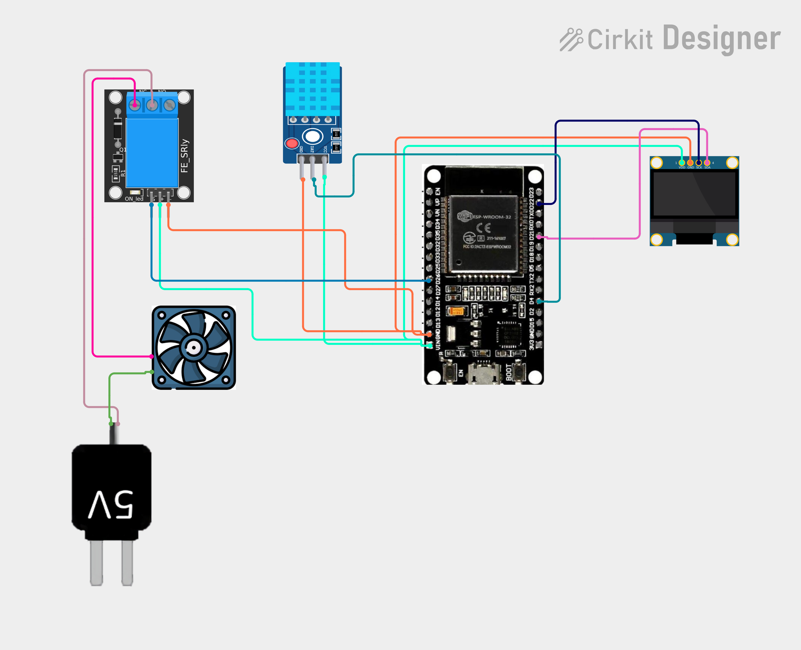

# Project 36 — Wi-Fi Smart Fan (ESP32 + DHT11 + 5V Relay + OLED) 🌀🌡️🌐

[](#difficulty)
[](#hardware-used)
[](#hardware-used)
[](#hardware-used)
[](#hardware-used)

## Overview

The **Wi-Fi Smart Fan** is an IoT-enabled automated thermal management and room cooling station. Built around the **ESP32 microcontroller**, a **DHT11 ambient temperature sensor**, an optocoupler-isolated **5V electromechanical relay module**, a **5V DC brushless cooling fan**, and a **0.96" SSD1306 I2C OLED display**, it autonomously regulates ambient temperature while broadcasting live climate metrics to any browser over Wi-Fi.

The ESP32 continuously polls the DHT11 sensor via a single-bus digital connection on **GPIO 4**:
1. **Automatic Thermal Regulation**:
   * **Turn On**: When ambient temperature reaches or exceeds **30.0 °C** (`temperature >= 30.0`), the ESP32 pulls **GPIO 26** `LOW` (active-LOW relay), closing the relay contacts to energize the 5V cooling fan.
   * **Turn Off**: Once ambient temperature cools down below **30.0 °C**, the relay de-energizes (`HIGH`), cutting fan power.
2. **Synchronous OLED Display**:
   * Displays `"SMART FAN"` title.
   * Renders the real-time temperature in large bold numbers (e.g. `31.4 C`).
   * Displays the current operating status: `"FAN: ON"` or `"FAN: OFF"`.
3. **Live Web Server Dashboard**:
   * Hosts a lightweight HTTP server on port 80.
   * Delivers an HTML5 dashboard with `<meta http-equiv='refresh' content='2'>` so any smartphone, tablet, or PC connected to the local Wi-Fi receives live updates every 2 seconds without external cloud dependencies.

This project introduces:
* Interfacing environmental temperature sensors with smart actuation logic on the ESP32
* Safe relay switching and inductive load isolation for DC cooling fans
* Combining local OLED telemetry with a wireless HTTP web server
* Building energy-efficient, automated smart home climate systems

---

## Hardware Required

| Component | Quantity | Notes |
| :--- | :---: | :--- |
| **ESP32 Dev Module (30-pin)** | 1 | Dual-core Wi-Fi + Bluetooth microcontroller board |
| **DHT11 Sensor Module** | 1 | Digital temperature and relative humidity sensor module (3-pin) |
| **5V Relay Module (1-Channel)** | 1 | Optocoupler-isolated relay module with indicator LED (active-LOW) |
| **5V DC Cooling Fan** | 1 | 5V brushless DC propeller cooling fan |
| **5V External Power Adapter** | 1 | Dedicated 5V USB adapter or DC supply for fan motor |
| **0.96" I2C OLED Display** | 1 | 128x64 pixels (SSD1306 controller, address `0x3C`) |
| **Breadboard & Jumpers** | 1 | Solderless prototyping breadboard & DuPont jumper wires |
| **Micro-USB / Type-C Cable** | 1 | 5V USB power delivery and programming cable for ESP32 |

---

## Circuit Connections

### 1. ESP32 & Logic Connections
| Component Pin | ESP32 Pin | Description |
| :--- | :--- | :--- |
| **DHT11 VCC** | **VIN (5V) / 3V3** | Sensor Power (+3.3V to +5V) |
| **DHT11 GND** | **GND** | Ground |
| **DHT11 DAT / OUT** | **GPIO 4 (D4)** | Bidirectional single-wire digital data line |
| **Relay Module VCC (`+`)** | **VIN (5V)** | Relay coil power (+5V) |
| **Relay Module GND (`-`)** | **GND** | Relay ground |
| **Relay Module IN / Signal (`S`)** | **GPIO 26 (D26)** | Digital control signal (Active LOW) |
| **OLED VDD / VCC** | **VIN (5V) / 3V3** | Display Power |
| **OLED GND** | **GND** | Display Ground |
| **OLED SCK / SCL** | **GPIO 22 (D22)** | Hardware I2C Clock Line |
| **OLED SDA** | **GPIO 21 (D21)** | Hardware I2C Data Line |

### 2. High-Current Fan Motor Circuit
| Terminal | Connects To | Description |
| :--- | :--- | :--- |
| **5V External Adapter (+)** | **Relay COM (Common)** | Switched positive DC feed |
| **Relay NO (Normally Open)** | **Fan Positive Wire (Red / +)** | Switched 5V supply to cooling fan |
| **5V External Adapter (-)** | **Fan Negative Wire (Black / -)** | Direct ground return for fan motor |

> [!CAUTION]
> **Inductive Motor Isolation**: Always power the DC cooling fan using an external 5V power adapter switched through the relay's `COM` and `NO` screw terminals. Never power fan motors directly from the ESP32's `3V3` pin or onboard voltage regulator, as electrical noise and startup current surges can cause brownout resets or hardware damage.

---

## Circuit Diagram

### Wiring Diagram


### Schematic (ASCII)

```text
ESP32 Dev Module (30-Pin)

             ┌───────────────────────┐
     D22 ────┤ SCL / SCK             │
     D21 ────┤ SDA   0.96" SSD1306   │
     VIN ────┤ VDD   OLED Display    │
     GND ────┤ GND                   │
             └───────────────────────┘

             ┌───────────────────────┐
     VIN ────┤ VCC                   │
     GND ────┤ GND   DHT11 Sensor    │
      D4 ────┤ DAT   Module          │
             └───────────────────────┘

             ┌───────────────────────┐
     VIN ────┤ VCC (+)               │
     GND ────┤ GND (-)  5V Relay     │
     D26 ────┤ IN  (S)  Module       │
             └──────┬────────┬───────┘
                    │        │
                   COM       NO
                    │        │
     [5V Adapter +] ┘        └─── [Fan +]
     [5V Adapter -] ───────────── [Fan -]
```

---

## Setup & Configuration

1. In [`36_wifi_smart_fan.ino`](36_wifi_smart_fan.ino), enter your 2.4 GHz Wi-Fi credentials:
   ```cpp
   const char* ssid = "YOUR_WIFI_SSID";
   const char* password = "YOUR_WIFI_PASSWORD";
   ```
2. In the Arduino IDE:
   - Select Board: `Tools -> Board -> ESP32 Arduino -> DOIT ESP32 DEVKIT V1` (or your ESP32 board variant).
   - Set Serial Baud Rate: `115200`.
3. Verify required libraries are installed:
   - `DHT sensor library by Adafruit`
   - `Adafruit GFX Library`
   - `Adafruit SSD1306`
4. Click **Upload**.
5. Open the Serial Monitor. Once connected to Wi-Fi, the ESP32 displays its IP address:
   ```text
   Connecting WiFi.....
   IP Address: 192.168.1.140
   ```
6. Open any browser on your phone, tablet, or PC connected to the same Wi-Fi and navigate to:
   ```text
   http://192.168.1.140
   ```
   The dashboard updates every 2 seconds with the live ambient temperature and current fan status!

---

## Arduino Code

Available in [`36_wifi_smart_fan.ino`](36_wifi_smart_fan.ino).

```cpp
#include <WiFi.h>
#include <WebServer.h>
#include <Wire.h>
#include <DHT.h>
#include <Adafruit_GFX.h>
#include <Adafruit_SSD1306.h>

#define DHT_PIN 4
#define DHT_TYPE DHT11
#define RELAY_PIN 26

#define SCREEN_WIDTH 128
#define SCREEN_HEIGHT 64
#define OLED_RESET -1

const char* ssid = "YOUR_WIFI";
const char* password = "YOUR_PASSWORD";

DHT dht(DHT_PIN, DHT_TYPE);
WebServer server(80);

Adafruit_SSD1306 display(
  SCREEN_WIDTH, SCREEN_HEIGHT,
  &Wire, OLED_RESET
);

float temperature = 0;
bool fanOn = false;

void readTemperature() {
  float t = dht.readTemperature();

  if (!isnan(t)) {
    temperature = t;
  }
}

void setFan(bool state) {
  fanOn = state;

  // Most relay modules are active LOW
  digitalWrite(RELAY_PIN, fanOn ? LOW : HIGH);
}

void updateDisplay() {
  display.clearDisplay();

  display.setTextSize(1);
  display.setCursor(35, 5);
  display.println("SMART FAN");

  display.setTextSize(2);
  display.setCursor(10, 25);
  display.print(temperature, 1);
  display.println(" C");

  display.setTextSize(1);
  display.setCursor(35, 50);

  if (fanOn)
    display.println("FAN: ON");
  else
    display.println("FAN: OFF");

  display.display();
}

void handleRoot() {
  readTemperature();

  String html = "<!DOCTYPE html><html>";
  html += "<head><meta http-equiv='refresh' content='2'>";
  html += "<meta name='viewport' content='width=device-width,initial-scale=1'>";
  html += "<title>Smart Fan</title></head>";
  html += "<body><h2>Smart Fan</h2>";

  html += "<p>Temperature: <b>";
  html += String(temperature, 1);
  html += " C</b></p>";

  html += "<p>Fan: <b>";
  html += fanOn ? "ON" : "OFF";
  html += "</b></p>";

  html += "</body></html>";

  server.send(200, "text/html", html);
}

void setup() {
  Serial.begin(115200);

  dht.begin();

  pinMode(RELAY_PIN, OUTPUT);
  setFan(false);

  display.begin(SSD1306_SWITCHCAPVCC, 0x3C);
  display.setTextColor(SSD1306_WHITE);

  display.clearDisplay();
  display.setTextSize(1);
  display.setCursor(20, 25);
  display.println("Connecting WiFi...");
  display.display();

  WiFi.begin(ssid, password);

  while (WiFi.status() != WL_CONNECTED) {
    delay(500);
    Serial.print(".");
  }

  Serial.println();
  Serial.print("IP Address: ");
  Serial.println(WiFi.localIP());

  server.on("/", handleRoot);
  server.begin();
}

void loop() {
  readTemperature();

  // Automatic temperature control
  if (temperature >= 30.0) {
    setFan(true);
  } 
  else {
    setFan(false);
  }

  updateDisplay();

  server.handleClient();

  delay(2000);
}
```

---

## How It Works

1. **Relay Initialization (`setup()`)**:
   - `pinMode(RELAY_PIN, OUTPUT)` configures GPIO 26.
   - `setFan(false)` writes `digitalWrite(RELAY_PIN, HIGH)`. Because optocoupler relay boards are active-LOW, driving the pin `HIGH` keeps the relay normally open, ensuring the fan does not inadvertently start upon boot or reset.
2. **Wi-Fi Web Server**:
   - The ESP32 joins your local network and starts an HTTP server on port 80.
   - `handleRoot()` constructs a clean HTML page containing `<meta http-equiv='refresh' content='2'>`. The client browser automatically requests fresh data every 2 seconds.
3. **Threshold Control Loop (`loop()`)**:
   - `readTemperature()` obtains current ambient temperature from the DHT11 sensor.
   - If `temperature >= 30.0`, `setFan(true)` brings GPIO 26 `LOW`, closing relay contacts `COM` and `NO` to power the cooling fan.
   - If `temperature < 30.0`, `setFan(false)` sets GPIO 26 `HIGH`, opening relay contacts and switching off the fan.
4. **OLED Status Telemetry**:
   - `updateDisplay()` updates the 128x64 display with real-time temperature in °C and clear fan state indication (`"FAN: ON"` or `"FAN: OFF"`).
