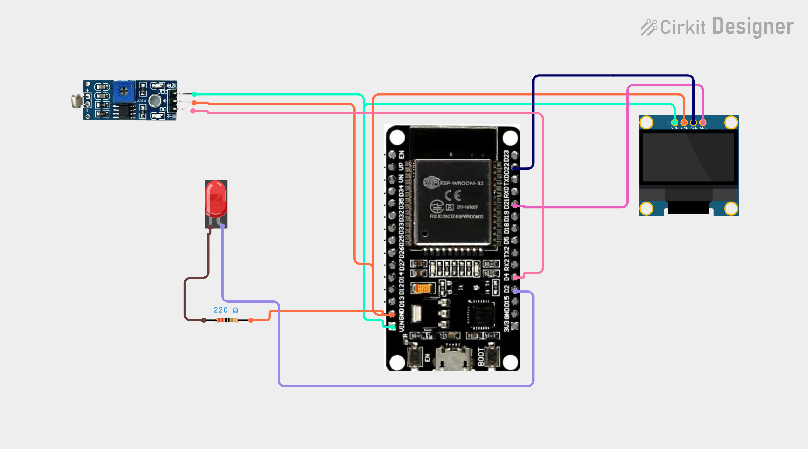

# Project 37 — Smart Night Lamp (ESP32 + LDR Sensor + LED + OLED) 🌙💡📟

[](#difficulty)
[](#hardware-used)
[](#hardware-used)
[](#hardware-used)

## Overview

The **Smart Night Lamp** is an automated ambient light detection and smart illumination controller. Powered by the **ESP32 microcontroller**, an **LDR (Light Dependent Resistor) sensor module**, a **5mm indicator LED**, and a **0.96" SSD1306 I2C OLED display**, it automatically triggers nighttime lighting when ambient illumination drops below an adjustable threshold and turns it off during daylight hours.

The photoresistor's electrical resistance changes inversely with light intensity (high resistance in darkness, low resistance under illumination). An onboard LM393 voltage comparator on the LDR module compares the photoresistor's voltage against an adjustable reference voltage set by a multi-turn potentiometer:
1. **Darkness Detected (`lightState == LOW`)**:
   * The digital output (`DO`) pulls `LOW`.
   * The ESP32 drives **GPIO 2** `HIGH`, illuminating the 5mm LED.
   * The OLED screen displays `"LIGHT ON"`.
2. **Daylight Conditions (`lightState == HIGH`)**:
   * The digital output (`DO`) stays `HIGH`.
   * The ESP32 drives **GPIO 2** `LOW`, turning the LED off to conserve energy.
   * The OLED screen updates to `"DAYLIGHT"`.

This project introduces:
* Interfacing photoresistors and analog/digital comparator modules with the ESP32
* Configuring GPIO pins for low-latency digital sensing and actuator driving
* Calibrating ambient light triggers using hardware trimpots
* Real-time visual status reporting on an I2C OLED screen

---

## Hardware Required

| Component | Quantity | Notes |
| :--- | :---: | :--- |
| **ESP32 Dev Module (30-pin)** | 1 | Dual-core Wi-Fi + Bluetooth microcontroller board |
| **LDR Light Sensor Module** | 1 | Photoresistor with onboard LM393 comparator & potentiometer (`DO`) |
| **5mm LED** | 1 | Red, White, or Warm Yellow indicator LED |
| **220Ω Resistor** | 1 | Current-limiting resistor (bands: Red-Red-Brown-Gold) |
| **0.96" I2C OLED Display** | 1 | 128x64 pixels (SSD1306 controller, address `0x3C`) |
| **Breadboard & Jumpers** | 1 | Solderless prototyping breadboard & DuPont jumper wires |
| **Micro-USB / Type-C Cable** | 1 | 5V USB power delivery and programming cable |

---

## Circuit Connections

| Component Pin | ESP32 Pin | Description |
| :--- | :--- | :--- |
| **LDR Module VCC** | **VIN (5V)** | Sensor Module Power (+5V) |
| **LDR Module GND** | **GND** | Sensor Ground |
| **LDR Module DO** | **GPIO 4 (D4)** | Digital light threshold output (LOW = dark, HIGH = light) |
| **LED Anode (+, Long Leg)** | **GPIO 2 (D2)** | Digital illumination control output |
| **LED Cathode (-, Short Leg)** | **220Ω Resistor -> GND** | Current limiting return path to ground |
| **OLED VDD / VCC** | **VIN (5V) / 3V3** | Display Power |
| **OLED GND** | **GND** | Display Ground |
| **OLED SCK / SCL** | **GPIO 22 (D22)** | Hardware I2C Clock Line |
| **OLED SDA** | **GPIO 21 (D21)** | Hardware I2C Data Line |

---

## Circuit Diagram

### Wiring Diagram


### Schematic (ASCII)

```text
ESP32 Dev Module (30-Pin)

             ┌───────────────────────┐
     D22 ────┤ SCL / SCK             │
     D21 ────┤ SDA   0.96" SSD1306   │
     VIN ────┤ VDD   OLED Display    │
     GND ────┤ GND                   │
             └───────────────────────┘

             ┌───────────────────────┐
     VIN ────┤ VCC                   │
     GND ────┤ GND   LDR Sensor      │
      D4 ────┤ DO    Module (LM393)  │
             └───────────────────────┘

      D2 ────[ Anode (+) 5mm LED Cathode (-) ]───[ 220Ω Resistor ]─── GND
```

---

## Setup & Configuration

1. In the Arduino IDE:
   - Select Board: `Tools -> Board -> ESP32 Arduino -> DOIT ESP32 DEVKIT V1` (or your ESP32 board variant).
   - Set Serial Baud Rate: `115200`.
2. Verify required libraries are installed:
   - `Adafruit GFX Library`
   - `Adafruit SSD1306`
   - `Wire` (built-in)
3. Open [`37_smart_night_lamp.ino`](37_smart_night_lamp.ino) and click **Upload**.
4. Sensitivity Adjustment:
   - Cover the LDR photoresistor with your palm; the onboard comparator LED lights up, the 5mm LED turns ON, and the OLED displays `"LIGHT ON"`.
   - Expose the sensor to room light; the LED turns OFF and the OLED displays `"DAYLIGHT"`.
   - Use a small screwdriver to turn the blue potentiometer on the LDR module to calibrate the exact light level that triggers switching.

---

## Arduino Code

Available in [`37_smart_night_lamp.ino`](37_smart_night_lamp.ino).

```cpp
#include <Wire.h>
#include <Adafruit_GFX.h>
#include <Adafruit_SSD1306.h>

#define LDR_PIN 4
#define LED_PIN 2

#define SCREEN_WIDTH 128
#define SCREEN_HEIGHT 64
#define OLED_RESET -1

Adafruit_SSD1306 display(
  SCREEN_WIDTH,
  SCREEN_HEIGHT,
  &Wire,
  OLED_RESET
);

void setup() {
  pinMode(LDR_PIN, INPUT);
  pinMode(LED_PIN, OUTPUT);

  display.begin(SSD1306_SWITCHCAPVCC, 0x3C);
  display.setTextColor(SSD1306_WHITE);
}

void loop() {

  int lightState = digitalRead(LDR_PIN);

  display.clearDisplay();

  display.setTextSize(1);
  display.setCursor(30, 5);
  display.println("SMART NIGHT");

  display.setTextSize(2);

  // Most LDR modules: LOW = dark
  if (lightState == LOW) {
    digitalWrite(LED_PIN, HIGH);

    display.setCursor(5, 28);
    display.println("LIGHT ON");
  }
  else {
    digitalWrite(LED_PIN, LOW);

    display.setCursor(15, 28);
    display.println("DAYLIGHT");
  }

  display.display();

  delay(200);
}
```

---

## How It Works

1. **Pin Configuration (`setup()`)**:
   - `pinMode(LDR_PIN, INPUT)` configures GPIO 4 to read the active digital logic level from the LDR module.
   - `pinMode(LED_PIN, OUTPUT)` sets GPIO 2 to drive the 5mm LED.
   - The SSD1306 OLED display initializes over I2C on address `0x3C` (GPIO 21 & GPIO 22).
2. **Digital Threshold Reading (`loop()`)**:
   - `digitalRead(LDR_PIN)` polls the LM393 comparator output.
   - Under ambient room lighting, the photoresistor's low resistance keeps the comparator output `HIGH`.
   - When light levels fall below the threshold, the photoresistor resistance rises sharply, driving the comparator output `LOW`.
3. **Actuation & Visual Display**:
   - When `lightState == LOW`, `digitalWrite(LED_PIN, HIGH)` illuminates the LED, and the OLED prints `"LIGHT ON"`.
   - When `lightState == HIGH`, `digitalWrite(LED_PIN, LOW)` switches off the LED, and the OLED prints `"DAYLIGHT"`.
   - The loop repeats every 200 ms for responsive ambient detection.
