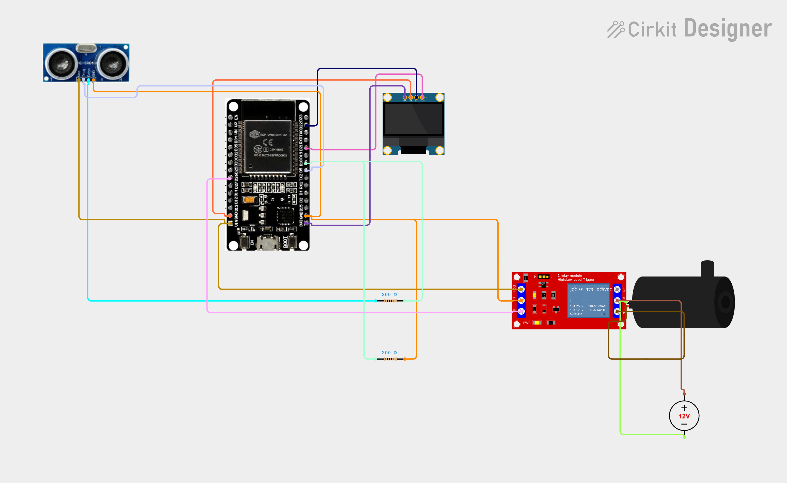

# Project 38 — Smart Water Tank (ESP32 + Ultrasonic Sensor + Relay + OLED) 🚰🌊📟

[](#difficulty)
[](#hardware-used)
[](#hardware-used)
[](#hardware-used)
[](#hardware-used)

## Overview

The **Smart Water Tank** is an automated fluid level telemetry and closed-loop inflow pumping station. Powered by an **ESP32 microcontroller**, an **HC-SR04 ultrasonic distance sensor**, an optocoupler-isolated **5V relay module**, an external **DC water pump**, and a **0.96" SSD1306 I2C OLED display**, it ensures overhead tanks or reservoirs never run dry nor overflow.

The ultrasonic sensor is installed at the top lid of the tank facing downwards toward the water surface. By measuring the time-of-flight of 40 kHz acoustic ultrasonic pulses, it calculates the air gap between the sensor and the water:
1. **Dynamic Level Calculation**:
   * Knowing the total tank height (`TANK_DEPTH`, default `30 cm`), the water depth is `TANK_DEPTH - distance`.
   * Water percentage is calculated as:
     $$\text{Level (\%)} = \left(\frac{\text{TANK\_DEPTH} - \text{distance}}{\text{TANK\_DEPTH}}\right) \times 100$$
2. **Automated Dual-Threshold Inflow Control**:
   * **Low Water Refill Trigger**: When the water level falls below **30%** (`level < 30`), the ESP32 energizes the active-LOW relay on **GPIO 26**, powering the water pump to begin filling the reservoir.
   * **Overflow Cut-off**: Once the water level rises to **90%** or above (`level >= 90`), the relay de-energizes (`HIGH`), immediately halting the pump.
   * This 60% hysteresis band ensures quiet, stable operation and prevents pump short-cycling.
3. **Local OLED Diagnostics**:
   * Displays `"SMART WATER TANK"` header.
   * Shows continuous water level percentage (`Level: XX%`).
   * Renders bold actuation text: `"PUMP ON"` during refilling or `"PUMP OFF"` when quiescent.
   * Detects sensor disconnection or acoustic echo timeout and displays `"SENSOR ERR"`.

This project introduces:
* Non-contact ultrasonic liquid depth sensing using high-frequency acoustics
* Time-of-flight pulse measurement using ESP32 microsecond timers (`pulseIn`)
* Safe electromechanical relay switching for high-voltage or high-current pump motors
* Real-time automated level regulation with fail-safe error handling

---

## Hardware Required

| Component | Quantity | Notes |
| :--- | :---: | :--- |
| **ESP32 Dev Module (30-pin)** | 1 | Dual-core Wi-Fi + Bluetooth microcontroller board |
| **HC-SR04 Ultrasonic Sensor Module** | 1 | 4-pin acoustic transceiver module (Trig / Echo) |
| **5V Relay Module (1-Channel)** | 1 | Optocoupler-isolated relay module (Active-LOW trigger) |
| **DC Water Pump** | 1 | 5V submersible pump or 12V external diaphragm water pump |
| **External DC Power Supply** | 1 | 5V or 12V adapter matching water pump voltage rating |
| **0.96" I2C OLED Display** | 1 | 128x64 pixels (SSD1306 controller, address `0x3C`) |
| **Breadboard & Jumpers** | 1 | Solderless prototyping breadboard & DuPont jumper wires |
| **Micro-USB / Type-C Cable** | 1 | 5V USB power delivery and programming cable |

---

## Circuit Connections

### 1. ESP32 & Logic Connections
| Component Pin | ESP32 Pin | Description |
| :--- | :--- | :--- |
| **HC-SR04 VCC** | **VIN (5V)** | Sensor Power (+5V) |
| **HC-SR04 GND** | **GND** | Sensor Ground |
| **HC-SR04 Trig** | **GPIO 5 (D5)** | Ultrasonic pulse trigger output |
| **HC-SR04 Echo** | **GPIO 18 (D18)** | Ultrasonic pulse echo timing input |
| **Relay Module VCC (`+`)** | **VIN (5V)** | Relay coil power (+5V) |
| **Relay Module GND (`-`)** | **GND** | Relay ground |
| **Relay Module IN / Signal (`S`)** | **GPIO 26 (D26)** | Digital control signal (Active LOW) |
| **OLED VDD / VCC** | **VIN (5V) / 3V3** | Display Power |
| **OLED GND** | **GND** | Display Ground |
| **OLED SCK / SCL** | **GPIO 22 (D22)** | Hardware I2C Clock Line |
| **OLED SDA** | **GPIO 21 (D21)** | Hardware I2C Data Line |

### 2. Relay High-Power Pump Circuit
| Terminal | Connects To | Description |
| :--- | :--- | :--- |
| **External Power Supply (+)** | **Relay COM (Common)** | Switched positive DC feed |
| **Relay NO (Normally Open)** | **Water Pump Positive (+)** | Switched DC power to pump |
| **External Power Supply (-)** | **Water Pump Negative (-)** | Direct ground return for pump motor |

> [!CAUTION]
> **Motor Electrical Isolation**: Always switch external power for the pump through the relay's `COM` and `NO` screw terminals. Never power pumps or inductive motors directly from the ESP32 board headers to protect the microcontroller from voltage spikes and reset loops.

---

## Circuit Diagram

### Wiring Diagram


### Schematic (ASCII)

```text
ESP32 Dev Module (30-Pin)

             ┌───────────────────────┐
     D22 ────┤ SCL / SCK             │
     D21 ────┤ SDA   0.96" SSD1306   │
     VIN ────┤ VDD   OLED Display    │
     GND ────┤ GND                   │
             └───────────────────────┘

             ┌───────────────────────┐
     VIN ────┤ VCC                   │
     GND ────┤ GND   HC-SR04         │
      D5 ────┤ Trig  Ultrasonic      │
     D18 ────┤ Echo  Sensor          │
             └───────────────────────┘

             ┌───────────────────────┐
     VIN ────┤ VCC (+)               │
     GND ────┤ GND (-)  5V Relay     │
     D26 ────┤ IN  (S)  Module       │
             └──────┬────────┬───────┘
                    │        │
                   COM       NO
                    │        │
     [External DC +]┘        └─── [Pump +]
     [External DC -]───────────── [Pump -]
```

---

## Setup & Configuration

1. Calibrate Tank Depth:
   - Measure the internal height of your container or water tank from the ultrasonic sensor face to the bottom.
   - Update line 10 in [`38_smart_water_tank.ino`](38_smart_water_tank.ino):
     ```cpp
     #define TANK_DEPTH 30  // Change to your tank depth in cm
     ```
2. In the Arduino IDE:
   - Select Board: `Tools -> Board -> ESP32 Arduino -> DOIT ESP32 DEVKIT V1` (or your ESP32 board variant).
   - Set Serial Baud Rate: `115200`.
3. Verify required libraries are installed:
   - `Adafruit GFX Library`
   - `Adafruit SSD1306`
   - `Wire` (built-in)
4. Open [`38_smart_water_tank.ino`](38_smart_water_tank.ino) and click **Upload**.
5. Testing:
   - Point the sensor towards a flat surface (wall or desk) at varying distances:
     - When distance is far (e.g. > 21 cm in a 30 cm tank), level reads `< 30%`. The relay clicks `ON` and OLED shows `"PUMP ON"`.
     - Move the surface closer (e.g. < 3 cm), level reads `> 90%`. The relay clicks `OFF` and OLED displays `"PUMP OFF"`.
     - If the sensor beam is blocked or out of range (> 30 cm), the screen shows `"SENSOR ERR"`.

---

## Arduino Code

Available in [`38_smart_water_tank.ino`](38_smart_water_tank.ino).

```cpp
#include <Wire.h>
#include <Adafruit_GFX.h>
#include <Adafruit_SSD1306.h>

#define TRIG_PIN 5
#define ECHO_PIN 18
#define RELAY_PIN 26

// Set this to your tank depth in cm
#define TANK_DEPTH 30

#define SCREEN_WIDTH 128
#define SCREEN_HEIGHT 64
#define OLED_RESET -1

Adafruit_SSD1306 display(
  SCREEN_WIDTH, SCREEN_HEIGHT,
  &Wire, OLED_RESET
);

bool pumpOn = false;

float getDistance() {
  digitalWrite(TRIG_PIN, LOW);
  delayMicroseconds(2);

  digitalWrite(TRIG_PIN, HIGH);
  delayMicroseconds(10);
  digitalWrite(TRIG_PIN, LOW);

  long duration = pulseIn(ECHO_PIN, HIGH, 30000);

  if (duration == 0)
    return -1;

  return duration * 0.0343 / 2.0;
}

void setPump(bool state) {
  pumpOn = state;

  // Most relay modules are active LOW
  digitalWrite(RELAY_PIN, pumpOn ? LOW : HIGH);
}

void setup() {
  pinMode(TRIG_PIN, OUTPUT);
  pinMode(ECHO_PIN, INPUT);
  pinMode(RELAY_PIN, OUTPUT);

  setPump(false);

  display.begin(SSD1306_SWITCHCAPVCC, 0x3C);
  display.setTextColor(SSD1306_WHITE);
}

void loop() {

  float distance = getDistance();

  if (distance > 0 && distance <= TANK_DEPTH) {

    int level = ((TANK_DEPTH - distance) / TANK_DEPTH) * 100;
    level = constrain(level, 0, 100);

    // Automatic pump control
    if (!pumpOn && level < 30) {
      setPump(true);
    }

    if (pumpOn && level >= 90) {
      setPump(false);
    }

    display.clearDisplay();

    display.setTextSize(1);
    display.setCursor(25, 5);
    display.println("SMART WATER TANK");

    display.setCursor(10, 20);
    display.print("Level: ");
    display.print(level);
    display.println("%");

    display.setTextSize(2);
    display.setCursor(25, 40);

    if (pumpOn)
      display.println("PUMP ON");
    else
      display.println("PUMP OFF");

  } else {

    display.clearDisplay();

    display.setTextSize(1);
    display.setCursor(25, 5);
    display.println("SMART WATER TANK");

    display.setTextSize(2);
    display.setCursor(20, 30);
    display.println("SENSOR ERR");
  }

  display.display();

  delay(1000);
}
```

---

## How It Works

1. **Ultrasonic Distance Measurement (`getDistance()`)**:
   - The ESP32 triggers a 10 $\mu\text{s}$ pulse on `TRIG_PIN` (GPIO 5).
   - The sensor transmits eight 40 kHz ultrasonic burst cycles and raises `ECHO_PIN` (GPIO 18) `HIGH`.
   - `pulseIn(ECHO_PIN, HIGH, 30000)` counts the duration in microseconds before the acoustic wave reflects back.
   - Distance in centimeters is calculated via speed of sound in air ($343\text{ m/s}$):
     $$\text{Distance} = \frac{\text{duration} \times 0.0343}{2}$$
2. **Water Level Mapping**:
   - As water rises, the air distance to the sensor shrinks, so $(\text{TANK\_DEPTH} - \text{distance})$ increases.
   - Clamped cleanly with `constrain(level, 0, 100)`.
3. **Active-LOW Relay Pump Actuation**:
   - Default initialization in `setup()` drives `RELAY_PIN` `HIGH`, ensuring the pump is safely disabled on startup.
   - When `level < 30%`, `setPump(true)` pulls GPIO 26 `LOW`, closing the relay contacts to refill the tank.
   - Once `level >= 90%`, `setPump(false)` pulls GPIO 26 `HIGH`, shutting off the pump.
4. **OLED Visual Status**:
   - Updates every 1 second with current percentage and actuation state, or alerts `"SENSOR ERR"` if the reading is invalid or outside tank boundaries.
