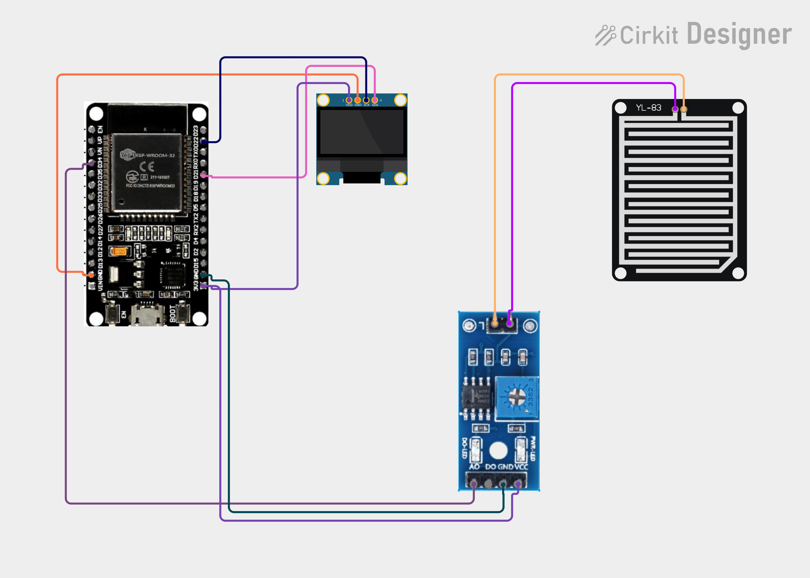

# Project 39 — Wi-Fi Rain Monitor (ESP32 + Rain Sensor + OLED) 🌧️🌐📟

[](#difficulty)
[](#hardware-used)
[](#hardware-used)
[](#hardware-used)
[](#hardware-used)

## Overview

The **Wi-Fi Rain Monitor** is an IoT-enabled meteorological station designed to detect precipitation intensity in real time. Powered by an **ESP32 microcontroller**, a **raindrop sensor plate (YL-83)** with an **LM393 signal conditioning board**, and a **0.96" SSD1306 I2C OLED display**, it tracks rainfall both on a local screen and through an embedded HTTP web server accessible across your local Wi-Fi network.

The rain sensing plate features interleaved nickel tracks acting as open-circuit conductive traces:
1. **Rainfall Conductivity Detection**:
   * When dry, the air gap provides very high electrical resistance; the analog voltage on **GPIO 34 (ADC1_CH6)** stays near 3.3V (ADC count ~4095).
   * As raindrops deposit onto the plate, the conductive water bridges the traces, dropping the electrical resistance and lowering the analog voltage towards ~1000.
   * The ESP32 maps this voltage inversely to a precipitation intensity percentage (`0% - 100%`):
     * **`< 20%`**: Categorized as `"DRY"` (clear weather).
     * **`20% - 59%`**: Categorized as `"LIGHT RAIN"` (drizzle or initial droplets).
     * **`>= 60%`**: Categorized as `"HEAVY RAIN"` (steady precipitation / downpour).
2. **Local OLED Interface**:
   * Shows `"RAIN MONITOR"` title.
   * Displays the continuous rainfall percentage (`Rain: XX%`).
   * Displays the weather category (`Status: DRY / LIGHT RAIN / HEAVY RAIN`).
3. **Live Web Dashboard**:
   * Serves an HTML5 portal on port 80.
   * Contains `<meta http-equiv='refresh' content='2'>` to automatically refresh client browser screens every 2 seconds without external cloud brokers or subscription services.

This project introduces:
* Resistive surface conduction sensing with the ESP32 platform
* Inverse 12-bit ADC mapping and threshold classification
* Dual-reporting architecture: synchronous local I2C display + asynchronous Wi-Fi HTTP web server
* Building smart home rain alerts for automatic window closers, laundry protection, and weather logging

---

## Hardware Required

| Component | Quantity | Notes |
| :--- | :---: | :--- |
| **ESP32 Dev Module (30-pin)** | 1 | Dual-core Wi-Fi + Bluetooth microcontroller board |
| **Raindrop Sensor Module (YL-83)** | 1 | Rain detection plate + LM393 comparator driver board (`AO`) |
| **0.96" I2C OLED Display** | 1 | 128x64 pixels (SSD1306 controller, address `0x3C`) |
| **Breadboard & Jumpers** | 1 | Solderless prototyping breadboard & DuPont jumper wires |
| **Micro-USB / Type-C Cable** | 1 | 5V USB power delivery and programming cable |

---

## Circuit Connections

| Component Pin | ESP32 Pin | Description |
| :--- | :--- | :--- |
| **Rain Sensor Plate** | **Comparator 2-pin header** | Connects sensing plate to driver module |
| **Rain Sensor VCC** | **3V3 / VIN (5V)** | Module Power |
| **Rain Sensor GND** | **GND** | Ground |
| **Rain Sensor AO** | **GPIO 34 (ADC1_CH6)** | Analog voltage output (Input-only ADC pin) |
| **OLED VDD / VCC** | **VIN (5V) / 3V3** | Display Power |
| **OLED GND** | **GND** | Display Ground |
| **OLED SCK / SCL** | **GPIO 22 (D22)** | Hardware I2C Clock Line |
| **OLED SDA** | **GPIO 21 (D21)** | Hardware I2C Data Line |

> [!NOTE]
> **GPIO 34** is an input-only ADC pin belonging to `ADC1`. It does not conflict with Wi-Fi operations, ensuring reliable analog sampling while Wi-Fi transmission is active.

---

## Circuit Diagram

### Wiring Diagram


### Schematic (ASCII)

```text
ESP32 Dev Module (30-Pin)

             ┌───────────────────────┐
     D22 ────┤ SCL / SCK             │
     D21 ────┤ SDA   0.96" SSD1306   │
     VIN ────┤ VDD   OLED Display    │
     GND ────┤ GND                   │
             └───────────────────────┘

             ┌──────────────────────────────┐
     3V3 ────┤ VCC                          │
     GND ────┤ GND       Rain Sensor        │
 GPIO 34 ────┤ AO        LM393 Board        │
             │                              │
             │ [Probe Header] ── [ YL-83    │
             │                     Plate ]  │
             └──────────────────────────────┘
```

---

## Setup & Configuration

1. In [`39_wifi_rain_monitor.ino`](39_wifi_rain_monitor.ino), enter your 2.4 GHz Wi-Fi credentials:
   ```cpp
   const char* ssid = "YOUR_WIFI_SSID";
   const char* password = "YOUR_WIFI_PASSWORD";
   ```
2. In the Arduino IDE:
   - Select Board: `Tools -> Board -> ESP32 Arduino -> DOIT ESP32 DEVKIT V1` (or your ESP32 board variant).
   - Set Serial Baud Rate: `115200`.
3. Verify required libraries are installed:
   - `Adafruit GFX Library`
   - `Adafruit SSD1306`
   - `Wire` (built-in)
   - `WiFi` & `WebServer` (ESP32 core built-in)
4. Open [`39_wifi_rain_monitor.ino`](39_wifi_rain_monitor.ino) and click **Upload**.
5. Open the Serial Monitor. Once connected to Wi-Fi, the ESP32 prints its local IP address:
   ```text
   Connecting WiFi.....
   IP Address: 192.168.1.145
   ```
6. Open any web browser on your phone or PC connected to the same Wi-Fi and navigate to:
   ```text
   http://192.168.1.145
   ```
   Sprinkle a few drops of water on the rain plate to watch the dashboard and OLED instantly change from `"DRY"` to `"LIGHT RAIN"` or `"HEAVY RAIN"`!

---

## Arduino Code

Available in [`39_wifi_rain_monitor.ino`](39_wifi_rain_monitor.ino).

```cpp
#include <WiFi.h>
#include <WebServer.h>
#include <Wire.h>
#include <Adafruit_GFX.h>
#include <Adafruit_SSD1306.h>

#define RAIN_PIN 34

#define SCREEN_WIDTH 128
#define SCREEN_HEIGHT 64
#define OLED_RESET -1

const char* ssid = "YOUR_WIFI";
const char* password = "YOUR_PASSWORD";

WebServer server(80);

Adafruit_SSD1306 display(
  SCREEN_WIDTH,
  SCREEN_HEIGHT,
  &Wire,
  OLED_RESET
);

int rainLevel = 0;
String status = "DRY";

void readRain() {
  int value = analogRead(RAIN_PIN);

  // Typical sensor: lower ADC value = more water
  rainLevel = map(value, 4095, 1000, 0, 100);
  rainLevel = constrain(rainLevel, 0, 100);

  if (rainLevel < 20)
    status = "DRY";
  else if (rainLevel < 60)
    status = "LIGHT RAIN";
  else
    status = "HEAVY RAIN";
}

void updateDisplay() {
  display.clearDisplay();

  display.setTextSize(1);
  display.setCursor(30, 2);
  display.println("RAIN MONITOR");

  display.setCursor(5, 20);
  display.print("Rain: ");
  display.print(rainLevel);
  display.println("%");

  display.setTextSize(1);
  display.setCursor(5, 40);
  display.print("Status:");

  display.setCursor(5, 52);
  display.println(status);

  display.display();
}

void handleRoot() {
  readRain();

  String html = "<!DOCTYPE html><html>";
  html += "<head><meta http-equiv='refresh' content='2'>";
  html += "<meta name='viewport' content='width=device-width,initial-scale=1'>";
  html += "<title>IoT Rain Monitor</title></head>";
  html += "<body><h2>IoT Rain Monitor</h2>";

  html += "<p>Rain Level: <b>";
  html += String(rainLevel);
  html += "%</b></p>";

  html += "<p>Status: <b>";
  html += status;
  html += "</b></p>";

  html += "</body></html>";

  server.send(200, "text/html", html);
}

void setup() {
  Serial.begin(115200);

  display.begin(SSD1306_SWITCHCAPVCC, 0x3C);
  display.setTextColor(SSD1306_WHITE);

  display.clearDisplay();
  display.setTextSize(1);
  display.setCursor(20, 25);
  display.println("Connecting WiFi...");
  display.display();

  WiFi.begin(ssid, password);

  while (WiFi.status() != WL_CONNECTED) {
    delay(500);
    Serial.print(".");
  }

  Serial.println();
  Serial.print("IP Address: ");
  Serial.println(WiFi.localIP());

  server.on("/", handleRoot);
  server.begin();
}

void loop() {
  readRain();
  updateDisplay();

  server.handleClient();

  delay(1000);
}
```

---

## How It Works

1. **Conductivity Sampling (`readRain()`)**:
   - `analogRead(RAIN_PIN)` samples the voltage drop across the rain plate traces via GPIO 34.
   - Dry plate = high resistance $\rightarrow$ ~4095.
   - Saturated plate = low resistance $\rightarrow$ ~1000.
   - `map(value, 4095, 1000, 0, 100)` inverts this relationship to compute rain intensity (0% = completely dry, 100% = fully submerged).
2. **Threshold Categorization**:
   - Compares the mapped level against presets:
     - `rainLevel < 20%` $\rightarrow$ `"DRY"`
     - `20% <= rainLevel < 60%` $\rightarrow$ `"LIGHT RAIN"`
     - `rainLevel >= 60%` $\rightarrow$ `"HEAVY RAIN"`
3. **Local OLED Presentation (`updateDisplay()`)**:
   - Displays clear text telemetry updated every 1 second.
4. **Embedded Web Server (`handleRoot()`)**:
   - Formats a lightweight HTML5 response with `<meta http-equiv='refresh' content='2'>`.
   - Any connected browser updates autonomously every 2 seconds without requiring WebSocket configurations.
