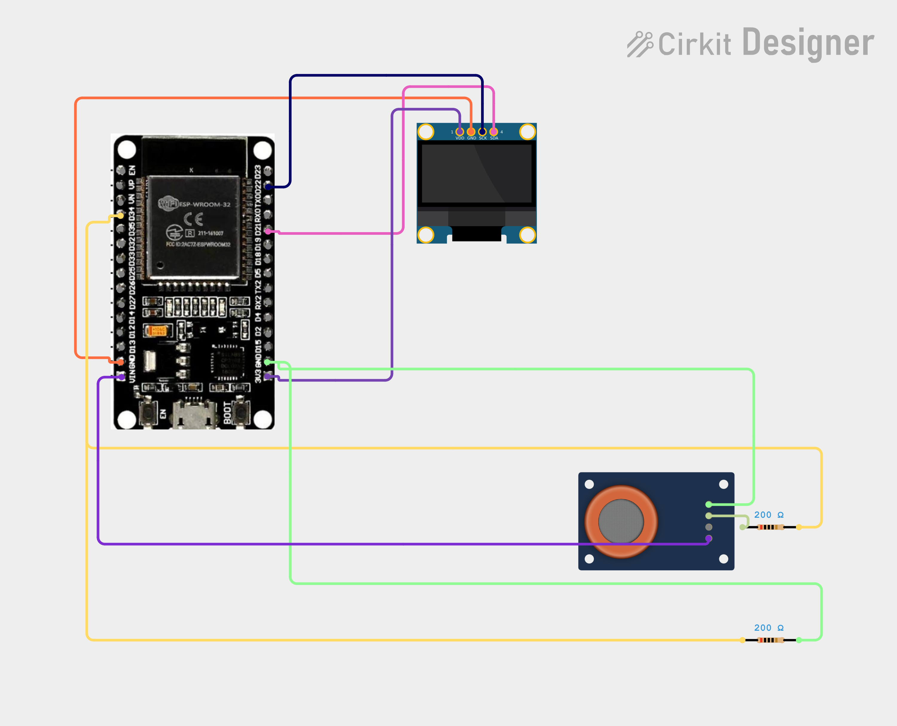

# Project 40 — Wi-Fi Air Quality Monitor (ESP32 + MQ-135 + OLED) 🌫️🌐📟

[](#difficulty)
[](#hardware-used)
[](#hardware-used)
[](#hardware-used)
[](#hardware-used)

## Overview

The **Wi-Fi Air Quality Monitor** is an IoT-enabled indoor atmospheric telemetry and ventilation tracking station. Powered by an **ESP32 microcontroller**, an **MQ-135 electrochemical gas sensor module**, and a **0.96" SSD1306 I2C OLED display**, it measures surrounding air contamination and broadcasts live air quality metrics to any web browser on your local network.

The MQ-135 sensor utilizes a heated Tin Dioxide ($\text{SnO}_2$) semiconductor sensitive to a wide spectrum of airborne contaminants including ammonia ($\text{NH}_3$), nitrogen oxides ($\text{NO}_x$), alcohol, benzene, smoke, and carbon dioxide ($\text{CO}_2$):
1. **Multi-Sample Noise Reduction**:
   * The ESP32's 12-bit ADC on **GPIO 34 (ADC1_CH6)** samples the sensor's analog output (`AO`) across 12 consecutive readings with short delays to filter out electrical ripple from the internal sensor heater.
   * Computes a normalized relative contamination index:
     $$\text{Air Quality (\%)} = \text{constrain}\left(\frac{\text{rawReading} \times 100}{4095}, 0, 100\right)$$
2. **Threshold Categorization**:
   * **`ADC <= 1100`**: Categorized as **`GOOD`** (clean, fresh ambient air).
   * **`1101 - 2300`**: Categorized as **`MODERATE`** (elevated VOCs, stale indoor air, or cooking fumes).
   * **`> 2300`**: Categorized as **`POOR`** (high gas concentrations, heavy smoke, or poor ventilation).
3. **Synchronous OLED Dashboard**:
   * Displays `"AIR QUALITY MONITOR"` header with a separator line.
   * Shows relative pollution percentage (`Relative level: XX%`).
   * Renders the bold categorical status in size-2 font (`GOOD`, `MODERATE`, or `POOR`).
   * Displays the assigned local Wi-Fi IP address once connected.
4. **Styled Wireless Web Portal**:
   * Runs an HTTP web server on port 80.
   * Delivers a responsive CSS-styled dashboard card that auto-refreshes every 2 seconds (`<meta http-equiv='refresh' content='2'>`) for wireless monitoring from any smartphone, tablet, or PC.

This project introduces:
* Semiconductor gas detection mechanisms and heater warm-up requirements
* 12-bit ADC multi-sample averaging algorithms on the ESP32
* Dual-interface telemetry: local I2C graphics + wireless HTTP dashboard
* Building indoor environmental monitoring solutions for home and classroom safety

---

## Hardware Required

| Component | Quantity | Notes |
| :--- | :---: | :--- |
| **ESP32 Dev Module (30-pin)** | 1 | Dual-core Wi-Fi + Bluetooth microcontroller board |
| **MQ-135 Air Quality Sensor Module** | 1 | Semiconductor gas sensor module with analog output (`AO`) |
| **0.96" I2C OLED Display** | 1 | 128x64 pixels (SSD1306 controller, address `0x3C`) |
| **Breadboard & Jumpers** | 1 | Solderless prototyping breadboard & DuPont jumper wires |
| **Micro-USB / Type-C Cable** | 1 | 5V USB power delivery and programming cable |

---

## Circuit Connections

| Component Pin | ESP32 Pin | Description |
| :--- | :--- | :--- |
| **MQ-135 VCC** | **VIN (5V)** | Sensor heater and comparator power (+5V) |
| **MQ-135 GND** | **GND** | Ground |
| **MQ-135 AO** | **GPIO 34 (ADC1_CH6)** | Analog gas concentration output (Input-only ADC pin) |
| **OLED VDD / VCC** | **VIN (5V) / 3V3** | Display Power |
| **OLED GND** | **GND** | Display Ground |
| **OLED SCK / SCL** | **GPIO 22 (D22)** | Hardware I2C Clock Line |
| **OLED SDA** | **GPIO 21 (D21)** | Hardware I2C Data Line |

> [!NOTE]
> The internal heating element of the MQ-135 requires 5V to maintain its operating temperature (~200–300°C). Connecting VCC to the ESP32's **VIN (5V)** pin (fed from USB) ensures proper heating.

---

## Circuit Diagram

### Wiring Diagram


### Schematic (ASCII)

```text
ESP32 Dev Module (30-Pin)

             ┌───────────────────────┐
     D22 ────┤ SCL / SCK             │
     D21 ────┤ SDA   0.96" SSD1306   │
     VIN ────┤ VDD   OLED Display    │
     GND ────┤ GND                   │
             └───────────────────────┘

             ┌───────────────────────┐
     VIN ────┤ VCC                   │
     GND ────┤ GND   MQ-135 Sensor   │
 GPIO 34 ────┤ AO    Module          │
             └───────────────────────┘
```

---

## Setup & Configuration

1. In [`40_wifi_air_quality_monitor.ino`](40_wifi_air_quality_monitor.ino), enter your local Wi-Fi credentials:
   ```cpp
   const char* WIFI_SSID = "YOUR_WIFI_SSID";
   const char* WIFI_PASSWORD = "YOUR_WIFI_PASSWORD";
   ```
2. In the Arduino IDE:
   - Select Board: `Tools -> Board -> ESP32 Arduino -> DOIT ESP32 DEVKIT V1` (or your ESP32 board variant).
   - Set Serial Baud Rate: `115200`.
3. Verify required libraries are installed:
   - `Adafruit GFX Library`
   - `Adafruit SSD1306`
   - `Wire` (built-in)
   - `WiFi` & `WebServer` (ESP32 core built-in)
4. Open [`40_wifi_air_quality_monitor.ino`](40_wifi_air_quality_monitor.ino) and click **Upload**.
5. Sensor Warm-up:
   - When first powered, the MQ-135 sensor body will feel warm to the touch.
   - Allow **2 to 3 minutes** for the internal heater to stabilize its baseline resistance before taking readings.
6. Open the Serial Monitor. Once connected to Wi-Fi, the ESP32 prints its local IP:
   ```text
   Air monitor page: http://192.168.1.150
   ```
7. Open any browser on your smartphone or PC and navigate to:
   ```text
   http://192.168.1.150
   ```
   Expose the sensor to an isopropyl alcohol wipe, marker vapour, or extinguished match smoke to observe immediate real-time response on both the OLED screen and the web portal!

---

## Arduino Code

Available in [`40_wifi_air_quality_monitor.ino`](40_wifi_air_quality_monitor.ino).

```cpp
#include <WiFi.h>
#include <WebServer.h>
#include <Wire.h>
#include <Adafruit_GFX.h>
#include <Adafruit_SSD1306.h>

// Wi-Fi network credentials (replace with your local network credentials)
const char* WIFI_SSID = "YOUR_WIFI_SSID";
const char* WIFI_PASSWORD = "YOUR_WIFI_PASSWORD";

constexpr uint8_t MQ135_AO_PIN = 34; // Analog output
constexpr uint8_t OLED_SDA = 21;
constexpr uint8_t OLED_SCL = 22;
constexpr int SCREEN_WIDTH = 128;
constexpr int SCREEN_HEIGHT = 64;
constexpr uint8_t OLED_ADDRESS = 0x3C;

Adafruit_SSD1306 display(SCREEN_WIDTH, SCREEN_HEIGHT, &Wire, -1);
WebServer server(80);

// Tune these ADC thresholds for your module.
// They indicate relative sensor response—not calibrated ppm or regulatory AQI.
constexpr int ADC_GOOD_MAX = 1100;
constexpr int ADC_MODERATE_MAX = 2300;

int rawReading = 0;
int airQualityPercent = 0; // Relative 0–100% sensor reading
String airStatus = "WARMING UP";
bool displayReady = false;
bool serverStarted = false;
unsigned long lastSampleMs = 0;
unsigned long lastWiFiAttemptMs = 0;

void sampleAir() {
  // Average samples to reduce ADC noise.
  uint32_t sum = 0;
  for (int i = 0; i < 12; ++i) {
    sum += analogRead(MQ135_AO_PIN);
    delay(3);
  }

  rawReading = sum / 12;
  airQualityPercent =
      constrain((int)((long)rawReading * 100L / 4095L), 0, 100);

  if (rawReading <= ADC_GOOD_MAX) {
    airStatus = "GOOD";
  } else if (rawReading <= ADC_MODERATE_MAX) {
    airStatus = "MODERATE";
  } else {
    airStatus = "POOR";
  }
}

String htmlPage() {
  String page = F(
      "<!doctype html><html><head>"
      "<meta name='viewport' content='width=device-width,initial-scale=1'>"
      "<meta http-equiv='refresh' content='2'>"
      "<title>ESP32 Air Quality Monitor</title>"
      "<style>body{font:20px Arial;text-align:center;"
      "background:#eef7ff;color:#123;padding:2em}"
      ".card{display:inline-block;background:white;padding:2em;"
      "border-radius:16px;box-shadow:0 2px 12px #abc}"
      ".level{font-size:3em;color:#1677c8}</style>"
      "</head><body><div class='card'>"
      "<h1>Air Quality Monitor</h1><div class='level'>");

  page += String(airQualityPercent);
  page += F("%</div><h2>");
  page += airStatus;
  page += F("</h2><p>MQ-135 ADC: ");
  page += String(rawReading);
  page += F(
      " / 4095</p>"
      "<small>Relative indication only; refreshes every 2 seconds</small>"
      "</div></body></html>");

  return page;
}

void handleRoot() {
  server.send(200, "text/html", htmlPage());
}

void updateDisplay() {
  if (!displayReady) return;

  display.clearDisplay();
  display.setTextColor(SSD1306_WHITE);
  display.setTextSize(1);
  display.setCursor(0, 0);
  display.println(F("AIR QUALITY MONITOR"));
  display.drawLine(0, 11, 127, 11, SSD1306_WHITE);

  display.setCursor(0, 18);
  display.print(F("Relative level: "));
  display.print(airQualityPercent);
  display.println(F("%"));

  display.setTextSize(2);
  display.setCursor(0, 32);
  display.println(airStatus);

  display.setTextSize(1);
  display.setCursor(0, 55);
  if (WiFi.status() == WL_CONNECTED) {
    display.print(WiFi.localIP());
  } else {
    display.print(F("WiFi connecting..."));
  }

  display.display();
}

void setup() {
  Serial.begin(115200);
  analogReadResolution(12);
  pinMode(MQ135_AO_PIN, INPUT);

  Wire.begin(OLED_SDA, OLED_SCL);
  displayReady = display.begin(SSD1306_SWITCHCAPVCC, OLED_ADDRESS);

  WiFi.mode(WIFI_STA);
  WiFi.begin(WIFI_SSID, WIFI_PASSWORD);
  lastWiFiAttemptMs = millis();

  // The MQ-135 heater needs warm-up; treat readings as relative.
  sampleAir();
  updateDisplay();
}

void loop() {
  const unsigned long now = millis();

  if (WiFi.status() == WL_CONNECTED) {
    if (!serverStarted) {
      server.on("/", handleRoot);
      server.begin();
      serverStarted = true;
      updateDisplay();

      Serial.print(F("Air monitor page: http://"));
      Serial.println(WiFi.localIP());
    }

    server.handleClient();
  } else {
    serverStarted = false;

    if (now - lastWiFiAttemptMs >= 10000UL) {
      WiFi.disconnect();
      WiFi.begin(WIFI_SSID, WIFI_PASSWORD);
      lastWiFiAttemptMs = now;
    }
  }

  if (now - lastSampleMs >= 1000UL) {
    sampleAir();
    updateDisplay();
    lastSampleMs = now;
  }

  delay(2);
}
```

---

## How It Works

1. **Averaged Sampling (`sampleAir()`)**:
   - Loops 12 times reading `analogRead(MQ135_AO_PIN)` with a 3 ms pause between readings.
   - Computes the average reading, eliminating transient voltage spikes from the heater circuit.
2. **Threshold Classification**:
   - Assesses the average ADC count against tuned boundaries:
     - `rawReading <= 1100`: Set to `"GOOD"`.
     - `rawReading <= 2300`: Set to `"MODERATE"`.
     - `rawReading > 2300`: Set to `"POOR"`.
3. **Non-Blocking Wi-Fi Management**:
   - Checks `WiFi.status()` inside `loop()`.
   - If Wi-Fi is lost, it periodically retries every 10 seconds without locking the microcontroller, maintaining active OLED display updates.
4. **Embedded Web Server**:
   - Serves an HTML5 document with embedded CSS styling on port 80.
   - Automatically refreshes every 2 seconds via `<meta http-equiv='refresh' content='2'>`.
